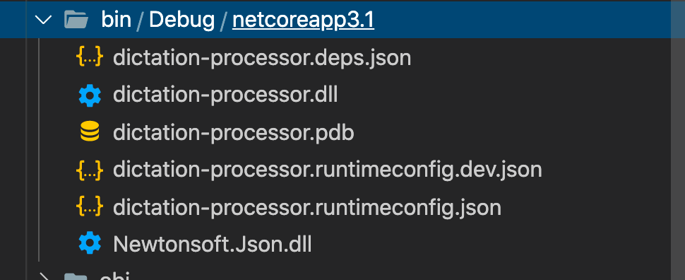

# 10 `running`

Plusieurs façon de faire tourner son application

- le debbuger qui construit et fait tourner l'application.
- `dotnet run` va `build` et faire tourner l'application.
- D'après le programme compilé `dotnet /path/to/MyProject.dll`.

## `obj` et `bin`

### `obj`

Contient le cache créé par `dotnet restore` .

Il contient aussi les objets temporaire créés par le compilateur au `build`.

### `bin` : binary



`.pdb` est un fichier pour le debug.

Le binaire est un fichier `.dll` ici `dictation-processor.dll`.

Pour la lancer :

```bash
🦄 dictation-processor dotnet /Users/kar/Documents/programmation/dotnet/dotnet-mac/dictation-processor/bin/Debug/netcoreapp3.1/dictation-processor.dll
```
