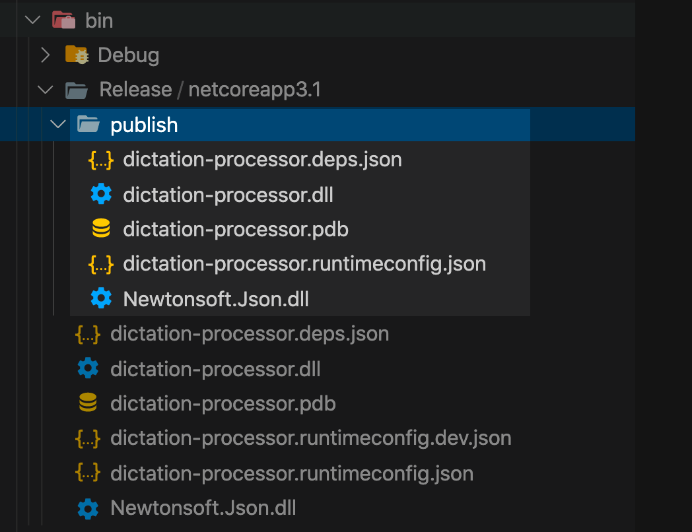
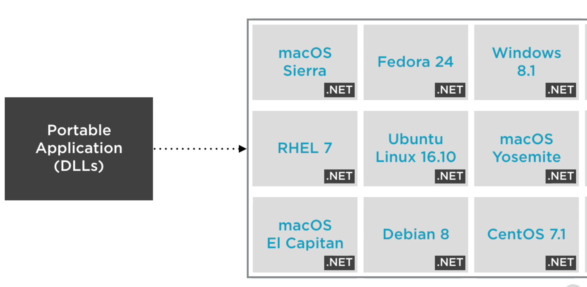
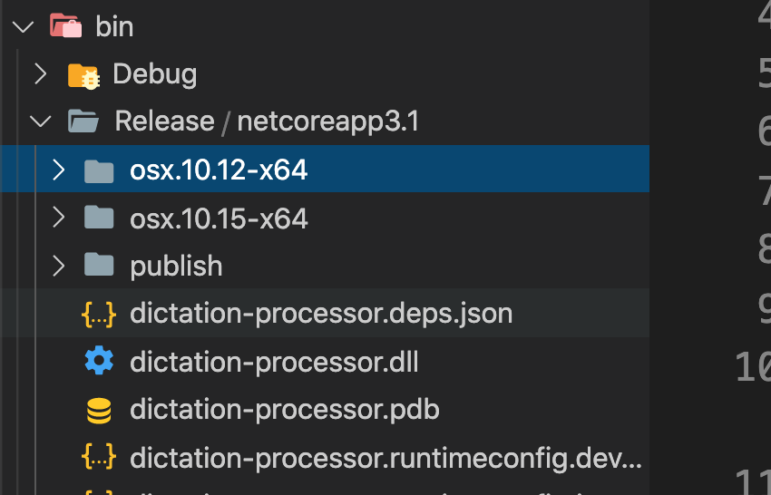
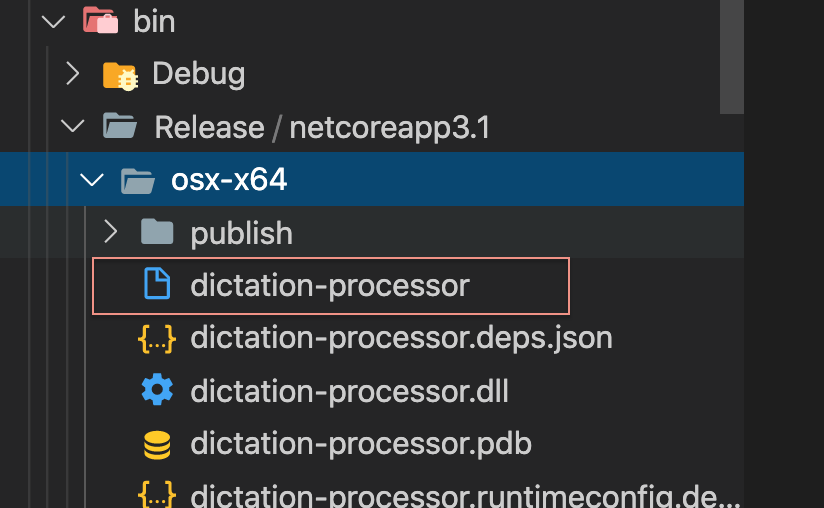
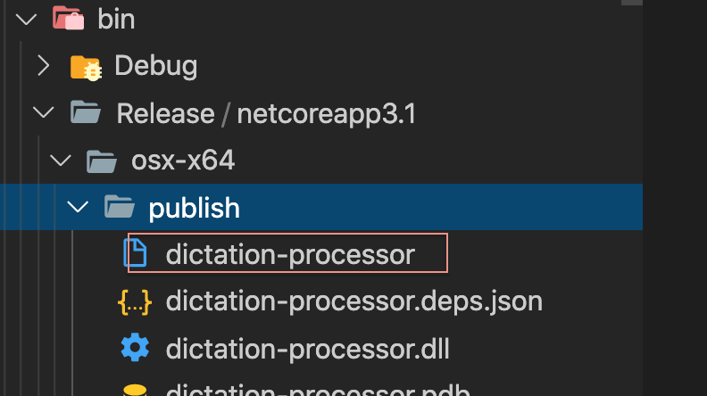
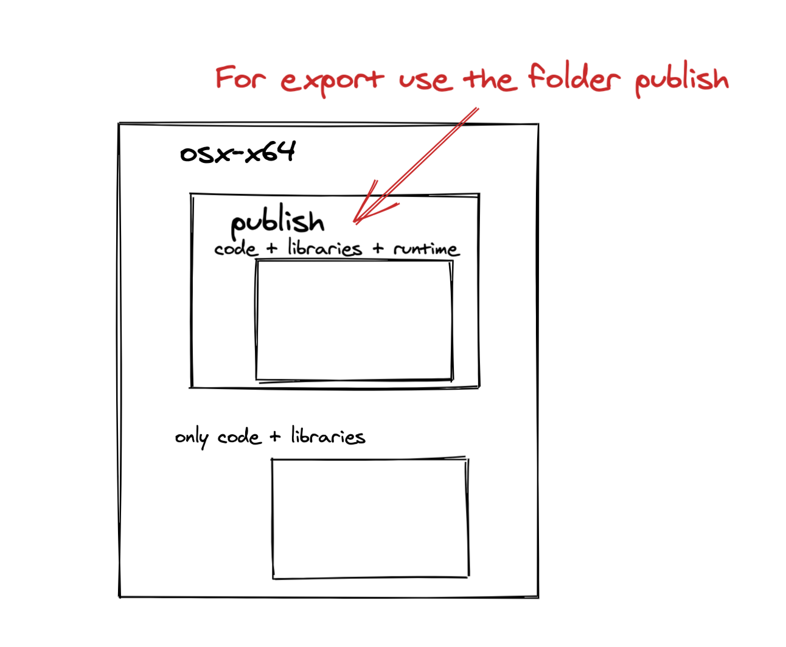
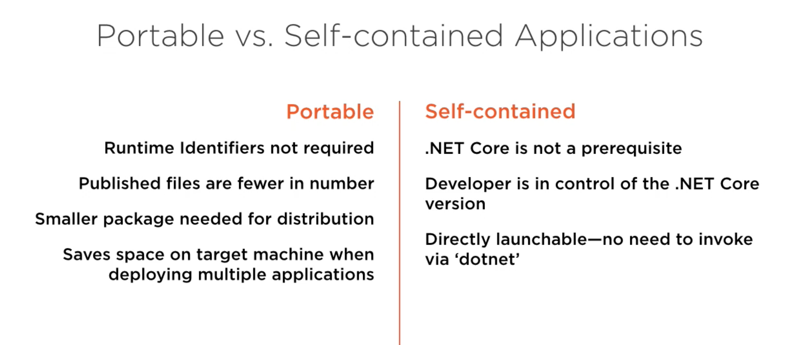

# 11 le déploiement

Le dossier `bin/Debug/netcoreapp3.1` contient des chemin en dur sur la machine :

`dictation-processor.runtimeconfig.dev.json`

```json
{
  "runtimeOptions": {
    "additionalProbingPaths": [
      "/Users/kar/.dotnet/store/|arch|/|tfm|",
      "/Users/kar/.nuget/packages",
      "/usr/local/share/dotnet/sdk/NuGetFallbackFolder"
    ]
  }
}
```

On ne peut donc pas déployer l'application en copiant/collant ce dossier.

## `dotnet publish`

On a une commande pour crée un déploiement :

```bash
🦄 dictation-processor dotnet publish -c Release
Microsoft (R) Build Engine version 16.7.0+7fb82e5b2 for .NET
Copyright (C) Microsoft Corporation. All rights reserved.

  Determining projects to restore...
  All projects are up-to-date for restore.
  dictation-processor -> /Users/kar/Documents/programmation/dotnet/dotnet-mac/dictation-processor/bin/Release/netcoreapp3.1/dictation-processor.dll
  dictation-processor -> /Users/kar/Documents/programmation/dotnet/dotnet-mac/dictation-processor/bin/Release/netcoreapp3.1/publish/
```

`-c Release` optimise le déploiement.



Dans le dossier `publish` on trouve les fichiers pouvant aller sur une autre machine.



L'application obtenu est portable et peut être déployée sur n'importe quelle système pris en charge par `dotnet core`.

Il suffit qu'une version compatible de `.net core` soit installée.

## self contained application

Une application exécutable qui n'a pas besoin qu'une version de `dotnet` soit installé sur la machine ôte.

### `dotnet publish -r`

`-r` pour définir le `runtime`

```bash
🦄 dictation-processor dotnet publish -c Release -r osx.10.15-x64
Microsoft (R) Build Engine version 16.7.0+7fb82e5b2 for .NET
Copyright (C) Microsoft Corporation. All rights reserved.

  Determining projects to restore...
  Restored /Users/kar/Documents/programmation/dotnet/dotnet-mac/dictation-processor/dictation-processor.csproj (in 227 ms).
  dictation-processor -> /Users/kar/Documents/programmation/dotnet/dotnet-mac/dictation-processor/bin/Release/netcoreapp3.1/osx.10.15-x64/dictation-processor.dll
  dictation-processor -> /Users/kar/Documents/programmation/dotnet/dotnet-mac/dictation-processor/bin/Release/netcoreapp3.1/osx.10.15-x64/publish/
```

Le `restore` est automatique.



Je peux cibler la plateforme de `osx` de manière plus générique :

```bash
🦄 dictation-processor dotnet publish -c Release -r osx-x64
```

J'obtiens deux exécutable (en cliquant) :





> Je crois que le dossier `publish` contient le runtime alors que le dossier parent ne le contient pas




