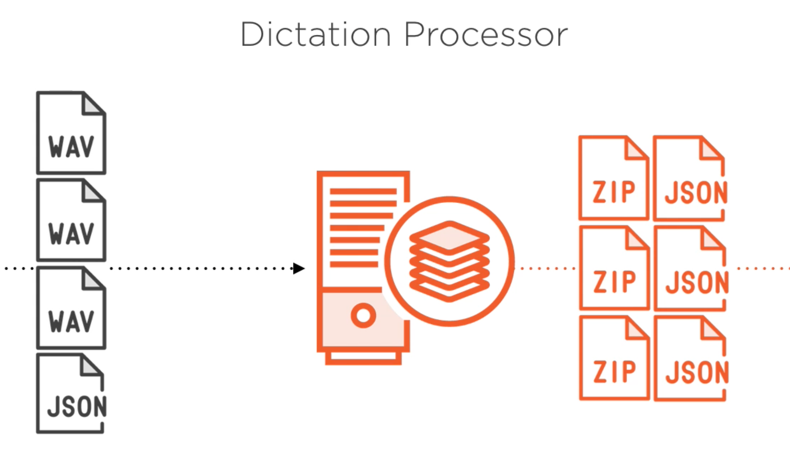
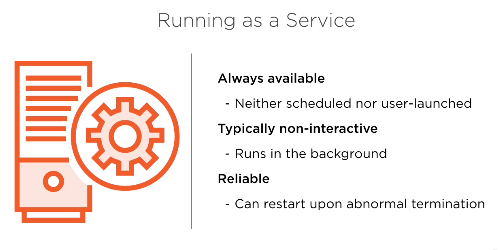
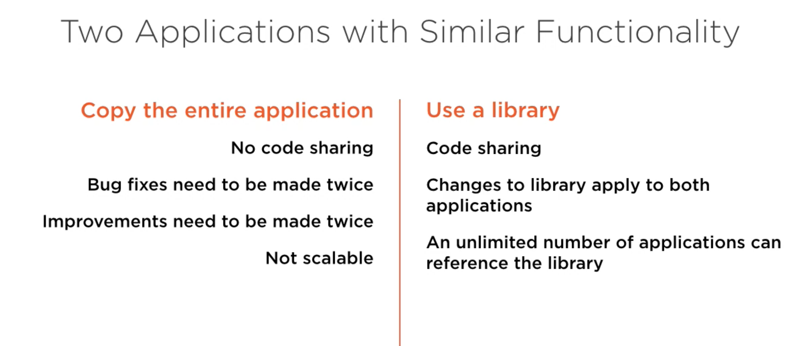
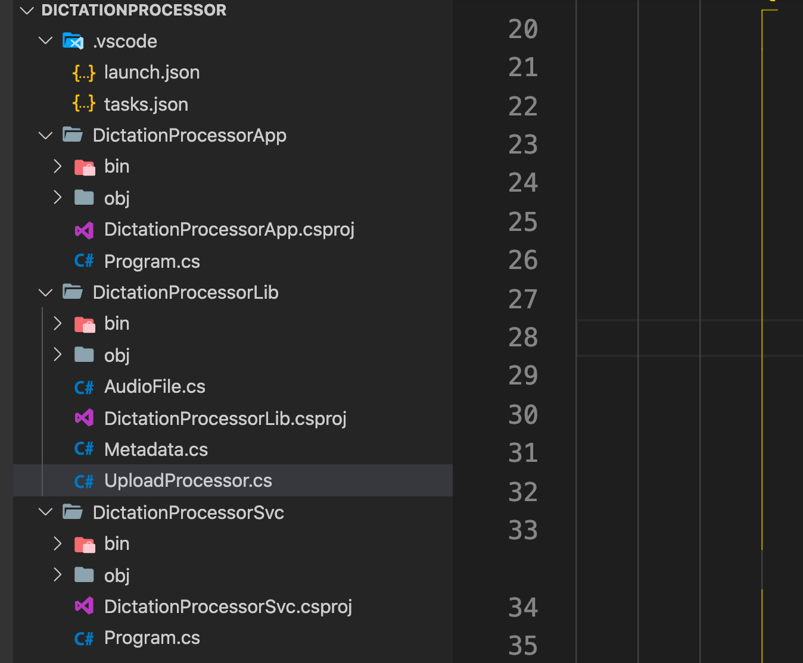

# 12 Services et librairies

## Application actuelle



On veut un service ou `daemon` :



- Toujours disponible
- Tourne en `background`
- Fiable : peut se relancer tout seul en cas de problème

## Library

On veut refaire l'application pour que celle-ci s'exécute automatiquement.

On pourrait copier l'original pour créer notre nouvelle application ou bien utiliser une librairie :



## création de la structure

On crée trois dossier un pour l'`app` un pour le `service` et un pour la `library`.

Pour l'`app` et le `service` on utilise un template de base (`console`) .

Pour la `library` on utilise `classlib`.

```bash
dotnet new console -o ./DictationProcessorApp/

dotnet new console -o ./DictationProcessorSvc/

dotnet new classlib -o ./DictationProcessorLib/
```



## `.net standard`

C'est une spécification qui garantie toute la compatibilité avec les différents projets `.net`.

Dans le projet de librairie :

`DictationProcessorLib.csproj`

```csharp
<Project Sdk="Microsoft.NET.Sdk">

  <PropertyGroup>
    <TargetFramework>netstandard2.0</TargetFramework>
  </PropertyGroup>

</Project>
```

Par défaut le librairie cible `netstandard`.

On doit remanier le code en mettant la logique dans la librairie.
