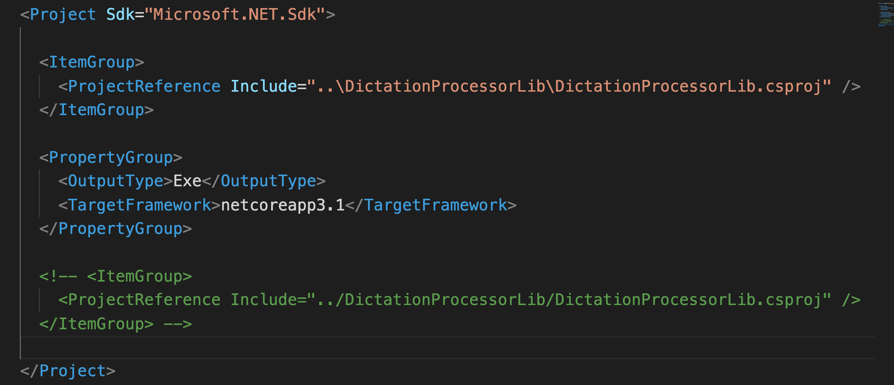

# 13. Références

Pour qu'un projet puisse utiliser les classes d'un autre, il faut lui ajouter une référence.

Dans notre programme on se sert des méthode de la librairie :

`DictationProcessorApp/Program.cs`

```csharp
using System;
using System.IO;
using DictationProcessorLib;

namespace DictationProcessorApp
{
    class Program
    {
        static void Main(string[] args)
        {


            var subfolders = Directory.GetDirectories("/Users/kar/Desktop/uploads");

            // iterer à travers le sous-dossier uploads
            foreach (var subfolder in subfolders)
            {

                UploadProcessor uploadProcessor = new UploadProcessor(subfolder);
                // tout le Main de l'ancien programme est maintenant dans une méthode Process()
                uploadProcessor.Process();

            }
        }
    }
}
```

L'import n'est pas suffisant il faut aussi ajouter une référence à `DictationProcessorApp.csproj`

```csharp
<Project Sdk="Microsoft.NET.Sdk">

  <PropertyGroup>
    <OutputType>Exe</OutputType>
    <TargetFramework>netcoreapp3.1</TargetFramework>
  </PropertyGroup>

  <ItemGroup>
    <ProjectReference Include="../DictationProcessorLib/DictationProcessorLib.csproj" />
  </ItemGroup>

</Project>
```

On peut ajouter la référence grace aussi à la commande `dotnet` :

```bash
🦄 DictationProcessorApp dotnet add reference ../DictationProcessorLib/DictationProcessorLib.csproj
Reference `..\DictationProcessorLib\DictationProcessorLib.csproj` added to the project.
```



On voit que c'est exactement le même code que celui tapé à la main et mis en commentaire.
