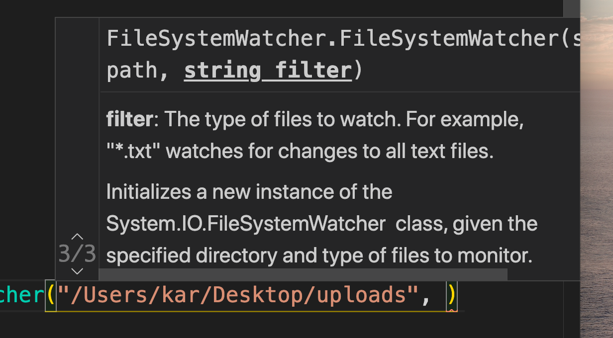
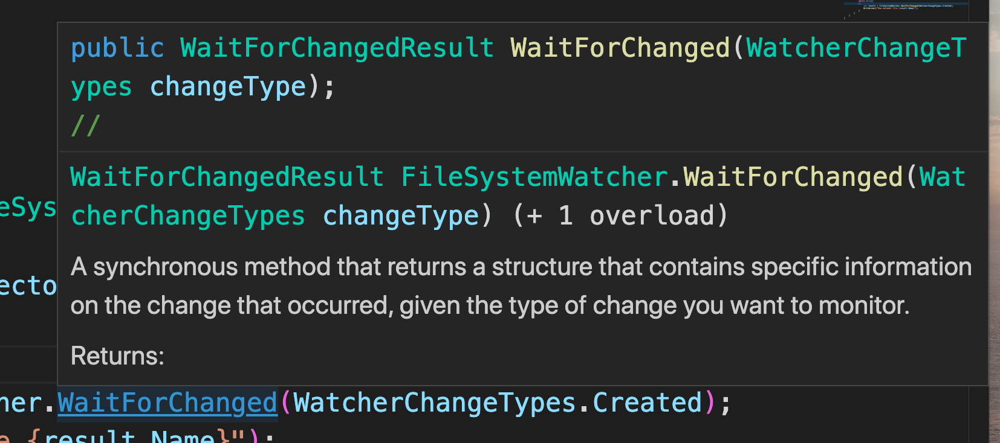
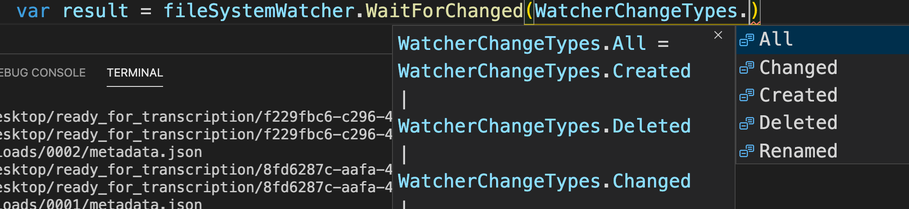

# 14. Service

On ajoute une référence à la librairie dans `DictationProcessorSvc` :

```bash
🦄 DictationProcessorSvc dotnet add reference ../DictationProcessorLib/DictationProcessorLib.csproj
Reference `..\DictationProcessorLib\DictationProcessorLib.csproj` added to the project.
```

`DictationProcessorSvc.csproj`

```csharp
<Project Sdk="Microsoft.NET.Sdk">

  <ItemGroup>
    <ProjectReference Include="..\DictationProcessorLib\DictationProcessorLib.csproj" />
  </ItemGroup>

  <PropertyGroup>
    <OutputType>Exe</OutputType>
    <TargetFramework>netcoreapp3.1</TargetFramework>
  </PropertyGroup>

</Project>
```

```
<ItemGroup>
	<ProjectReference Include="relativePath" />
</ItemGroup>
```

## Utiliser un `watcher` sur le dossier `uploads`

`System.IO` propose une classe `FileSystemWatcher` permettant de savoir si quelque chose a changé dans un dossier.

`DictationProcessorSvc/Program.cs`

```csharp
using System;
using System.IO;
using DictationProcessorLib;
using static System.Console;

namespace DictationProcessorSvc
{
    class Program
    {
        static void Main(string[] args)
        {
            var fileSystemWatcher = new FileSystemWatcher("/Users/kar/Desktop/uploads", "metadata.json");
            fileSystemWatcher.IncludeSubdirectories = true;
            while (true)
            {
                var result = fileSystemWatcher.WaitForChanged(WatcherChangeTypes.Created);
                WriteLine($"New metadat file {result.Name}");
            }
        }
    }
}
```



Le filtre permet de définir quel(s) fichier(s) seront _watché_.

`IncludeSubdirectories` permet d'aller surveiller dans l'arborescence.

### `WaitForChanged`



Cette méthode synchrone renvoie des informations sur le changement surveillé.

Elle prend un type de changement en argument :



Comme la méthode est synchrone elle bloque la boucle `while` tant qu'il n'y a pas de changement.
