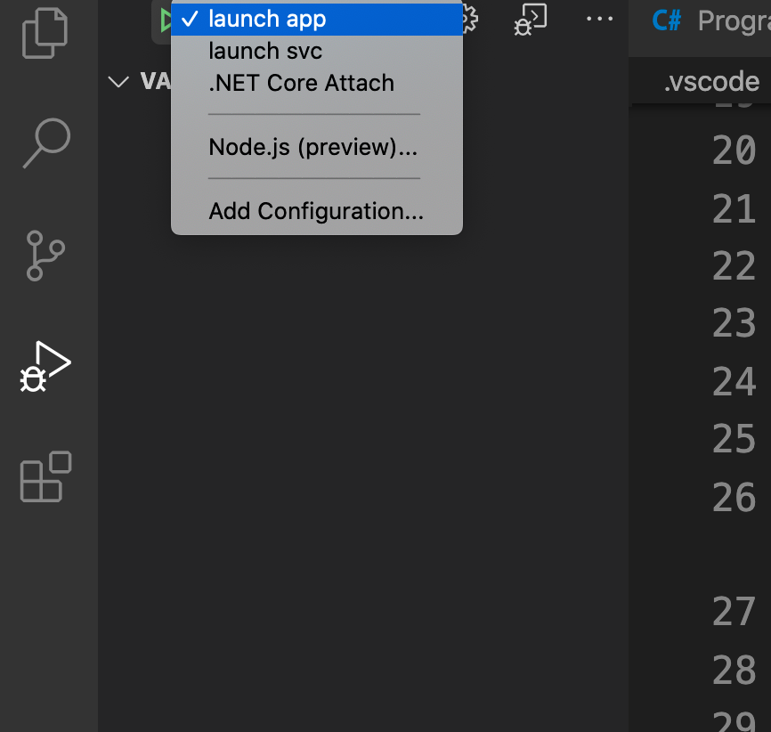
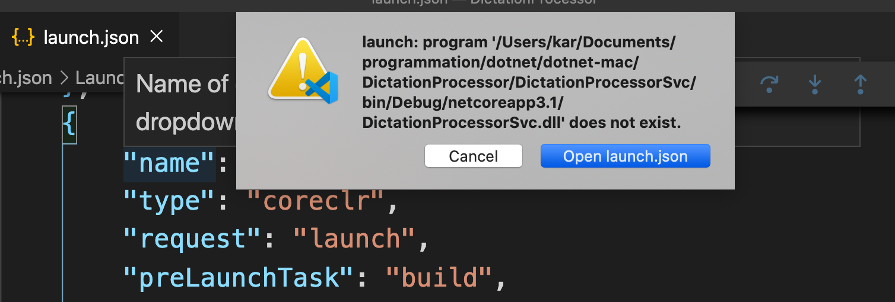
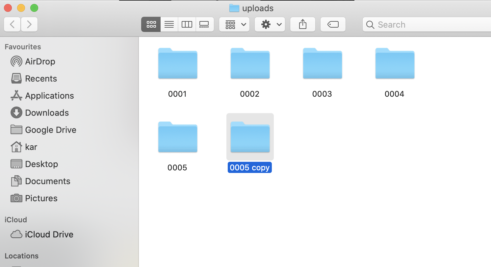
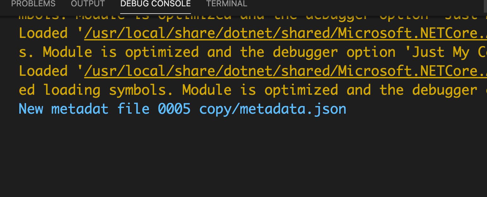

# 15. Configurer le service

## Configurer `launch.json`

```json
{
  // Use IntelliSense to find out which attributes exist for C# debugging
  // Use hover for the description of the existing attributes
  // For further information visit https://github.com/OmniSharp/omnisharp-vscode/blob/master/debugger-launchjson.md
  "version": "0.2.0",
  "configurations": [
    {
      "name": "launch app",
      "type": "coreclr",
      "request": "launch",
      "preLaunchTask": "build",
      // If you have changed target frameworks, make sure to update the program path.
      "program": "${workspaceFolder}/DictationProcessorApp/bin/Debug/netcoreapp3.1/DictationProcessorApp.dll",
      "args": [],
      "cwd": "${workspaceFolder}/DictationProcessorApp",
      // For more information about the 'console' field, see https://aka.ms/VSCode-CS-LaunchJson-Console
      "console": "internalConsole",
      "stopAtEntry": false
    },
    {
      "name": "launch svc",
      "type": "coreclr",
      "request": "launch",
      "preLaunchTask": "build",
      // If you have changed target frameworks, make sure to update the program path.
      "program": "${workspaceFolder}/DictationProcessorSvc/bin/Debug/netcoreapp3.1/DictationProcessorSvc.dll",
      "args": [],
      "cwd": "${workspaceFolder}/DictationProcessorSvc",
      // For more information about the 'console' field, see https://aka.ms/VSCode-CS-LaunchJson-Console
      "console": "internalConsole",
      "stopAtEntry": false
    },
    {
      "name": ".NET Core Attach",
      "type": "coreclr",
      "request": "attach",
      "processId": "${command:pickProcess}"
    }
  ]
}
```

On copie-colle la première configuration, on change les noms pour cibler `DictationProcessorSvc` et on change les noms (`name`).



On a bien nos deux configurations disponibles dans le `Debug`.

Si on lance le service :



On nous dit qu'il n'est pas `build` (pas de `.dll`).

Dans le dossier je lance un `build`.

```bash
🦄 DictationProcessorSvc dotnet build
```

On copie simplement un dossier dans `uploads` pour voire si le service réagit :





C'est OK!

## Lancer le `UploadProcessor`

`DictationProcessorSvc/Program.cs`

```csharp
using System;
using System.IO;
using DictationProcessorLib;
using static System.Console;

namespace DictationProcessorSvc
{
    class Program
    {
        static void Main(string[] args)
        {
            var fileSystemWatcher = new FileSystemWatcher("/Users/kar/Desktop/uploads", "metadata.json");
            fileSystemWatcher.IncludeSubdirectories = true;
            while (true)
            {
                var result = fileSystemWatcher.WaitForChanged(WatcherChangeTypes.Created);
                WriteLine($"New metadata file {result.Name}");
                var fullMetadataFilePath = Path.Combine("/Users/kar/Desktop/uploads", result.Name);
                WriteLine($"full path : {fullMetadataFilePath}");
                var subfolder = Path.GetDirectoryName(fullMetadataFilePath);
                WriteLine($"folder path : {subfolder}");
                var processor = new UploadProcessor(subfolder);
                processor.Process();
            }
        }
    }
}
```

`Path.combine` pour crée un `Path`.

`Path.GetDirectoryName` pour récupérer le nom du dossier.

On copie/colle un dossier pour déclencher la surveillance (`watch`).
