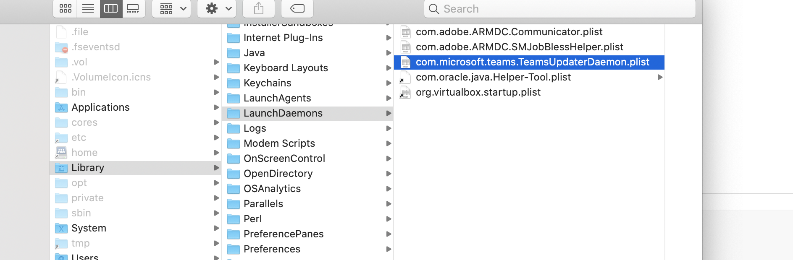
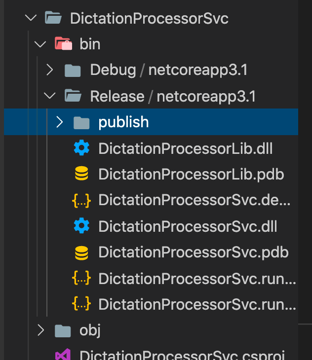
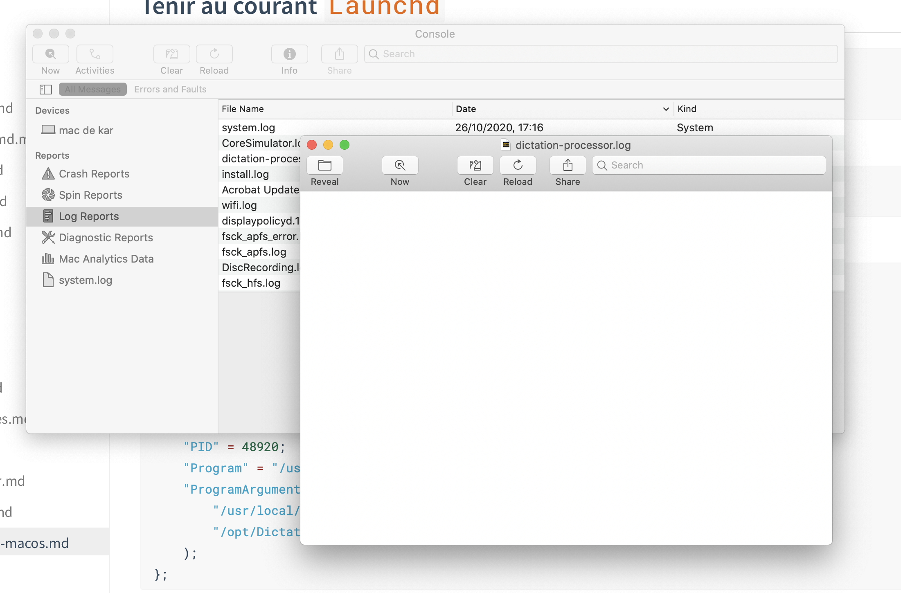
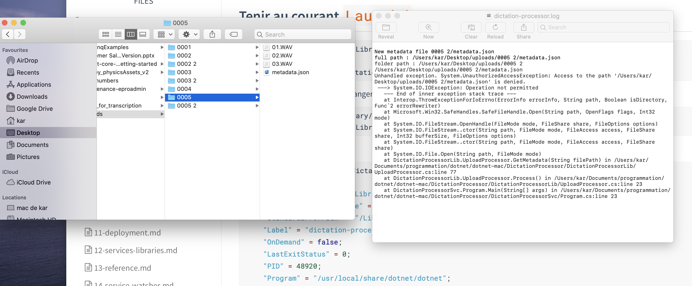

# 16. Faire tourner le service sur `macOS`

`Launchd` est le système qui permet de faire tourner un service en arrière plan sur `macOS`.

## `lauchctl list`

```bash
🦄 ~ launchctl list
PID	Status	Label
-	0	com.apple.SafariHistoryServiceAgent
2768	0	com.apple.progressd
-	0	com.macpaw.CleanMyMac4.HealthMonitor
-	0	com.google.keystone.user.xpcservice
899	0	com.apple.cloudphotod
-	0	abnerworks.Typora.33000
408	0	com.apple.Finder
2785	0	com.apple.homed
# ...
```

## Location des services



### `/Library/LaunchDaemons/`

Il y a aussi des services dans `/library/launchAgents`.

## `.plist`

Ce sont des fichiers formatés en XML

```xml
<?xml version="1.0" encoding="UTF-8"?>
<!DOCTYPE plist PUBLIC "-//Apple//DTD PLIST 1.0//EN" "http://www.apple.com/DTDs/PropertyList-1.0.dtd">
<plist version="1.0">
<dict>
	<key>Label</key>
	<string>com.adobe.ARMDC.SMJobBlessHelper</string>
	<key>MachServices</key>
	<dict>
		<key>com.adobe.ARMDC.SMJobBlessHelper</key>
		<true/>
	</dict>
	<key>ProgramArguments</key>
	<array>
		<string>/Library/PrivilegedHelperTools/com.adobe.ARMDC.SMJobBlessHelper</string>
	</array>
</dict>
</plist>
```

## Remplir le fichier `.plist`

### Obtenir l'adresse de `dotnet`

```bash
🦄 ~ which dotnet
/usr/local/share/dotnet/dotnet
```

### Publier notre service

```bash
🦄 DictationProcessorSvc dotnet publish -c Release
```



Copier `DictationProcessor/DictationProcessorSvc/bin/Release/netcoreapp3.1/publish` dans `/opt` (le système demande l'autorisation).

Le renommer en `DictationProcessorScv`.

> `/opt` est utilisé comme alternative aux dossiers cachés `/usr` et `/lib`. Il est utilisé par des développeurs de logiciels indépendants pour éviter les conflits avec les dossiers système. Si jamais vous utilisez `MacPorts` ou `HomeBrew`, par exemple, les scripts modulaires d'usage courant, les configs, les applications, etc.

```xml
<?xml version="1.0" encoding="UTF-8"?>
<!DOCTYPE plist PUBLIC "-//Apple//DTD PLIST 1.0//EN" "http://www.apple.com/DTDs/PropertyList-1.0.dtd">
<plist version="1.0">
<dict>
	<key>Label</key>
	<string>dictation-processor</string>
	<key>ProgramArguments</key>
	<array>
		<string>/usr/local/share/dotnet/dotnet</string>
		<string>/opt/DictationProcessorSvc/DictationProcessorSvc.dll</string>
	</array>
	<key>KeepAlive</key>
	<true />
	<key>StandardOutPath</key>
	<string>/Library/Logs/dictation-processor.log</string>
	<key>StandardErrorPath</key>
	<string>/Library/Logs/dictation-processor.log</string>

</dict>
</plist>

```

### `<key>Label</key>`

C'est le nom du service.

### `<key>ProgramArguments</key>`

Les élément de la commande. `dotnet monService.dll`

### `<key>KeepAlive</key>`

Informe le système de lancer le service au démarrage et que le service doivent tourner tout le temps.

Les logs doivent être enregistrés dans un fichiers :

### `<key>StandardOutPath</key>` et `<key>StandardErrorPath</key>`

On sauvegarde le fichier sur le bureau puis on le copie dans `/Library/LaunchDaemons` (authentification requise).

## Tenir au courant `Launchd`

```bash
🦄 ~ sudo launchctl load /Library/LaunchDaemons/dictation-processor.plist
Password:
/Library/LaunchDaemons/dictation-processor.plist: Path had bad ownership/permissions
```

Obligation du `sudo`, on doit changer les permissions et le charger de nouveau :

```bash
🦄 ~ sudo chown root /Library/LaunchDaemons/dictation-processor.plist
🦄 ~ sudo launchctl load /Library/LaunchDaemons/dictation-processor.plist
```

On vérifie le service :

```bash
🦄 ~ sudo launchctl list dictation-processor
{
	"StandardOutPath" = "/Library/Logs/dictation-processor.log";
	"LimitLoadToSessionType" = "System";
	"StandardErrorPath" = "/Library/Logs/dictation-processor.log";
	"Label" = "dictation-processor";
	"OnDemand" = false;
	"LastExitStatus" = 0;
	"PID" = 48920;
	"Program" = "/usr/local/share/dotnet/dotnet";
	"ProgramArguments" = (
		"/usr/local/share/dotnet/dotnet";
		"/opt/DictationProcessorSvc/DictationProcessorSvc.dll";
	);
};
```

Sur `mac` on a `console` pour voire les différents `log` :



## On procède à un test

On copie le dossier `uploads/05` et les logs sont écrits automatiquement :



## retirer le service

```bash
🦄 ~ sudo launchctl unload /Library/LaunchDaemons/dictation-processor.plist
```
