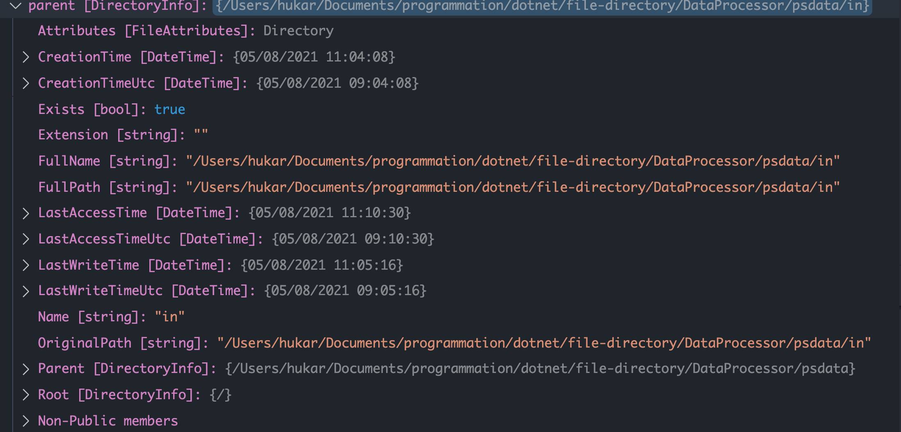

# 01 `Files` et `Directories`

## Mise en place

On crée une `Console App`

```bash
dotnet new console -o DataProcessor
```

On ajoute une classe `FileProcessor`

```cs
using static System.Console;

class FileProcessor
{
  public string InputFilePath { get; set; }
  public  FileProssor(string filePath) => InputFilePath = filePath;
  
  public void Process()
  {
    WriteLine($"Begin process of {InputFilePath}");
  }
}
```

On modifie `Program.cs`

```cs
using System;
using static System.Console;

WriteLine("Parsing command line options");

var command = args[1];

if(command == "--file")
{
	var filePath = args[2];
  WriteLine($"Single file {filePath} selected");
  ProcessSingleFile(filePath);
}
else if(command == "--directory")
{
	var directoryPath = args[2];
  var fileType = args[3];
  WriteLine("Directory {DirectoryPath} selected for {fileType} files");
  ProcessDirectory(directoryPath, fileType);
}
else{
    WriteLine("Invalid command line option")
}
```

> Dans la nouvelle syntaxe des `Console App`, on a accès aux agurments de la commande grace à la variable fournie : `args`.

```cs
void ProcessSingleFile(string filePath)
{
	var fileProcessor = new FileProcessor(filePath);
  fileProcessor.Process();
}
```

```cs
void ProcessDirectory(string directoryPath, string fileType)
{
	
}
```


## Vérifier l'existence d'un fichier `File.Exists`

```cs
public void Process()
{
  WriteLine($"Begin process of {InputFilePath}");
  
  // check if file exists
  if(!File.Exists(InputFilePath))
  {
    WriteLine($"ERROR: file {InputFilePath} does not exist.");
    return;
  }
  
}
```

On utilise `System.IO` :

```cs
using System.IO;
```


## Vérifier si le chemin est absolu `Path.IsPathFullyQualified`

```cs
if (command == "--file")
{
    var filePath = args[2];
  // check if path is absolute
  if(!Path.IsPathFullyQualified(filePath))
  {
    WriteLine($"ERROR: path '{filePath}' must be fully qualified");
    ReadLine();
    return;
  }
  
    WriteLine($"Single file {filePath} selected");
    ProcessSingleFile(filePath);
}
```


## Obtenir le dossier parent

```cs
public void Process()
{
  WriteLine($"Begin process of {InputFilePath}");

  // check if file exists
  if (!File.Exists(InputFilePath))
  {
    WriteLine($"ERROR: file {InputFilePath} does not exist.");
    return;
  }
  
  string rootDirectoryPath = new DirectoryInfo(InputFilePath).Parent.FullName;
  WriteLine($"Root data path is {rootDirectoryPath}");
}
```

`new DirectoryInfo(path).Parent` renvoie un `DirectoryInfo` sur lequel on peut obtenir la propriété `FullName`.

Voilà un `DirectoryInfo` :




