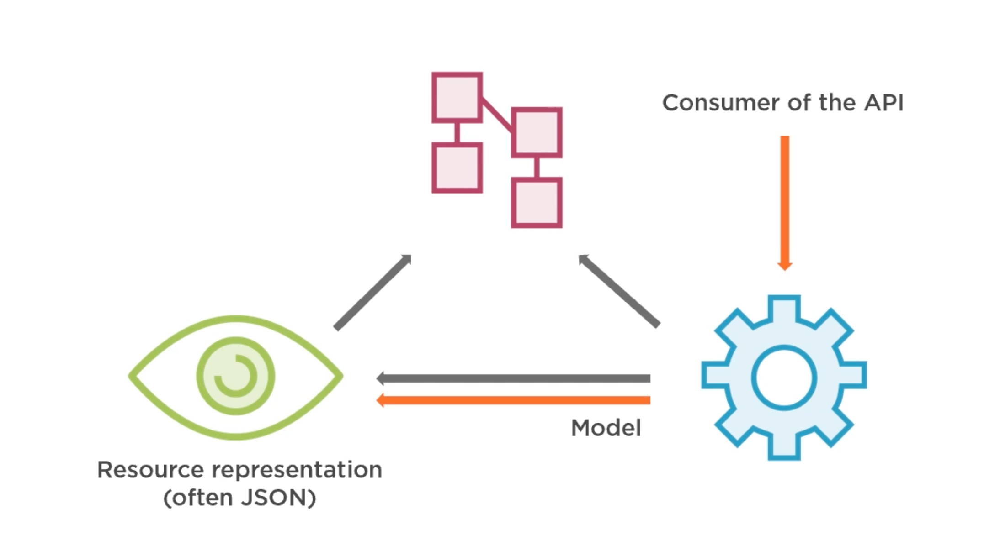
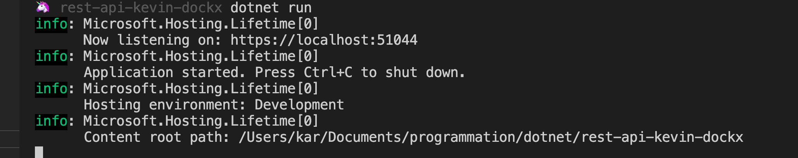

# 01 Premiers pas avec `.net core`

# Créer son projet

## Utilisation du MVC pattern



On va partir sur un template api

```bash
dotnet new webapi
```

## `Program.cs`

C'est le point d'entrée.

On y crée le serveur web et on le lance.

Le web server va utiliser `Startup`.

```csharp
public class Program
{
    public static void Main(string[] args)
    {
        CreateHostBuilder(args).Build().Run();
    }

    public static IHostBuilder CreateHostBuilder(string[] args) =>
        Host.CreateDefaultBuilder(args)
        .ConfigureWebHostDefaults(webBuilder =>
         {
         	webBuilder.UseStartup<Startup>();
         });

}
```

## `Startup.cs`

Le fichier `appsettings.json` est injecté dans le constructeur.

On configure les services.

On configure le pipe line avec les middleware (`UseSomething()`).

```csharp
public class Startup
{
    public Startup(IConfiguration configuration)
    {
        Configuration = configuration;
    }

    public IConfiguration Configuration { get; }

    // This method gets called by the runtime. Use this method to add services to the container.
    public void ConfigureServices(IServiceCollection services)
    {
        services.AddControllers();
    }

    // This method gets called by the runtime. Use this method to configure the HTTP request pipeline.
    public void Configure(IApplicationBuilder app, IWebHostEnvironment env)
    {
        if (env.IsDevelopment())
        {
            app.UseDeveloperExceptionPage();
        }

        app.UseRouting();

        app.UseAuthorization();

        app.UseEndpoints(endpoints =>
        {
             endpoints.MapControllers();
         });
    }
}
```

Chaque requête passe à travers les `middleware` dans l'ordre du code (l'ordre est important).

Chaque `middleware` peut potentiellement court-circuité la requête.

## Réglage du projet `Properties/launchSettings.json`

Avant :

```json
{
  // ...
    },
    "webapi": {
      "commandName": "Project",
      "launchBrowser": true,
      "launchUrl": "weatherforecast",
      "applicationUrl": "https://localhost:5001;http://localhost:5000",
      "environmentVariables": {
        "ASPNETCORE_ENVIRONMENT": "Development"
      }
    }
  }
}
```

après :

```json
"webapi": {
    "commandName": "Project",
    "launchBrowser": false,
    "launchUrl": "",
    "applicationUrl": "https://localhost:51044",
    "environmentVariables": {
        "ASPNETCORE_ENVIRONMENT": "Development"
    }
}
```

On ne lance pas le navigateur, on enlève `weatherforecat` de l'`url` et on met le port à `51044` pour être raccord avec les requête de Postman (fournies avec le cours).


