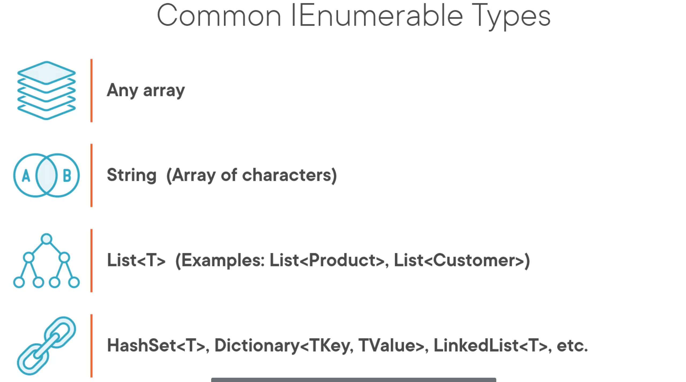

# 01 Language Integrated Query : `LINQ`

`Linq` fonctionne sur les objets implémentant le type `IEnumerable`.

## `SQL` syntax

On peut utiliser `linq` dans un style proche du `SQL`

Voici un tableau montrant les deux syntaxe `SQL` classique et `SQL` `LINQ` :

| SQL                                              | LINQ                                                         |
| ------------------------------------------------ | ------------------------------------------------------------ |
| SELECT * FROM Products                           | from prod in Products select prod                       |
| SELECT Name FROM Products                        | from prod in Products select Prod.Name                  |
| SELECT * FROM Products WHERE ListPrice > 10 | from prod in Products where prod.ListPrice > 10 select prod |

`Linq` possède deux types de syntaxe : `Query` (proche du `SQL`) et `Method` :

| Query                                                        | Method                                                       |
| ------------------------------------------------------------ | ------------------------------------------------------------ |
| from prod in Products select prod                       | Products.Select(prod => prod)                                |
| from prod in Products select prod.Name                  | Products.Select(prod => prod.Name)                           |
| from prod in Products where prod.ListPrice > 10 select prod | Products .Where(prod => prod.ListPrice > 10) .select(prod => prod) |

## `Linq` opérations

- `Select`
- Projection (change la forme)
- Ordonner ascending/descending
- Récupérer un élément (`Get`) `Find` `First` `Last` `Single`
- Filtrer `Where`
- Itérer / partitionner `ForEach` `Skip` `Take`
- Quantifier `Any` `All` `Contains`
- Set Comparaison `Equal` `Except` `Intersection`
- Set Opérations `Union` `Concat`
- Joindre `inner joins` `outer joins`
- Grouper `GroupBy` `subquery` `groupjoin`
- Distinct Sets `distinct`
- Aggregation `count` `sum` `min` `max` `average`

## Utiliser `Linq`

`Linq` crée des méthodes d'extension pour les objets `Enumerable` et `Queryable`.

`Linq` peut s'utiliser avec différents objets :

### `Linq` intégration

`Linq` est intégré avec d'autres technologies pour être utilisé avec `XML` ou `Entity Framework` :

