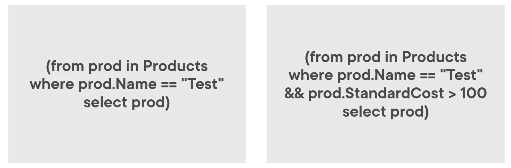
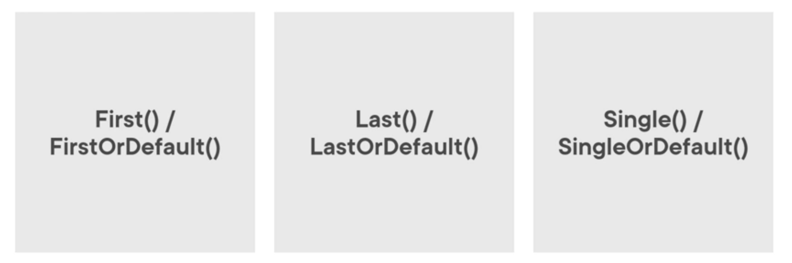

# 03 Filtrer les données

On va utiliser la clause `Where`.

On va aussi utiliser les méthodes :

- `Fist()` / `FirstOrDefault()`
- `Last()` / `LastOrDefault()`
- `Single` / `SingleOrDefault()`


## `Where`

Permet de retrouver un ou plusieurs éléments.



> ### `StartWith`
>
> 

```cs
string search = "L";
```

```cs
// Query Syntax 
Products = (from prod in Products
            where prod.Name.StartsWith(search)
            select prod).ToList();
```

```cs
// Method Syntax
Products = Products.Where(p => p.Name.StartsWith(search)).ToList();
```

Pas besoin de `Select` avec la syntaxe `Method`.

## `Where` sur plusieurs champs : `&&`

On utilise simplement le `&&` de `c#`.

```cs
// Query Syntax
Products = (from prod in Products
            where prod.Name.StartsWith(search) && prod.StandardCost > cost
            select prod).ToList();
```

```cs
// Method Syntax
Products = Products.Where(p => p.Name.StartsWith(search) && p.StandardCost > cost).ToList();
```


## `Linq` et les méthodes d'extension

En `c#` il n'y a pas de différence entre appeler une méthode de classe ou une méthode d'extension.

`Linq` est en fait une collection de méthodes d'extension pour le type `IEnumerable`.

Les méthodes d'extension sont `static` mais elles sont appelées par une `instance`.

> ### Méthode d'extension
> ```cs
> static class MyMethodExtensionClass
> {
>     public static TypeA DoSomething(this TypeB tB)
>     {
>         // ...
>     }
> }
> ```
>
> `tB` joue le rôle de `this` dans le scope de la méthode.
>
> `TypeB` étant le type sur lequel la méthode d'extension peut s'appliquer.

### Exemple :

```cs
public static class ProductHelper
{
    public static IEnumerable<Product> ByColor(this IEnumerable<Product> query, string color)
    {
        return query.Where(prod => prod.Color == color);
    }
}
```

```cs
// Query Syntax
Products = (from prod in Products
            select prod).ByColor(search).ToList();
```

```cs
// Method Syntax
Products = Products.ByColor(search).ToList();
```


## Sélectionner un seul élément



### On doit intercepter les `exceptions`

Pour `First()` `Last()` `Single()` et `SingleOrDefault()` on doit intercepter les `exceptions` si la requête ne trouve pas d'élément (ou plus que `un` pour `Single`).

Les autres méthodes `FirstOrDefault()` et `LastOrDefault()` renvoient `null`.


## `First()`

```cs
try
{
    if (UseQuerySyntax)
    {
        // Query Syntax
        value = (from p in Products
                 select p).First(p => p.Color == search);
    }
    else
    {
        // Method Syntax
        value = Products.First(p => p.Color == search);

    }

    ResultText = $"Found: {value}";
}
catch
{
    ResultText = "Not Found";
}
```

La méthode `First()` doit être mise entre `try/catch`.

Elle retourne le premier élément trouvé même s'il y en a plusieurs.

Si elle ne trouve pas d'élément, elle lance une `exception`.


## `FirstOrDefault`

```cs
if (UseQuerySyntax)
{
    // Query Syntax
    value = (from p in Products
             select p).FirstOrDefault(p => p.Color == search);

}
else
{
    // Method Syntax
    value = Products.FirstOrDefault(p => p.Color == search);

}

if (value == null)
{
    ResultText = "Not Found";
}
else
{
    ResultText = $"Found: {value}";
}
```

`FisrtOrDefault` ne lance pas d'`exception`, mais renvoie `null` si elle ne trouve rien.


## `Last` 

Recherche à partir de la fin de la collection.

```cs
try
{
    if (UseQuerySyntax)
    {
        // Query Syntax
        value = (from p in Products select p).Last(p => p.Color == search);
    }
    else
    {
        // Method Syntax
        value = Products.Last(p => p.Color == search);
    }

    ResultText = $"Found: {value}";
}
catch
{
    ResultText = "Not Found";
}
```

De nouveau nécessité d'utiliser un bloc `try and catch` avec `Last()`.


##  `LastOrDefault`

Recherche à partir de la fin de la collection.

```cs
if (UseQuerySyntax)
{
    // Query Syntax
    value = (from p in Products select p).LastOrDefault(p => p.Color == search);
}
else
{
    // Method Syntax
    value = Products.LastOrDefault(p => p.Color == search);
}

if (value == null)
{
    ResultText = "Not Found";
}
else
{
    ResultText = $"Found: {value}";
}
```

`LastOrDefault` renvoie `null` s'il ne trouve rien.


## `Single()`

Lance une `exception` s'il ne trouve rien ou plusieurs éléments.

Ideal pour rechercher par `ID`.

```cs
try
{
    if (UseQuerySyntax)
    {
        // Query Syntax
        value = (from p in Products select p).Single(p => p.ProductID == search);
    }
    else
    {
        // Method Syntax
        value = Products.Single(p => p.ProductID == search);
    }

    ResultText = $"Found: {value}";
}
catch
{
    ResultText = "Not Found, or multiple elements found";
}
```

 

## `SingleOrDefault`

Renvoie `null` s'il ne trouve pas et lance une `exception` s'il y a plusieurs éléments.

```cs
try
{
    if (UseQuerySyntax)
    {
        // Query Syntax
        value = (from p in Products select p).SingleOrDefault(p => p.Color == search);
    }
    else
    {
        // Method Syntax
        value = Products.SingleOrDefault(p => p.Color == search);
    }

    if (value == null)
    {
        ResultText = "Not Found";
    }
    else
    {
        ResultText = $"Found: {value}";
    }
}
catch
{
    ResultText = "Multiple elements found";
}
```

