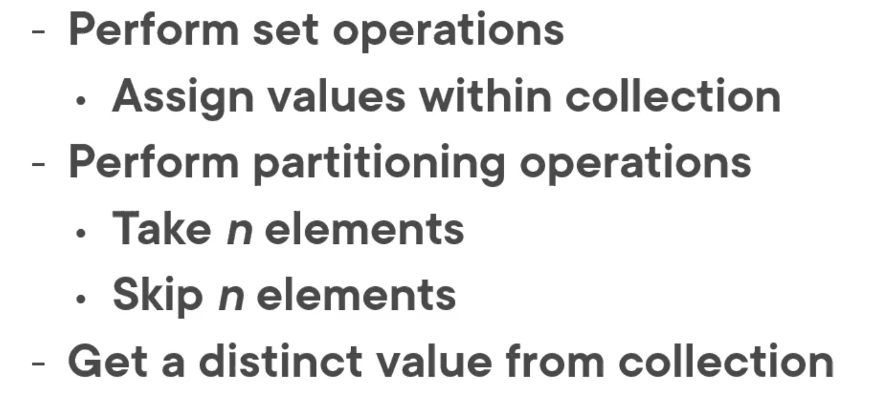
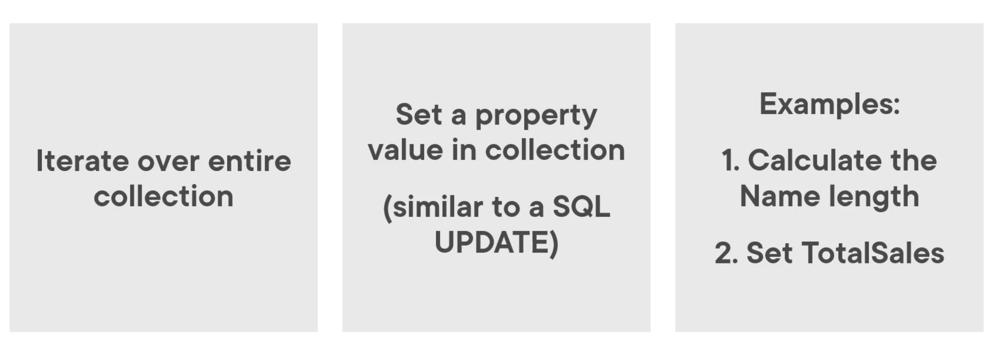

# 04 Extraire des données distinctes, assigner des valeur et partionner des collections



## `Set` opérations




## `ForEach`

```cs
// Query Syntax
Products = (from p in Products
            let tmp = p.NameLength = p.Name.Length
            select p).ToList();
```

```cs
// Method Syntax
Products.ForEach(p => p.NameLength = p.Name.Length);
```

#### ! il faut utiliser une variable temporaire avec `let tmp` dans la version `Query Syntax`

#### ! `ForEach` modifie la liste sur laquelle il est appliqué.


### Avec une méthode

On crée une méthode qui calcule la somme des ventes pour un produit

```cs
public decimal SalesForProduct(Product prod)
{
    return Sales.Where(sale => sale.ProductID == prod.ProductID)
        .Sum(sale => sale.LineTotal);
}
```

`Sum` est une méthode d'agrégation.

```cs
// Query Syntax
Products = (from p in Products
            let tmp = p.TotalSales = SalesForProduct(p)
            select p).ToList();
```

```cs
// Method Syntax
Products.ForEach(p => p.TotalSales = SalesForProduct(p));
```


## `Take`

Prend un certain nombre d'éléments d'une collection depuis le début.

Équivalent de `SELECT TOP` en `SQL`. 

```cs
// Query Syntax
Products = (from p in Products
            orderby p.Name
            select p).Take(5).ToList();
```

```cs
// Method Syntax
Products = Products.OrderBy(p => p.Name).Take(6).ToList();
```


## `TakeWhile`

Prend un certain nombre d'éléments tant qu'une certaine condition reste vrai.

```cs
// Query Syntax
Products = (from p in Products
            orderby p.Name
            select p).TakeWhile(p => p.Name.StartsWith("A")).ToList();
```

```cs
// Method Syntax
Products = Products.OrderBy(p => p.Name).TakeWhile(p => p.Name.StartsWith("A")).ToList();
```


## `Skip`

Saute un certain nombre d'éléments en partant du début.

```cs
// Query Syntax
Products = (from p in Products
            orderby p.Name
            select p).Skip(22).ToList();
```

```cs
// Method Syntax
Products = Products.OrderBy(p => p.Name).Skip(24).ToList();
```


## `SkipWhile`

Saute un certain nombre d'élément tant qu'une certaine condition est vrai.

```cs
// Query Syntax
Products = (from p in Products
            orderby p.Name
            select p).SkipWhile(p => p.Name.StartsWith("A")).ToList();
```

```cs
// Method Syntax
Products = Products.OrderBy(p => p.Name).SkipWhile(p => p.Name.StartsWith("A")).ToList();
```


## `Distinct`

Élimine les doublons de la liste obtenue.

```cs
// Query Syntax
colors = (from p in Products
          select p.Color).Distinct().ToList();
```

```cs
// Method Syntax
colors = Products.Select(p => p.Color).Distinct().ToList();
```

