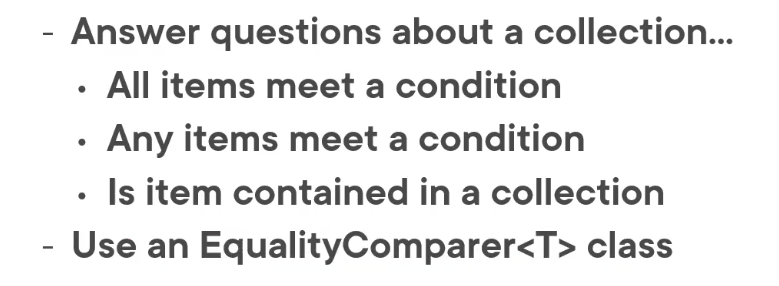

# 05 Identifier les données dans une collection



- Est-ce que tous les éléments répondent à une condition
- Est-ce que certain éléments répondent à une condition
- Est-ce qu'un élément est contenu dans une collection


## `All`

Détermine si `tous` les éléments correspondent à la condition.

La méthode `All` prend un `Predicat` en paramètre renvoie un `bool`.

```cs
Products.All(predicate);

Products.All(prod => prod.Name.Contains(" "));
```

Est-ce que tous les produits contiennent un `espace` ?

### Exemple

```cs
// Query Syntax
value = (from p in Products
         select p).All(p => p.Name.Contains(search));
```

```csharp
// Method Syntax
value = Products.All(p => p.Name.Contains(search));
```


## `Any`

Détermine si `certain` éléments correspondent à la condition.

```cs
Products.Any(prod => prod.Name.Contains("Z"));
```

Est-ce que certain éléments contiennent la lettre `"Z"` ?

```cs
Products.Any();
```

Y-a-t-il au moins un produit ?

### Exemple

```cs
// Query Syntax
value = (from p in Products
         select p).Any(p => p.Name.Contains(search));
```

```cs
// Method Syntax
value = Products.Any(p => p.Name.Contains(search));
```


## Linq `Contains`


- Différent du `string.Contains`
- Recherche dans une collection si une valeur existe
- Ne fonctionne que pour les types simples `int`, `decimal`, `string` ...

La méthode `Contains` renvoie un `boolean`.

```cs
// Query Syntax
value = (from nb in numbers
         select nb).Contains(3);
```

```cs
// Method Syntax
value = numbers.Contains(3);
```


## Linq `Contains` avec des valeur objet

Par défaut `Contains` compare les références des objets.

Le plus souvent on voudrait comparer sur la valeurs de certaines propriétés.

On a besoin pour ça de créer une classe `EqualityComparer<T>`.

```cs
public class ProductIdComparer : EqualityComparer<Product>
{
    public override bool Equals(Product x, Product y) => x.ProductId == y.ProductId;
    public override int GetHashCode(Product obj) => obj.ProductId.GetHashCode();
}
```

### Exemple

On doit instancier un `ProcuctIdComparer` et un un produit à rechercher :

```cs
ProductIdComparer pc = new ProductIdComparer();
Product proToFind = new Product { ProductId = search };
```

On utilise ensuite ces deux objets avec `Contains` :

```cs
// Query Syntax
value = (from p in Products
         select p).Contains(prodToFind, pc);
```

```cs
// Method Syntax
value = Products.Contains(prodToFind, pc);
```


