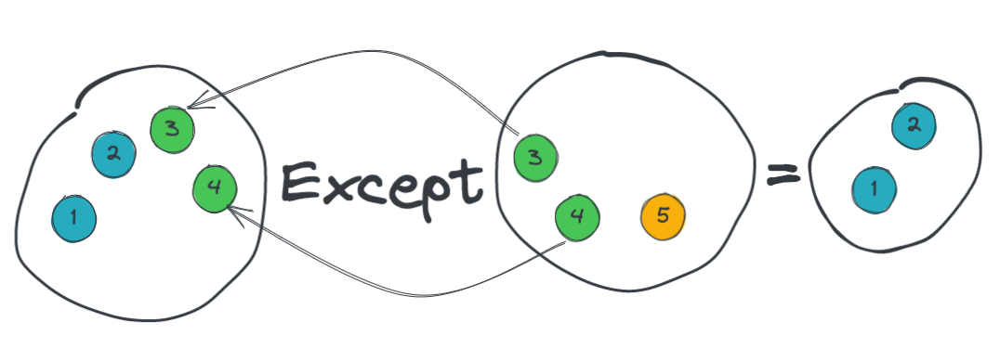

# 06 Comparer et Unir deux collections

## `SequenceEqual`

- Compare deux collections pour voire si elle sont égales
- Avec des données simple (`int`, `string`, `decimal`), il vérifie les valeurs.
- Avec des objets il compare les références
- On peut utiliser une `Comparer class` pour comparer la valeur des propriétés entre elles.


### Par valeur

```cs
bool value;
List<int> list1 = new List<int> { 1, 2, 3, 4 };
List<int> list2 = new List<int> { 1, 2, 3, 4 };
```

```cs
// Query syntax
value = (from nb in list1
        select nb).SequenceEqual(list2);
```

```cs
value = list1.SequenceEqual(list2);
```


### Par référence

```cs
bool value = true;
// Create a list of products
List<Product> list1 = new()
{
    new() { ProductID = 1, Name = "Product 1" },
    new() { ProductID = 2, Name = "Product 2" },
};
// Create a list of products
List<Product> list2 = new()
{
    new() { ProductID = 1, Name = "Product 1" },
    new() { ProductID = 2, Name = "Product 2" },
};
```

```cs
// Query Syntax
value = (from p in list1 select p).SequenceEqual(list2);
```

```cs
// Method Syntax
value = list1.SequenceEqual(list2);
```


## `SequenceEqual` avec une `Comparer class`

```cs
public class ProductComparer : EqualityComparer<Product>
{
    public override bool Equals(Product x, product y)
    {
        return (x.ProductID == y.ProductID &&
               x.Name == y.Name &&
               x.Color == y.Color &&
               x.Size == y.Size &&
               // ...
               );
    }
    
    public override int GetHashCode(Product prod) => prod.ProductID.GetHashCode();
}
```

```cs
bool value;
ProductComparer pc = new ProductComparer();
List<Product> list1 = ProductRepository.GetAll();
List<Product> list2 = ProductRepository.GetAll();

// Retirer un élément à list1 rend les listes non égales
list1.RemoveAt(0);
```

```csharp
// Query Syntax
value = (from p in list1 select p).SequenceEqual(list2, pc);
```

```cs
// Method Syntax
value = list1.SequenceEqual(list2, pc);
```


## `Except`

Trouve toutes les valeurs dans une liste mais pas dans l'autre.

- Données Simples : regarde la valeur.
- Objects : regarde la référence.
- On peut utiliser une `Comparer class` pour regarder la valeur des propriétés.

```cs
List<int> exceptions;
List<int> list1 = new List<int> { 1, 2, 3, 4 };
List<int< list2 = new List<int> { 2, 4, 5 };
```

```cs
// Query Syntax
exceptions = (from nb in list1 select nb).Except(list2).ToList();
```

```cs
// Method Syntax
exceptions = list1.Except(list2).ToList();
```

```
number: 1
number: 2
```



`1` et `2` sont dans la liste `list1` mais pas dans la liste `list2`.


### Avec la `Comparer class`

```cs
ProductComparer pc = new();
List<Product> list1 = ProductRepository.GetAll();
List<Product> list2 = ProductRepository.GetAll();

// On retire tous les produits avec la couleur 'Black'
list2.RemoveAll(p => p.Color == "Black");
```

```cs
// Query Syntax
Products = (from p in list1 select p).Except(list2, pc).ToList();
```

```cs
// Method Syntax
Products = list1.Except(list2, pc).ToList();
```

On va donc récupérer les produits de couleur `Black`, car ils sont dans la liste `list1` et ils ne sont pas dans la liste `list2`.


## `Intersect`

Trouve les valeur en commun entre deux listes.

- Données simples : regarde la valeur.
- Objets : regarde la référence.
- Utilisation de `Comparer class` pour regarder la valeur des propriété.

On va directement faire un exemple avec la `Comparer class` :

```cs
ProductComparer pc = new();
List<Product> list1 = ProductRepository.GetAll();
List<Product> list2 = ProductRepository.GetAll();

list1.RemoveAll(p => p.Color == "Black");
list2.RemoveAll(p => p.Color == "Red");
```

```cs
// Query Syntax
Products = (from p in Products select p).Intersect(list2, pc).ToList();
```

```cs
// Method Syntax
Products = list1.Intersect(list2, pc).ToList();
```

On obtient tous les produits ni `"Black"` et ni `"Red"`.


## `Unions` : `Union` et `Concat`

Met les contenus de deux listes ensemble.

`Union` vérifie les doubles.

`Concat` ne les vérifie pas.

On doit utiliser une `Comparer class`.

```cs
ProductComparer pc = new();
List<Product> list1 = ProductRepository.GetAll();
List<Product> list2 = ProductRepository.GetAll();
```

 ```cs
 // Query Syntax
 Products = (from p in Products select p)
     .Union(list2, pc)
     .OrderBy(p => p.Name).ToList();
 ```

```cs
// Method Syntax
Products = list1.Union(list2, pc).OrderBy(p => p.Name).ToList();
```

On trouve `40` produits, les doubles ne sont pas ajoutés.

### Avec `Concat`

Par définition `Concat` ajoute les éléments d'une liste à une autre.

Il n'y a donc pas à utiliser la `Comparer class`.

```cs
// Query Syntax
Products = (from p in list1 select p)
    .Concat(list2)
    .OrderBy(p => p.Name).ToList();
```

```cs
// Method Syntax
Products = list1.Concat(list2).OrderBy(p => p.Name).ToList();
```


