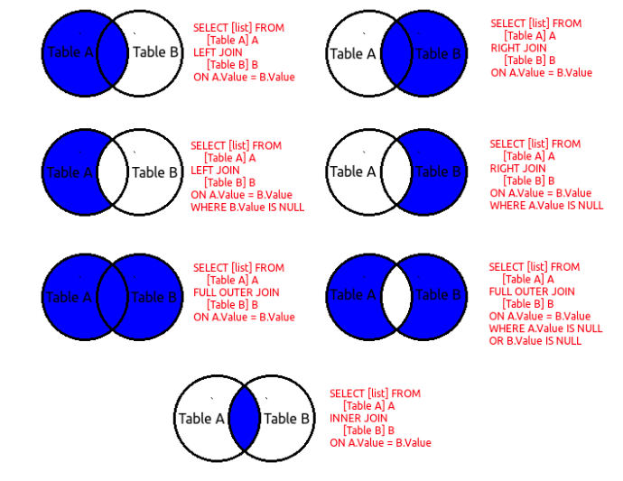
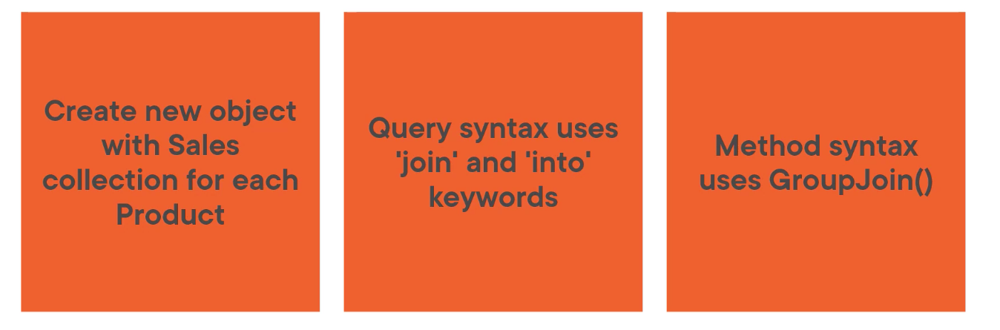
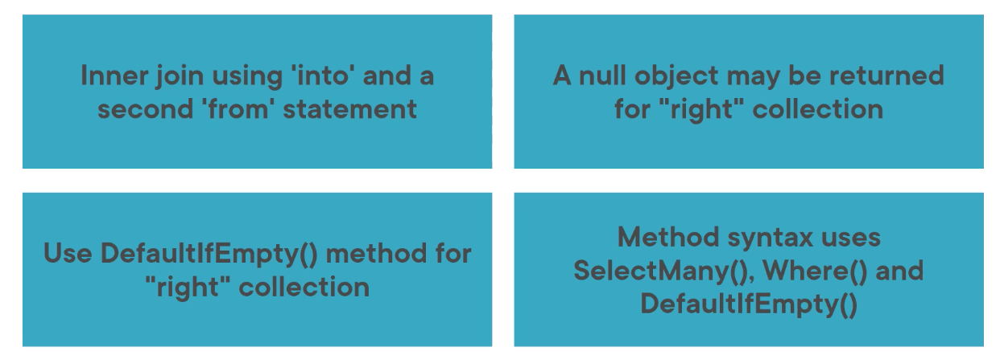

# 07 `Join`

- effectuer un `Equijoin` (`inner join`) entre les collections
- Créer une relation `one-to-many` avec `group join`
- Simuler un `left outer join`





## `Equijoin` / `Inner Join`

Ne prend que l'intersection.

En `SQl` un `Equijoin` s'appelle `Inner Join`.

Il faut deux ou plus collections.

Au moins une propriété dans chaque collections doit partager une valeur égale.

```cs
// Query Syntax
var query = (from p in Products
            join s in Sales
            on p.ProductID equals s.ProductID
            select new {
                p.ProductID,
                p.Name,
                p.Color,
                p.StandardCost,
                p.ListPrice,
                p.Size,
                s.SalesOrderID,
                s.OrderQty,
                s.UnitPrice,
                s.LineTotal
            });
```

```cs
// Method Syntax
var query = Products.Join(Sales, p => p.ProductID, s => s.ProductID, 
                          (p, s) => new
                          {
                              p.ProductID,
                              p.Name,
                              p.Color,
                              p.StandardCost,
                              p.ListPrice,
                              p.Size,
                              s.SalesOrderID,
                              s.OrderQty,
                              s.UnitPrice,
                              s.LineTotal
                          });
```

On a `25` résultats qui correspondent au `Join`.


## `Inner Join` avec deux champs

Si on a plus d'une propriété pour le `Join`, on utilise des objets anonymes.

```cs
short qty = 6;
```

```cs
// Query Syntax
var query = (from p in Products
             join s in Sales
             on 
             new { p.ProductID, Qty = qty }
             equals
             new { S.ProductID, Qty = s.OrderQty }
             select new          
             {
                 p.ProductID,
                 p.Name,
                 p.Color,
                 p.StandardCost,
                 p.ListPrice,
                 p.Size,
                 s.SalesOrderID,
                 s.OrderQty,
                 s.UnitPrice,
                 s.LineTotal
             })
```

```cs
// Method Syntax
var query = Products.Join(Sales,
                          p => new { p.ProductID, Qty = qty },
                          s => new {s.ProductID, Qty = s.OrderQty },
                          (p, s) => new
                          {
                              p.ProductID,
                              p.Name,
                              p.Color,
                              p.StandardCost,
                              p.ListPrice,
                              p.Size,
                              s.SalesOrderID,
                              s.OrderQty,
                              s.UnitPrice,
                              s.LineTotal
                          })
```

Ici que `2` résultats.


## `GroupJoin` => `One To Many`



- Créer un nouvel objet avec une collection de `Sales` pour chaque `Product`
- Utilisation de `join` et `into` pour la `Query Syntax`
- Utilisation de `GroupJoin()` pour la `Method Syntax`

On crée la classe `ProductSales` :

```cs
public class ProductSales
{
    public Product Product { get; set; }
    public IEnumerable<SalesOrderDetail> Sales { get; set; }
}
```

On crée une liste de `ProductSales` :

```cs
IEnumerable<ProductSales> grouped;
```

```cs
// Query Syntax 'join ... into'
grouped = (from p in Products
           join s in Sales
           on p.ProduvtID equals s.ProductID
           into sales
           select new ProductSales
           {
               Product = p,
               Sales = sales
           });
```

`into sales` met le résultat du `join` dans une variable `sales`.

```cs
// Method Syntax
grouped = Products.GroupJoin(Sales,
                            p => p.ProductID,
                            s => s.ProductID,
                            (p, sales) => new ProductSales
                             {
                                 Product = p,
                                 Sales = sales // .ToList() pas utile
                             })
```


## `Left Outer Join` : Simulation => `SelectMany`



> En `c#` le `?` point d'interrogation après une variable est appelé `null-conditional operator`.
>
> Il retrouve la valeur de la propriété uniquement si la variable n'est pas `null`.

```cs
// Query Syntax
var query = (from p in Products
             join s in Sales
             on p.ProductID equals s.ProductID
             into sales
             from s in sales.DefaultIfEmpty()
             select new
             {
                 p.ProductID,
                 p.Name,
                 s?.SalesOrderID,
                 s?.OrderQty,
                 s?.UnitPrice,
                 s?.LineTotal
             }).OrderBy(ps => ps.Name);
```

```
Product Name: LL Road Frame - Black, 52 (738)
  Order ID: 
  Size: 52
  Order Qty: 
  Total: 
Product Name: LL Road Frame - Black, 58 (722)
  Order ID: 71786
  Size: 58
  Order Qty: 2
  Total: 226,00 €
```

Les champs sont `null` s'il n'y a pas eu de `Sale`.

```cs
// Method Syntax
var query = Products.SelectMany(
	sale => Sales.Where(s => sale.ProductID == s.ProductID).DefaultIfEmpty(),
    (p, s) => new
    {
        p.ProductID,
        p.Name,
        s?.SalesOrderID,
        s?.OrderQty,
        s?.UnitPrice,
        s?.LineTotal
    }
).OrderBy(ps => ps.Name);
```

### `DefaultIfEmpty`

Cela permet de simuler des `Outer Join`.

