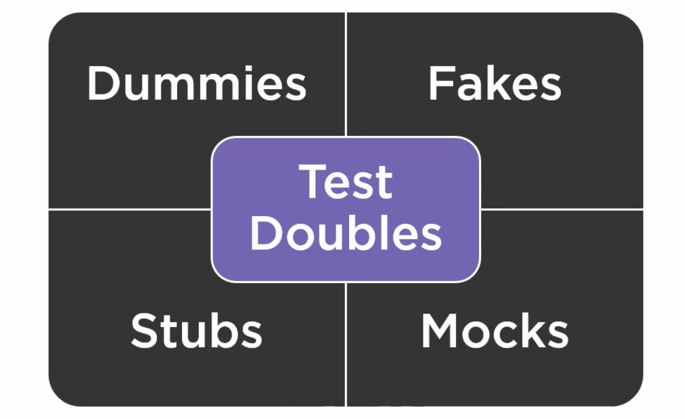
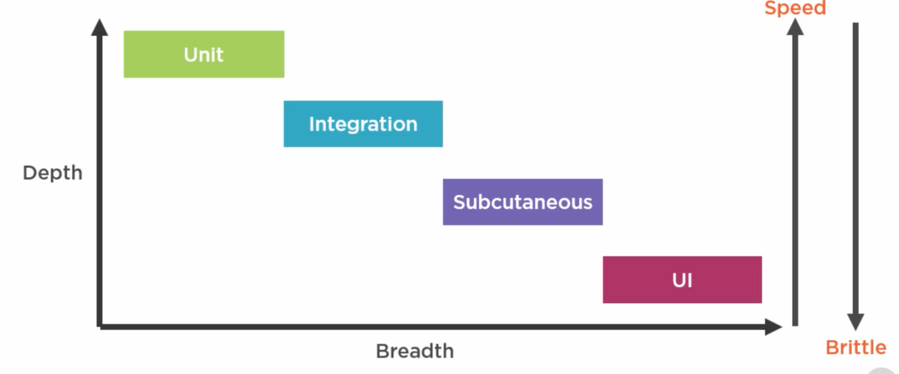
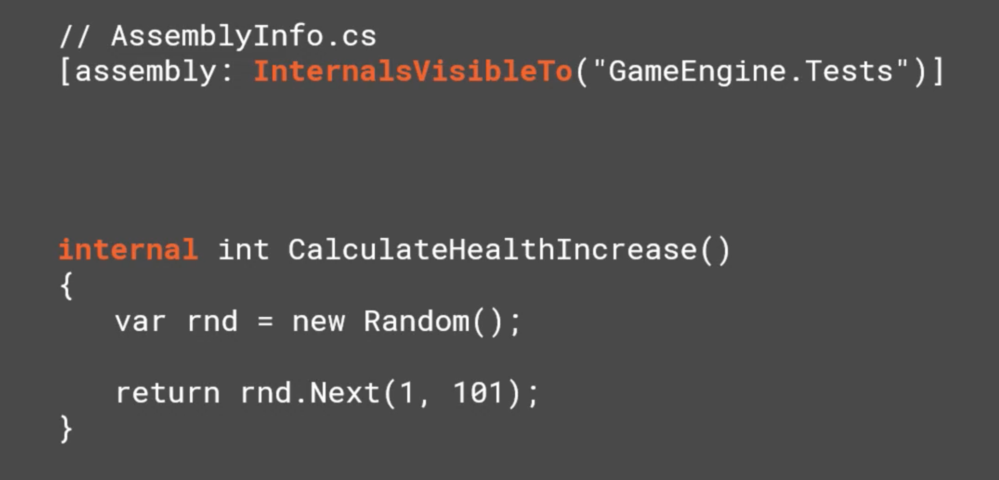
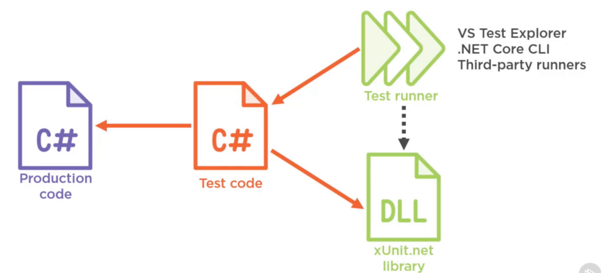
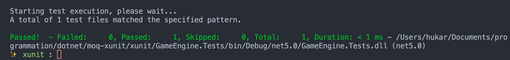

# 01 Getting started

## Test Doubles

> `Test Double` est un terme générique employé lorsqu'on remplace un objet de production par un objet pour tester.
>
> **Martin Fowler**



`Test Doubles` est un terme qui englobe d'autres termes :

- `Dummies`
- `Fakes`
- `Stubs`
- `Mocks`


## `Fakes` : contrefaçon

Fournit une implémentation pour les `tests` qui n'est pas utilisable en production.

Exemple : `EF Core` In-Memory Provider


## `Dummies` : leurres

On transmet des paramètres satisfaisant qui ne seront jamais utilisés ou accèdés.


## `Stubs` : bout (terminaison)

Produit une réponse aux différents appelles => propriété `get` ou retour de `method`.


## `Mocks` : Imitateur

prévoit et vérifie les appelles aux `propriétés` et aux `méthodes`.


## Créer un projet de Tests et Ajouter une référence à l'application

```bash 
dotnet new xunit -o Tests
dotnet add Tests reference CreditCardApplication
```


## Les différents types de `Tests`

> **nitty gritty** : minutieux
>
> **breadth** : l'étendue
>
> **brittle** : fragilité



On voit que les `tests unitaire` porte sur un élément profond (une `classe`, une `méthode`), sont rapides et peu cassant (car ils portent sur un élément simple et isolé).


## Tester le comportement : `Behaviour`

On ne cherche pas à courler les `tests` avec l'implémentation, mais plutôt à tester le comportement (`l'interface publique`).

Pour cette raison on ne teste pas les méthodes privées qui sont des détails d'implémentation.

Il est possible si on veut de tester une `méthode privée` en la passant en `internal` :




## Les phases de tests : `AAA`

### `Arrange` : préparer le jeu de données

On met en place les données pour le `Test`. On crée les instances d'objet et les données de `Test` (les `inputs`).

### `Act` : agir avec les données

On exécute le code de production pour avoir une réponse. Cela peut être appeler une `méthode` ou attribuer une valeur à une variable (`set`).

### `Assert` : prétendre quelque chose sur les données

On vérifie les résultats, On programme les `Test` qui seront réussis ou ratés.


## `xUnit`



Le `test explorer` peut aussi être en `Dotnet CLI`.

Le code de `Test` possède une référence vers le code de production ainsi qu'une `DLL` de `xUnit`.


## Nommage des `Test`

Par convention, la `classe ` de `Test` finit par `Should` :

```cs
public class PlayerCharacterShould
```

Chaque `méthode` précédée par l'attribut `[Fact]` est un `Test`

```cs
public class PlayerCharacterShould
{
  [Fact]
  public void IncreaseHealthAfterSleeping()
  {
    // ARRANGE
    PlayerCharecter sut = new PlayerCharacter();
    
    // ACT
    sut.Sleep();
    
    // ASSERT
    Assert.InRange(sut.Health, 101, 200);
  }
}
```

`sut` : `S`ystem `U`nder `T`est c'est le système soumis aux `tests`.


## Créer les `Test`

```bash
dotnet new xunit -o GameEngine.Tests
dotnet add GameEngine.Tests reference GameEngine
```

Puis ajouter les `Tests` à la `Solution` :

```bash
dotnet sln add GameEngine.Tests
```


## Écrire le premier `Test`

On commence par renommer notre `class` :

```cs
public class PlayerCharacterShould
```

Par convention on utilise l'acronyme `sut` ( system under test) pour savoir exactement ce qui est testé.

```cs
public class PlayerCharacterShould
{
  [Fact]
  public void BeInexperienceWhenNew()
  {
    PlayerCharacter sut = new PlayerCharacter(); // new ();
  }
}
```


## Exécuter le `Test` en `CLI` : `dotnet test <project>`

```bash
dotnet test GameEngine.Tests
```




