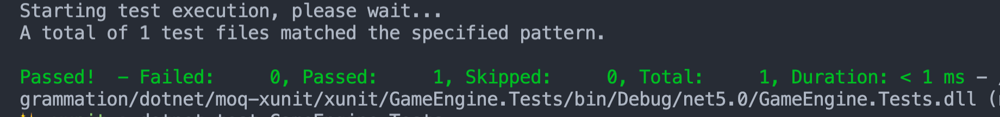
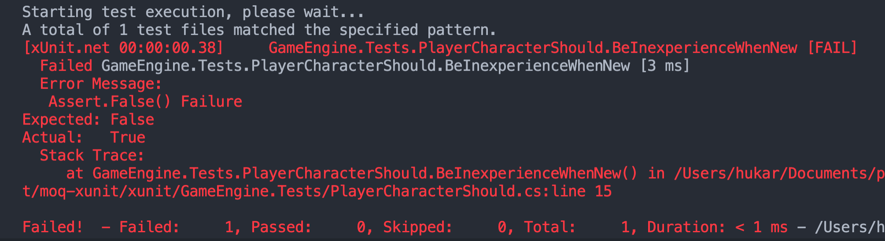
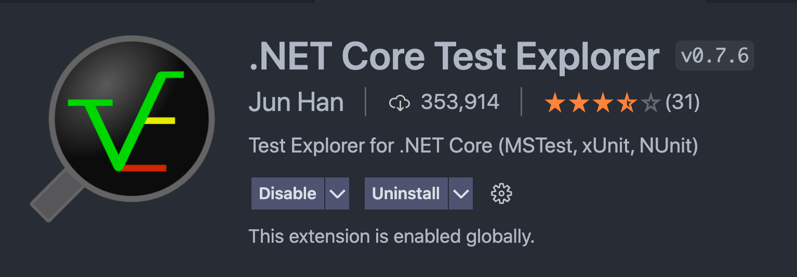
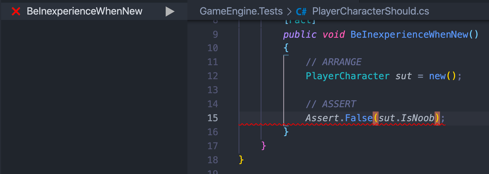

# Déterminer si les `Tests` sont `passed` ou `failed` avec les `Asserts`


## Les `Asserts` (affirmations)

Un `assert` passe ou échoue (`passed` ou `failed`).

Il évalue la sortie d'un `test`.

Si tous les `asserts` passent le `test` passe, sinon il échoue (`failed`).


## Overview des `asserts`

### Boolean

- `true` ou `false`


### String

- Egalité, Inégalité
- Vide (`empty`)
- Commence avec / fini avec
- Contient une sous-chaîne
- Correspond à une expression régulère


### Valeur Numérique

- Égalité/inégalité
- dans un ensemble donné (`range`)
- Précision de la virgule flottante


### Collection

- égalité avec une autre `collection`
- Contient / Ne contient pas
- Contient un item satisfaisant un prédicat
- Tous les items doivent satisafier un `assert` (une affirmation)


### Événement déclanché

- Custom events
- Framework events


### Les `Type` d'objets

- Est / N'est pas d'un `type` particulier
- Est / N'est pas d'un d'un `type` ou d'un `type` dérivé


## Combien d'`Asserts` par `Test`

Un `Test` (une `méthode`) pour les puriste, ne doit contenir qu'un **seul** `assert`.

Il peut quand même y en avoir plusieurs, mais il doivent tester le même concept (titre du `test`).


## Tester un `Boolean` : `Asset.True` `Assert.False`

```cs
[Fact]
public void BeInexperienceWhenNew()
{
  // ARRANGE
  PlayerCharacter sut = new ();
  
  // ASSERT
  Asset.True(sut.IsNoob);
}
```



```cs
Assert.False(sut.IsNoob)
```



Installation dans `vscode` de `.NET Core Test Explorer`






## `Assert` pour les `string`

On va tester si la propriété `FullName` renvoie bien ce qu'on attends


### `Assert.Equal`

```cs
[Fact]
public void CalculateFullName()
{
  PlayerCharacter sut = new();
  
  sut.FirstName = "Sarah";
  sut.LastName = "Smith";
  
  Assert.Equal("Sarah Smith", sut.FullName);
}
```


