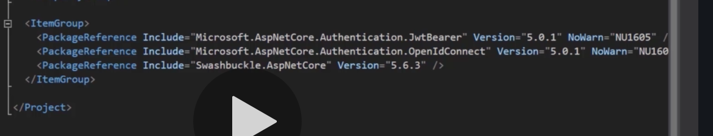

# 01 getting Started

## Site avec des `API` public

`any-api.com` down lors de mes tests.


## Create `API`

nom du projet `HotelListing`

### Remarques



En mode `CLI` `JwtBearer` et `OpenIdConnect` ne sont pas installés.

```bash
dotnet add package Microsoft.AspNetCore.Authentication.JwtBearer --version 5.0.5
```

```bash
dotnet add package Microsoft.AspNetCore.Authentication.OpenIdConnect --version 5.0.5
```

Si besoin voici les packages ci-dessus.


On peut voire les dépendances dans `obj/project.assets.json`.

