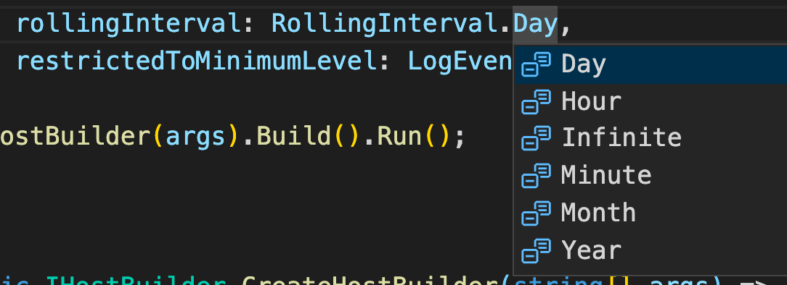
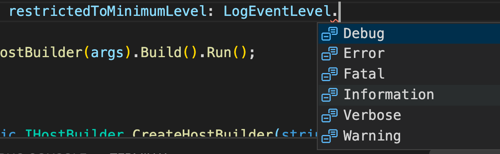
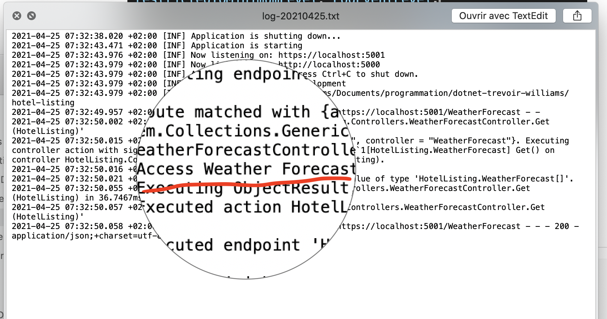

# `Logging` avec `SeriLog`

```bash
dotnet add package Serilog.AspNetCore --version 4.1.0
```


## dans `Program.cs`

```cs
using System;
using System.Collections.Generic;
using System.Linq;
using System.Threading.Tasks;
using Microsoft.AspNetCore.Hosting;
using Microsoft.Extensions.Configuration;
using Microsoft.Extensions.Hosting;
using Microsoft.Extensions.Logging;
using Serilog;

namespace HotelListing
{
  public class Program
  {
    public static void Main(string[] args)
    {
      Log.Logger = new LoggerConfiguration()
                .WriteTo.File(
                    path: "/Users/kms/Desktop/hotellisting/logs/log-.txt",
                    outputTemplate: "{Timestamp:yyyy-MM-dd HH:mm:ss.fff zzz} [{Level:u3}] {Message:lj}{NewLine}{Exception}",
                    rollingInterval: RollingInterval.Day,
                    restrictedToMinimumLevel: LogEventLevel.Verbose // Information
                ).CreateLogger();
      try
      {
        Log.Information("Application is starting");
        CreateHostBuilder(args).Build().Run();
      }
      catch (Exception ex)
      {
        Log.Fatal(ex, "Application failed to start");
      }
      finally
      {
        Log.CloseAndFlush();
      }
    }

    public static IHostBuilder CreateHostBuilder(string[] args) =>
      Host.CreateDefaultBuilder(args)
      .UseSerilog() // <- ajouter cette ligne
      .ConfigureWebHostDefaults(webBuilder =>
                                {
                                  webBuilder.UseStartup<Startup>();
                                });
  }
}
```

`path` : chemin en dehors du projet, peut-être ailleurs sur le réseau.

`outputTemplate` : modèle du log.

`rollingInterval` : Délai avant de réer un autre fichier, d'où le `-` dans le nom du fichier `log-.txt`.



On peut donc avoir jusqu'à un fichier par `minute`.

`restrictedToMinimumLevel` : permet de définir un niveau de log.



`Verbose` étant le plus volubile et `Fatal` le moins


## Exemple dans `WeatherForecastController`

```cs
private readonly ILogger<WeatherForecastController> _logger;

public WeatherForecastController(ILogger<WeatherForecastController> logger)
{
  _logger = logger;
}

[HttpGet]
public IEnumerable<WeatherForecast> Get()
{
  _logger.LogInformation("Access Weather Forecast");
  
  var rng = new Random();
  return Enumerable.Range(1, 5).Select(index => new WeatherForecast
                                       {
                                         Date = DateTime.Now.AddDays(index),
                                         TemperatureC = rng.Next(-20, 55),
                                         Summary = Summaries[rng.Next(Summaries.Length)]
                                       })
    .ToArray();
}
```

Le `logger` par défaut utilise `SeriLog`.

Il est déjà injecté via le contrôleur.



