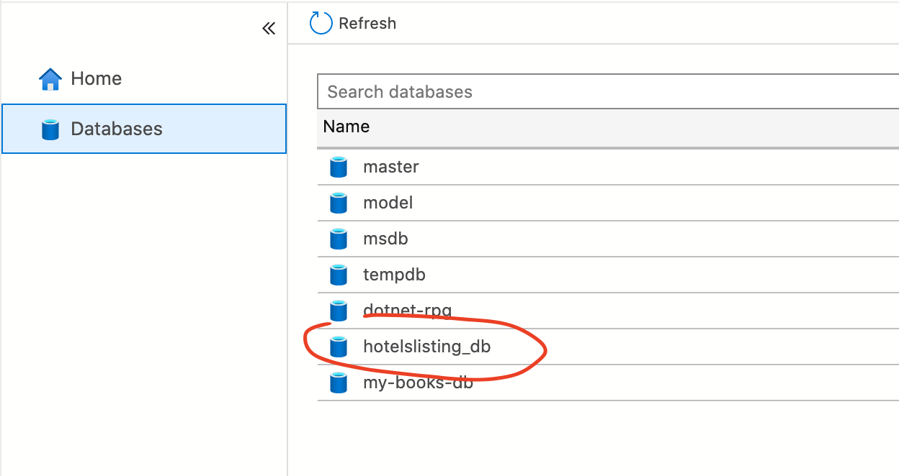

# 04  Classes `Data` et `EF Core`


## Définir le modèle

On créer un dossier `Data` et à l'intérieur deux classes `Country` et `Hotel`.

On crée aussi la classe `DataContext` qui sera un pont entre l'application et la base de données.

Par convention le nom des tables sera le nom de l'entité associé au pluriel :

`Country` => `Countries`, `Hotel` => `Hotels`.

On appelle ce procédé `Code First` car c'est le code qui va générer la `BDD`.


## `DataContext.cs`

On doit installer `Entity Framework Core` pour `SQL Server` :

```bash
dotnet add package Microsoft.EntityFrameworkCore.SqlServer --version 5.0.5
```

Les `tools` sont déjà installé.

```cs
using Microsoft.EntityFrameworkCore;

namespace Data
{
    public class DataContext : DbContext
    {
			public DataContext(DbContextOptions options) : base(options)
      {
        
      }
      
      public DbSet<Country> Countries { get; set; }
      public DbSet<Hotel> Hotels { get; set; }
    }
}
```


### Création du `ConnectionString`

Ajouter l'entrée `ConnectionStrings` au pluriel (car il peut y en avoir plusieurs) dans `appsettings.json` :

```json
{
  "Logging": {
    "LogLevel": {
      "Default": "Information",
      "Microsoft": "Warning",
      "Microsoft.Hosting.Lifetime": "Information"
    }
  },
  "ConnectionStrings": {
    "HukarSqlConnection": "Server=localhost,1433; Database=hotelslisting_db; User=sa; Password=huk@r2Xmen99"
  },
  "AllowedHosts": "*"
}
```

On va injecter le `DataContext` dans `Startup.cs` :

```cs
public void ConfigureServices(IServiceCollection services)
{

  services.AddDbContext<DataContext>(
    options => options.UseSqlServer(
      Configuration.GetConnectionString("HukarSqlConnection")
    ));
  
  // ...
```

`Configuration.GetConnectionString` permet de récupérer simplement son `connection string` grâce au nom qu'on lui a donnée.


## `Country.cs`

```cs
namespace Data
{
    public class Country
    {
        public int Id { get; set; }
      	public string Name { get; set; }
      	public string ShortName { get; set; }
    }
}
```

Une propriété nommée `EntityNameId` ou `Id` est comprise par `EF Core` comme clé primaire automatiquement.

Ici on aurait aussi pu l'appeler `CountryId`.


## `Hotel.cs`

```cs
using System.ComponentModel.DataAnnotations.Schema;

namespace Data
{
    public class Hotel
    {
        public int Id { get; set; }
        public string Name { get; set; }
      	public string Address { get; set; }
      	public double Rating { get; set; }
      	[ForeignKey(nameof(Country))]
      	public int CountryId { get; set; }
     		public Country Coutry { get; set; }
    }
}
```

Pour créer une clé étrangère on a besoin des trois lignes :

```cs
[ForeignKey(nameof(Country))]
public Country Coutry { get; set; }
public int CountryId { get; set; }
```

`ForeignKey(<NameForeignKey)` prend un nom choisi arbitrairement, ici on prend simplemnt le nom de la classe.

On utilise `using System.ComponentModel.DataAnnotations.Schema;`.


## ajouter la `Migration`

Il faut ajouter le package `Microsoft.EntityFrameworkCore.Design`:

```bash
dotnet add package Microsoft.EntityFrameworkCore.Design --version 5.0.5
```


Maintenant on peut lancer la migration.

```bash
dotnet ef migrations add DatabaseCreated
```

Va généré les fichiers préliminaires.

### Céer physiquement la `BDD`

```bash
dotnet ef database update
```




