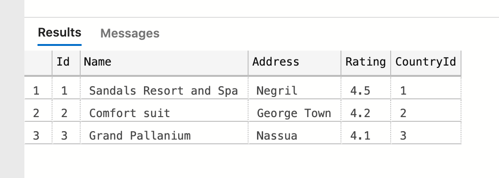

# 05 `Data` seeding

Procurer des données de base à la `BDD`.

Pour ce faire dans `DataContext` on va `override` la méthode `OnModelCreating` :

```cs
// DataContext.cs

protected override void OnModelCreating(ModelBuilder builder)
{
	builder.Entity<Country>().HasData(
    	new()
        {
            Id = 1,
            Name = "Jamaica",
            ShortName = "JM"
        },
        new()
        {
            Id = 2,
            Name = "Bahamas",
            ShortName = "BS"
        },
        new()
        {
            Id = 3,
            Name = "Cayman Island",
            ShortName = "CI"
        }
    );
    
    builder.Entity<Hotel>().Hasdata(
    	new()
        {
            Id = 1,
            Name = "Sandals Resort and Spa",
            Address = "Negril",
            CountryId = 1,
            Rating = 4.5
        },
        new()
        {
            Id = 2,
            Name = "Comfort suit",
            Address = "George Town",
            CountryId = 2,
            Rating = 4.2
        },
        new()
        {
            Id = 3,
            Name = "Grand Pallanium",
            Address = "Nassua",
            CountryId = 3,
            Rating = 4.1
        },
    );
}
```


## maintenant on ajoute une `Migration`

```bash
dotnet ef migrations add SeedingData
```

```bash
dotnet ef database update
```



