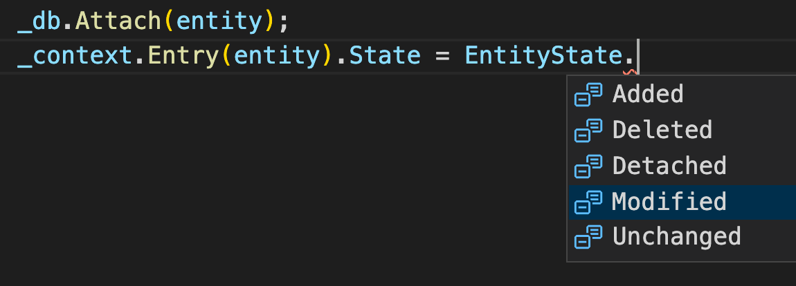

# 06 Service Repositories

On va utiliser deux `pattern` :

- `Repository Pattern`
- `Unit Of Work Pattern`


On va créer deux dossiers : `IRepository` et `Repository`.

## `IGenericRepository`

Dans `IRepository` on va créer l'interface `IGenericRepository.cs`

```cs
using System;
using System.Collections.Generic;
using System.Linq;
using System.Linq.Expressions;
using System.Threading.Tasks;

namespace IRepository
{
    public interface IGenericRepository<T> where T : class
    {
        Task<IList<T>> GetAll(
            Expression<Func<T, bool>> expression = null,
            Func<IQueryable<T>, IOrderedQueryable<T>> orderBy = null,
            List<string> includes = null
        );
        Task<T> Get(Expression<Func<T, bool>> expression, List<string> includes = null);
        Task Insert(T entity);
        Task InsertRange(IEnumerable<T> entities);
        Task delete(int id);
        void DeleteRange(IEnumerable<T> entities);
        void Update(T entity);
    }
}
```


## `GenericRepository`

Comme `DataContext` est enregitré dans `Startup.cs` comme service, on peut le récupérer dans une classe grâce au constructeur : **injection de dépendance**.

```cs
using System;
using System.Collections.Generic;
using System.Linq;
using System.Linq.Expressions;
using System.Threading.Tasks;
using Data;
using IRepository;
using Microsoft.EntityFrameworkCore;

namespace Repository
{
    public class GenericRepository<T> : IGenericRepository<T> where T : class
    {
        private readonly DataContext _context;
        private readonly DbSet<T> _db;
        
        public GenericRepository(DataContext contextD)
        {
            _context = context;
            _db = _context.Set<T>();
        }
        
        // méthodes
    }
}
```

Récupérer un `DbSet` : `T` doit être un type défini dans les `DbSet` du `DataContext`.

# Implémentation des méthodes

## `Delete` 

```cs
public async Task delete(int id)
{
    var entity = await _db.FindAsync(id);
    _db.Remove(entity);
}
```

`FindAsync(<PrimaryKeyValue)` on lui passe donc un `Id`.

## `DeleteRange`

```cs
public void DeleteRange(IEnumerable<T> entities)
{
    _db.RemoveRange(entities);
}
```


## `Insert`

```cs
public async Task Insert(T entity)
{
    await _db.AddAsync(entity);
}
```


## `InsertRange`

```cs
public async Task InsertRange(IEnumerable<T> entities)
{
    await _db.AddRangeAsync(entities);
}
```


## `Update`

```cs
public void Update(T entity)
{
    _db.Attach(entity);
    _context.Entry(entity).State = EntityState.Modified;
}
```

On *track* l'`entity` avec `Attach` 

et on dit au contexte de l'enregistrer si il y a des modifications : `State = EntityState.Modified`.




## `Get`

```cs
public async Task<T> Get(Expression<Func<T, bool>> expression, List<string> includes = null)
{
    IQueryable<T> query = _db;
    if(include is not null)
    {
        foreach (var includeProperty in includes)
        {
            query = query.Include(includeProperty);
        }
    }
    
    return await query.AsNoTracking().FirstOrDefaultAsync(expression);
}
```

`includes`permet de remplir totalement l'objet en clé étrangère et pas seulement récupérer son `Id`.

`expression` est une `lambda` qui renvoie un `bool` (un prédicat) :

```cs
c => c.Id == id
u => u.Name != "Michel"
```

`AsNoTracking` permet d'optimiser les performances d'`EF Core` (à approfondir).


## `GetAll`

Quasi identique à `Get`.

On remplace `FirstOrDefaultAsync` par `ToListasync`.

```cs
public async Task<IList<T>> GetAll(
    Expression<Func<T, bool>> expression = null,
    Func<IQueryable<T>, IOrderedQueryable<T>> orderBy = null,
    List<string> includes = null)
{
    IQueryable<T> query = _db;
    
    if(expression is not null)
    {
        query = query.Where(expression);
    }
    
    if(includes is not null)
    {
        foreach (var includeProperty in includes)
        {
            query = query.Include(includeProperty);
        }
    }
    
    if(orderBy is not null)
    {
        query = orderBy(query);
    }
    
    return await query.AsNoTracking().ToListAsync();
}
```


