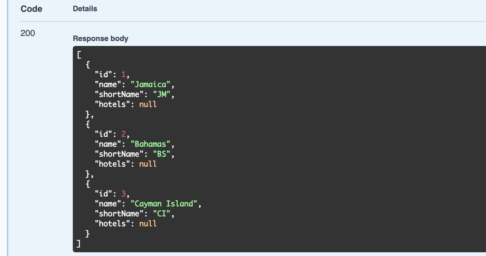

# 09 `GET` requests

Un contrôleur se compose d'actions correspondant à des verbers `HTTP` et des routes.


## Créer son contrôleur

`Controllers/CountryController.cs`

```cs
using Microsoft.AspNetCore.Mvc;

namespace Controllers
{
    [ApiController]
    [Route("api/[controller]")]
    public class CountryController : ControllerBase
    {
		private readonly IUnitOfWork _unitOfWork;
        private readonly ILogger _logger;
        
        public CountryController(IUnitOfWork unitOfWork, ILogger logger)
        {
            _unitOfWork = unitOfWork;
            _logger = logger;
        }
    }
}
```

On pourrait configurer le routage dans `Startup.cs`, mais dans le cadre d'une `API`, on utilise plutôt les attributs de routage.

On injecte `UnitOfWork` et `Logger`.

## Première méthode : `GetCountries`

```cs
[HttpGet]
public async Task<IActionResult> GetCoutries()
{
    try
    {
        var countries = await _unitOfWork.Countries.GetAll();
        return Ok(countries);
    }
    catch(Exception ex)
    {
        _logger.LogError(ex, $"Something went wrong in the {nameof(GetCountries)}");
        return StatusCode(500, "Internal Server Error. Please Try Again Later.");
    }
}
```

`StatusCode(500)` c'est une erreur côté serveur : **"ce n'est pas vous, c'est moi"**

À ce stade on obtient une erreur car le service `UnitOfWork` n'est pas encore enregistré.

On doit l'enregistrer dans `Startup.cs` :

```cs
services.AddAutoMapper(typeof(MapperInitializer));

services.AddTransient<IUnitOfWork, UnitOfWork>();
```

#### `AddTransient` 

Les objets `Transient` sont toujours différents, pour chaque requête et pour chaque méthode (?)

#### `AddScoped` 

Les objets `Scoped` sont les même dans une même requête, mais différents dans différentes requêtes.

#### `AddSingleton` 

Les objets `Singleton` reste toujours les même.


## Problème avec `ILogger`

Le `ILogger` doit être injecter avec le bon type : `ILogger<CountryController>` au lieu de `ILogger`.

```cs
// Controller/CountryController.cs

private readonly ILogger<CountryController> _logger;
public CountryController(IUnitOfWork unitOfWork, ILogger<CountryController> logger)
{
    _logger = logger;
    _unitOfWork = unitOfWork;

}
```


### Nouvelle erreur

> ```
> System.Text.Json.JsonException: A possible object cycle was detected. This can either be due to a cycle or if the object depth is larger than the maximum allowed depth of 32. Consider using ReferenceHandler
> ```

Cela est dû au fait que `Hotel` a une dépendance vers `Country` et `Country` vers `Hotel`.

On doit installer un nouveau package : `Microsoft.AspNetCore.Mvc.NewtonsoftJson`

```bash
dotnet add package Microsoft.AspNetCore.Mvc.NewtonsoftJson --version 5.0.5
```

Ensuite dans `Startup.cs` :

```cs
services.AddControllers().AddNewtonsoftJson(
	o => 
    o.SerializeSettings.ReferenceLoopHandling = Newtonsoft.Json.ReferenceLoopHandling.Ignore
);
```

Cela va dire au programme de continuer de tourner même avec une boucle de référence.


## Test avec Swagger




## Mapper la réponse avec un `DTO`

`CountryController.cs`

On injecte `_mapper`

```cs
private readonly IMapper _mapper;

public CountryController(IMapper mapper, /* ... */)
{
    _mapper = mapper;
    // ...
}
```

Dans `GetCountries`

```cs
var countries = _unitOfWork.Countries.GetAll();
var results = _mapper.Map<IList<CountryDto>>(countries);

return Ok(results);
```

Maintenant les `hotels` ne sont plus `null`, mais un tableau vide `[]` :


