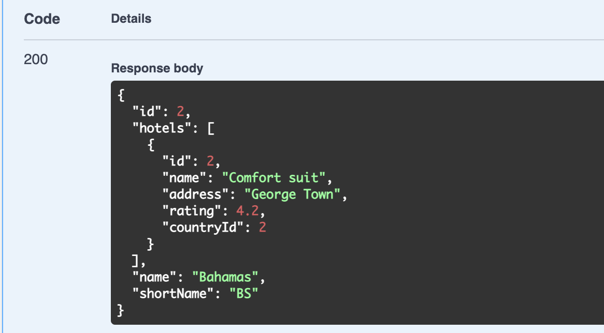

# 10 `GET` by `id`


## `GetCountry` method

```cs
// Dans CountryController.cs
// ...

[HttpGet("{id:int}")]
public async Task<IActionResult> GetCountry(int id)
{
    try
    {
        var country = await _unitOfWork.Countries.Get(c => c.Id == id, new List<string> { "Hotels" });
        var result = _mapper.Map<CountryDto>(country);

        return Ok(result);
    }
    catch (Exception ex)
    {
        _logger.LogError(ex, $"Something went wrong in the {nameof(GetCountry)}");
        return StatusCode(500, "Internal Server Error. Please Try Again Later.");
    }
}
```

`[HttpGet("{id:int}")]` prend un template pour l'`URL`, ici on attend un `id` de type `int`.

La méthode `Get` de `_unitOfWork` prend une `expression` en premier argument et une liste de `includes` en deuxième (cf. implémentation de `UnitOfWork`).



On a bien les hôtels inclus dans la réponse.


## Nouveaux attributs

Pour `Swagger` (qui est en fait la documentation), on ajoute deux nouveaux `attributs` pour indiquer les `Status Code ` de retour :

```cs
[ProducesResponseType(StatusCode.Status200OK)]
[ProducesResponseType(StatusCode.Status500InternalServerError)]
```

```cs
[HttpGet]
[ProducesResponseType(StatusCodes.Status200OK)]
[ProducesResponseType(StatusCodes.Status500InternalServerError)]
public async Task<IActionResult> GetHotels()
{
    // ...
```


