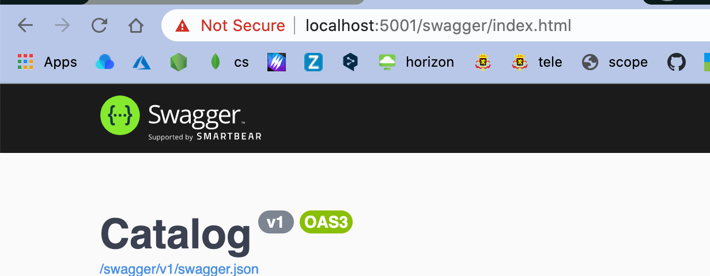
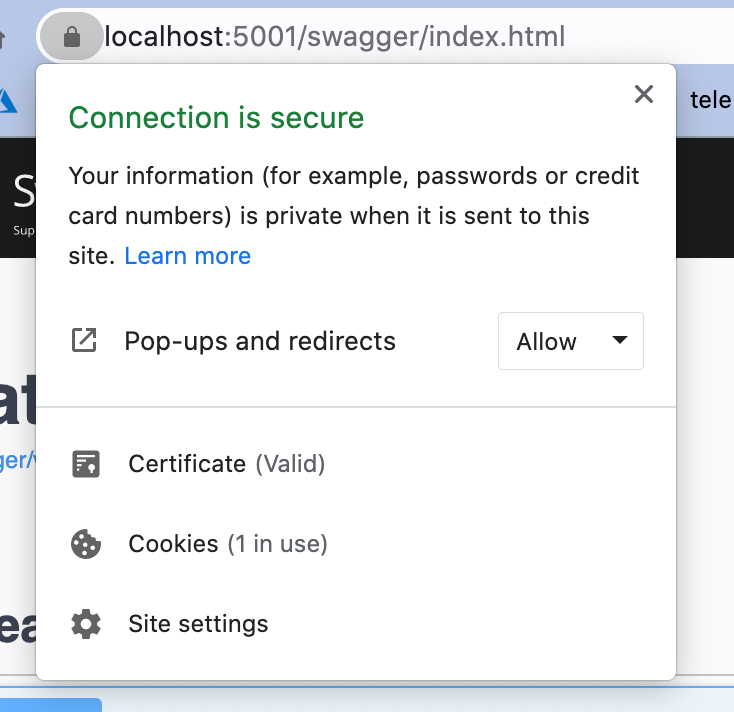
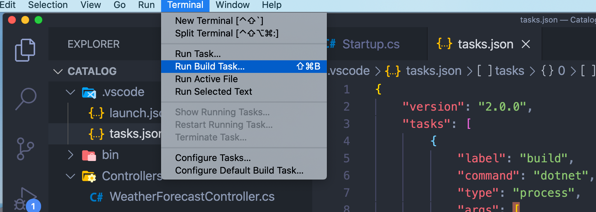

# 01 Getting Started

```bash
dotnet new webapi -n Catalog
code -r Catalog
```



Pour l'instant, `HTTPS` n'a pas de certificat.

## Créer un certificat `Dotnet`

```bash
dotnet dev-certs https --trust
```



Maintenant le navigateur trouve un certificat valide pour `https`.


## Configurer le `build` de `VSCode`

Dans `tasks.json` :

```json
"version": "2.0.0",
    "tasks": [
        {
            // on ajoute ce qui suit
            "group": {
                "kind": "build",
                "isDefault": true
            }
        },
```

Cela permet de faire l'économie d'un prompt lorsqu'on `build` le projet.



