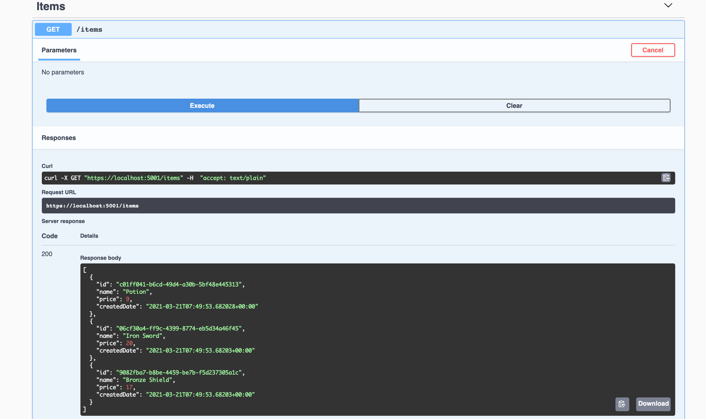
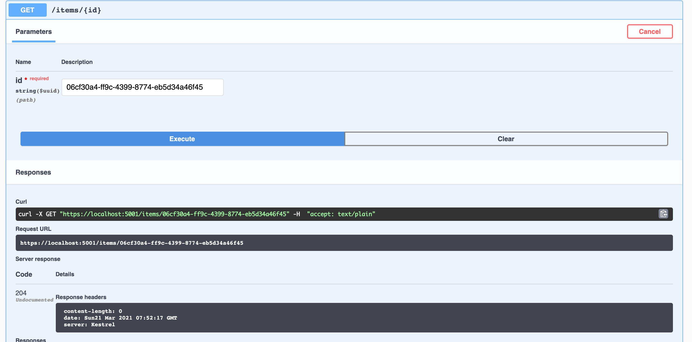
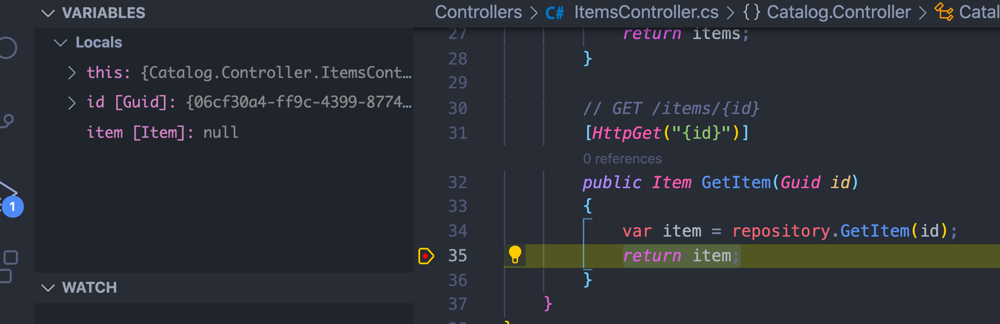
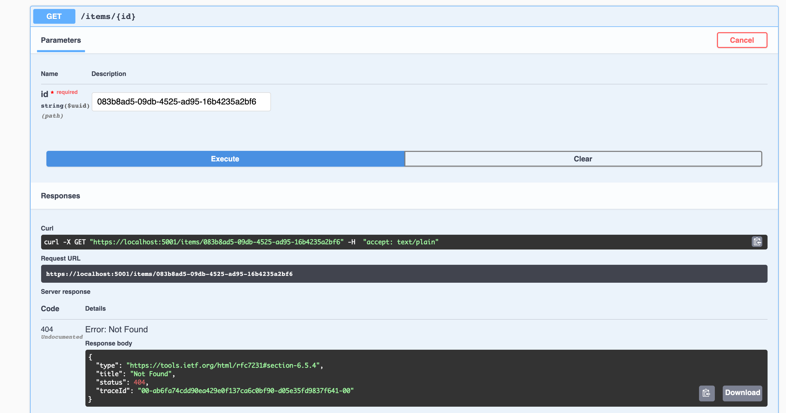

# 02 `entity`  `repository`  `controller`


## `Entity`

On crée un dossier `Entities`, certain l'appelle `Domain` ou encore `Model`.

On va créer une classe `Item.cs` dedans et utiliser un `Record Type` .

### `Record Type` :

- utilisé pour les objets immuable

- Possède des `with` expression

  ```csharp
  Item potion2 = potion1 with { price = 12 };
  ```

- Comparaison basée sur les valeurs

  ```csharp
  Item potion1 = new() { Name = "Potion", Price = 9 };
  Item potion2 = new() { Name = "Potion", Price = 9 };
  
  bool areEqual = potion1 == potion2; // true
  ```

  

### `init-only` properties

Permet d'initialiser la valeur de la propriété et c'est tout.

Après la propriété est immuable.

```csharp
public Guid Id { get; init; }
```

C'est à dire :

```csharp
// On peut faire ça :
Item item = new() { Id = Guid.NewGuid() };

// mais pas ça :
Item.Id = Guid.NewGuid();
```


## `Record` Item

```csharp
using System;

namespace Catalog.Entities
{
  public record Item
  {
    public Guid Id { get; init; }
    public string Name { get; init; }
    public decimal Price { get; init; }
    public DateTimeOffset CreatedDate { get; init; }
  }
}
```


## Créer un `Repository`

On crée un dossier `Repositories` et dedans un classe `InMemItemsRepository.cs`.

```csharp
using System;
using System.Collections.Generic;
using Catalog.Entities;
using System.Linq;

namespace Catalog.Repositories
{
  public class InMemItemsRepository
  {
    private readonly List<Item> items = new()
    {
      new Item { Id = Guid.NewGuid(), Name = "Potion", price = 9, CreatedDate = DateTimeOffset.UtcNow },
      new Item { Id = Guid.NewGuid(), Name = "Iron Sword", price = 20, CreatedDate = DateTimeOffset.UtcNow },
      new Item { Id = Guid.NewGuid(), Name = "Bronze Shield", price = 17, CreatedDate = DateTimeOffset.UtcNow },
    };
    
    public IEnumerable<Item> GetItems()
    {
      return items;
    }
    
    public Item GetItem(Guid id)
    {
      return items.Where(item => item.Id == id).SingleOrDefault();
    }
  }
}
```

### Target-typed new expression `c# 9`

On peut écrire simplement `new() { ... }` si le type est clairement signifié par la déclaration (`left value`).

### Linq

`Where` retourne une `List` des `items` correspondants.

`SingleOrDefault` retourne un élément (pas une liste) ou `null`.


## Le contrôleur : `ItemsController`

Dans le dossier `controller` on crée une classe `ItemsController.cs` :

```csharp
using System;  // Guid
using System.Collections.Generic; // IEnumerable
using Catalog.Entities;
using Catalog.Repositories;
using Microsoft.AspNetCore.Mvc;  // ControllerBase

namespace Catalog.Controller
{
  // /items
  [ApiController]
  // [Route([controller])]
  [Route("items")]
  public class ItemsController : ControllerBase
  {
    private readonly InMemItemsRepository repository;
    
    public ItemsController()
    {
      repository = new InMemItemsRepository();
    }
    
    // GET /items
    [HttpGet]
    public IEnumerable<Item> GetItems()
    {
      var items = repository.GetItems();
      return items;
    }
    
    // GET /items/{id}
    [HttpGet("{id}")]
    public Item GetItem(Guid id)
    {
      var item = repository.GetItem(id);
      return item;
    }
  }
}
```

`[ApiController]` cela apporte un certain nombre de comportement par défaut au contrôleur. 

Le constructeur va instancier un `repository`.

`[HttpGet("{id}")]` permet de paramétrer les routes : `/items/890-876-5443`.



Pour plusieurs `items` cela fonctionne parfaitement.

Pour un `item` :



On ne reçoit pas d'`item`, si on place un `breakpoint` :



`item` est `null`.

C'est parce que les `Guid` sont changé à chaque requête par le contrôleur.

Le status `204` n'est pas approprié.

On va changer le type de retour :

```csharp
if (item is null)
{
  return NotFound();
}
```

Mais maintenant la signature de la méthode n'est plus correcte, on va la changer aussi :

```csharp
public ActionResult<Item> GetItem(Guid id)
{
  var item = repository.GetItem(id);
  if (item is null)
  {
    return NotFound();
  }
  return item;
}
```

`ActionResult<Item>` à la place de `Item`.

On a un message d'erreur juste cette fois ci :



