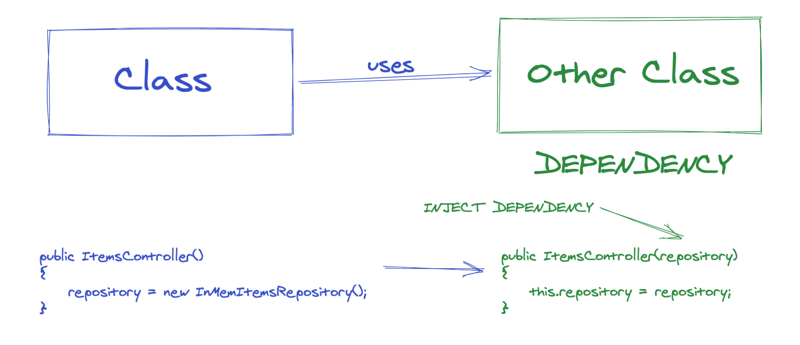
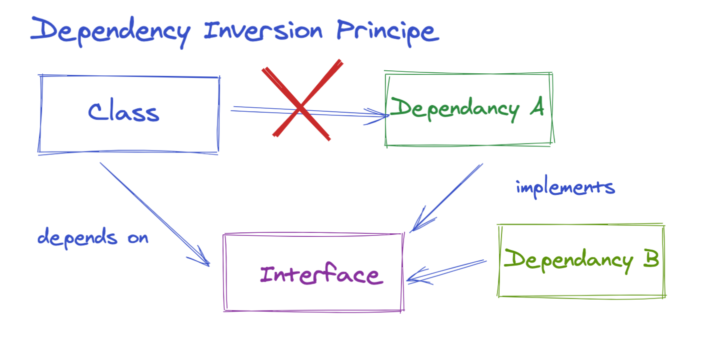
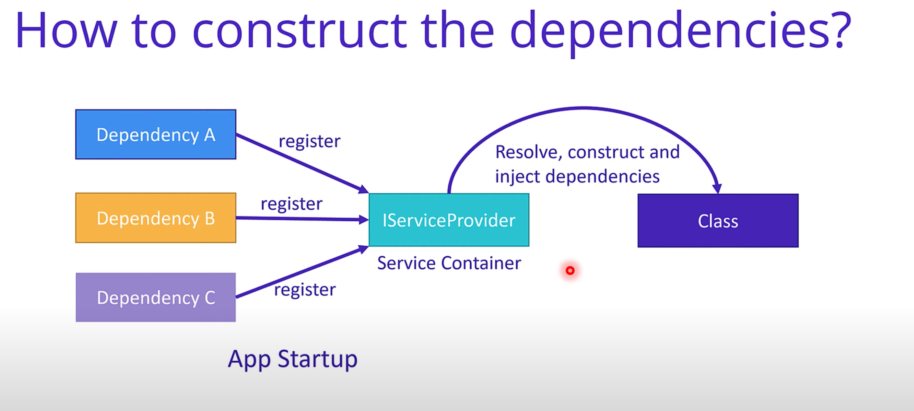
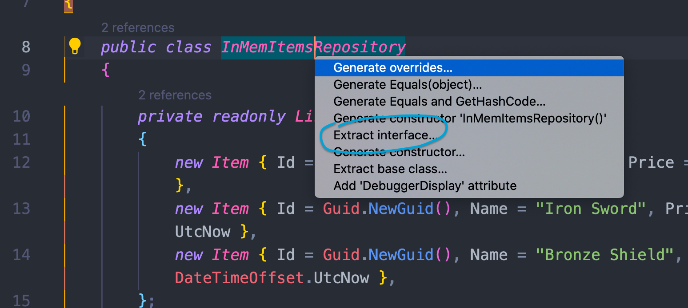
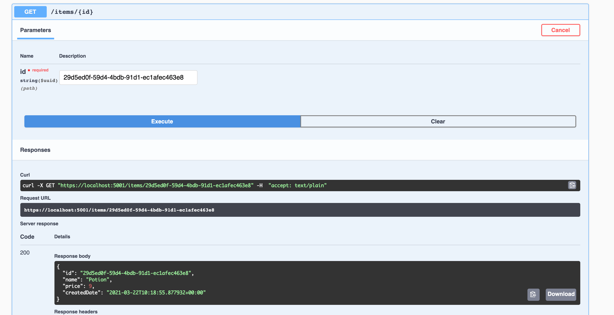

# 03 Injection de dépendance


## définition `Dependency Injection`



Ici on a une injection simple dans le constructeur.

### Inversion de dépendance



Grâce à une interface on brise le lien entre la classe de base et ses dépendances.

La classe de base ne doit rien connaître de ses dépendances.

#### Avantages

- Le code dépend d'abstraction, les classes sont découplées
- Le code est plus propre, plus simple à modifier et plus facile à ré-utiliser.


## Comment construire les Dépendances



Le problème précédent avec la récupération d'un `Item` par son `Id` vient du fait que le contrôleur est instancié à chaque nouvelle requête :

- Si on place l'instanciation des données `In Memory` dans le contrôleur, elle seront régénérée à chaque requête et les `Id` ne correspondront plus

Pour éviter cela il faut utiliser le conteneur de service qui lui n'est instancié qu'une seule fois au démarrage et qui instancie les services une seule fois aussi.

C'est quand la classe `controller` est instancié, que le `Service Provider` lui injecte pour son constructeur les dépendances.

Les services implémentent `IServiceProvider`.


## Modification de `InMemItemsRepository`

On peut extraire grâce à `VSCode` automatiquemnt l'interface de la classe :

`shift` + `cmd` + `;`



```csharp
public interface IInMemItemsRepository
    {
        Item GetItem(Guid id);
        IEnumerable<Item> GetItems();
    }

    public class InMemItemsRepository : IInMemItemsRepository
    {
      // ...
```

On va mettre notre `interface` dans un fichier propre et la renommer plus simplement `IItemsRepository`.

```csharp
using System;
using System.Collections.Generic;
using Catalog.Entities;

namespace Catalog.Repositories
{
    public interface IItemsRepository
    {

        Item GetItem(Guid id);
        IEnumerable<Item> GetItems();
    }
}
```

On va modifier `ItemsController.cs` :

```csharp
public class ItemsController : ControllerBase
    {
        private readonly IItemsRepository _repository;

        public ItemsController(IItemsRepository repository)
        {
            _repository = repository;
        }
```


On doit maintenant enregistrer notre `Repository` dans `Startup.cs` :

```csharp
public void ConfigureServices(IServiceCollection services)
{
  services.AddSingleton<IItemsRepository, InMemItemsRepository>();
  
  // ...
}
```

On ajoute bien un `singleton` pour que nos données ne soit pas régénérées.


## `GetItem(id)`

On peut re-tester notre route `/items/{id}` avec `Swagger` :



Maintenant cela focntionne correctement, la collection en mémoire est instancié une seule fois.


