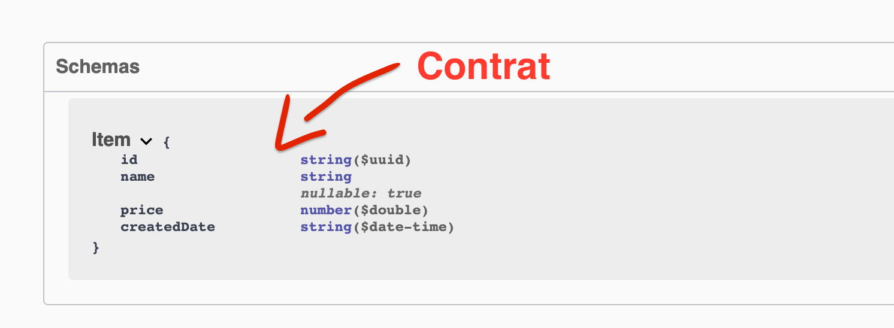
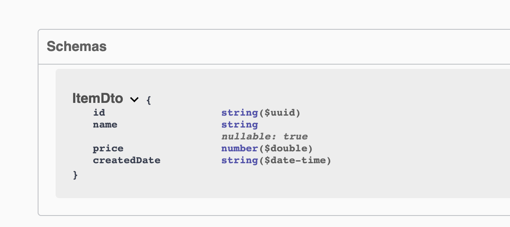

# 04 `D`ata `T`ransfert `O`bject

## Data Transfert Object `DTO`

Pour l'instant à chaque fois qu'on envoie un `Item` on utilise directement la classe `Item` comme schéma.

Une `API Rest` est un contrat avec les clients utilisateurs qu'on ne peut pas modifier facilement.

Si on utilise directement la classe `Item`, à chaque fois que l'on va la modifier, on va rompre le contrat !!

#### ! On doit éviter d'exposer directement nos classes métiers (nos entités).



### Création du `DTO`

C'est lui le contrat de l'`API`.

On crée un dossier `Dtos` et dedans une classe `ItemDto.cs`

```csharp
using System;

namespace Catalog.Dtos
{
    public record ItemDto
    {
        public Guid Id { get; init; }
        public string Name { get; init; }
        public decimal Price { get; init; }
        public DateTimeOffset CreatedDate { get; init; }
    }
}
```

Pour l'instant il est identique à la classe `Item.cs`, mais en cas de modification de celle-ci, il preserve le contrat.

Maintenant on va pouvoir l'utiliser.

### Modification du `controller` pour utiliser `ItemDto`

`GetItems`

```csharp
[HttpGet]
public IEnumerable<ItemDto> GetItems()
{
  var items = _repository.GetItems().Select(item => new ItemDto {
    Id = item.Id,
    Name = item.Name,
    Price = item.Price,
    CreatedDate = item.CreatedDate
  });
  return items;
}
```

le `controller` retourne maintenant un `IEnumerable<ItemDto>`

`Select` fait partie de `System.Linq`.


### Création d'une méthode d'extension

Pour éviter de répéter le code on va créer une classe d'extension à la racine de `Catalog` :

`Extensions.cs`

```csharp
using Catalog.Dtos;
using Catalog.Entities;

namespace Catalog
{
  public static class Extensions
  {
    public static ItemDto AsDto(this Item item)
    {
      return new ItemDto{
        Id = item.Id,
        Name = item.Name,
        Price = item.Price,
        CreatedDate = item.CreatedDate
      }
    }
  }
}
```

`this Item item` la valeur de `this` reçoit un `item`.


### Simplification de `GetItems`

```csharp
[HttpGet]
public IEnumerable<ItemDto> GetItems()
{
  var items = _repository.GetItems().Select(item => item.AsDto());
  return items;
}
```


### Utilisation de `ItemDto` dans `GetItem(id)`

```csharp
[HttpGet("{id}")]
public ActionResult<ItemDto> GetItem(Guid id)
{
  var item = _repository.GetItem(id);
  if (item is null)
  {
    return NotFound();
  }
  return item.AsDto();
}
```

On check d'abord si `item` est `null` avant d'utiliser la méthode d'extension `AsDto()`.

On voit dans `Swagger` que le schéma est maintenant `ItemDto` :



