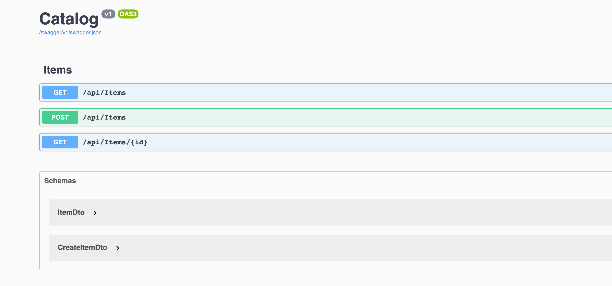
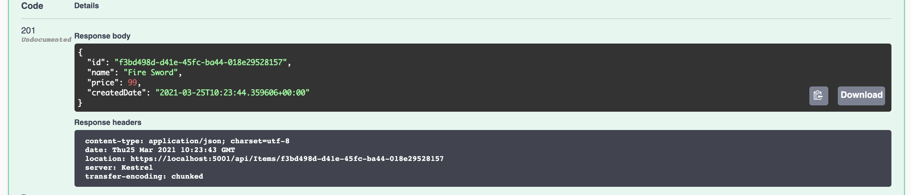
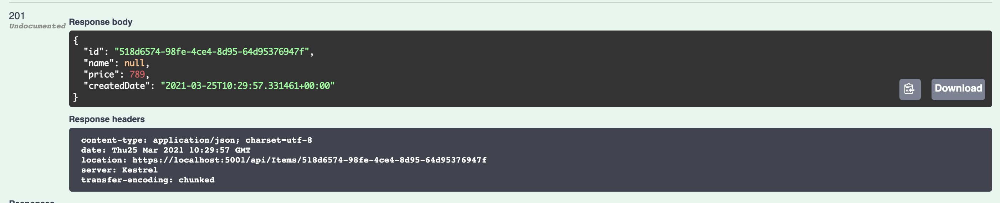
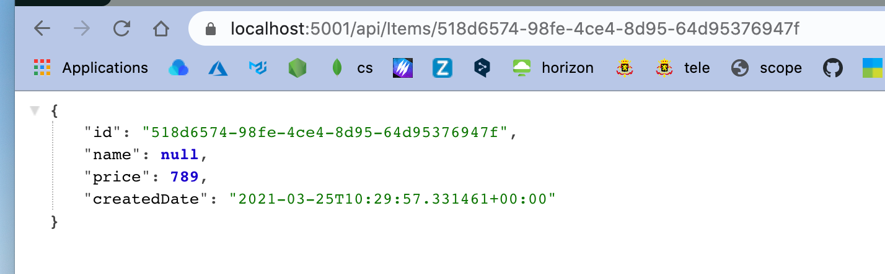
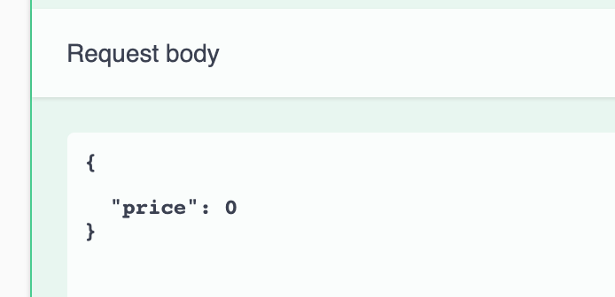
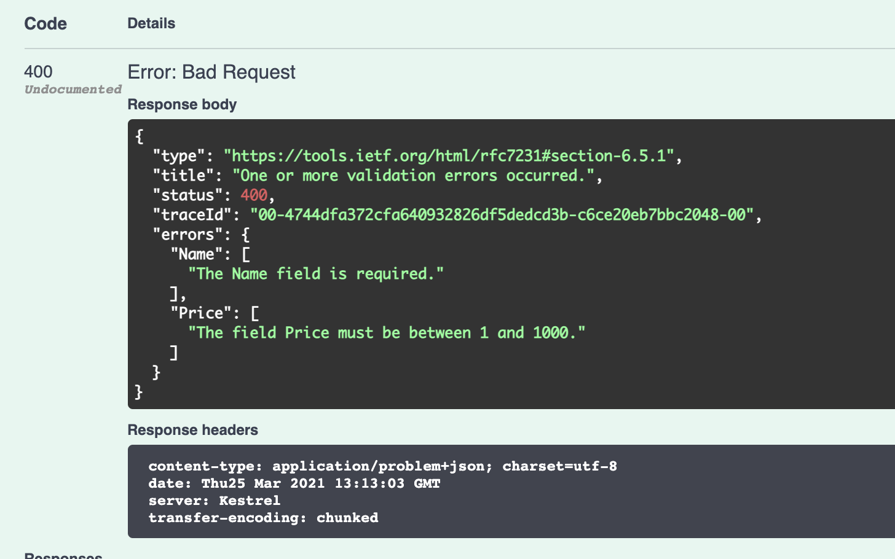
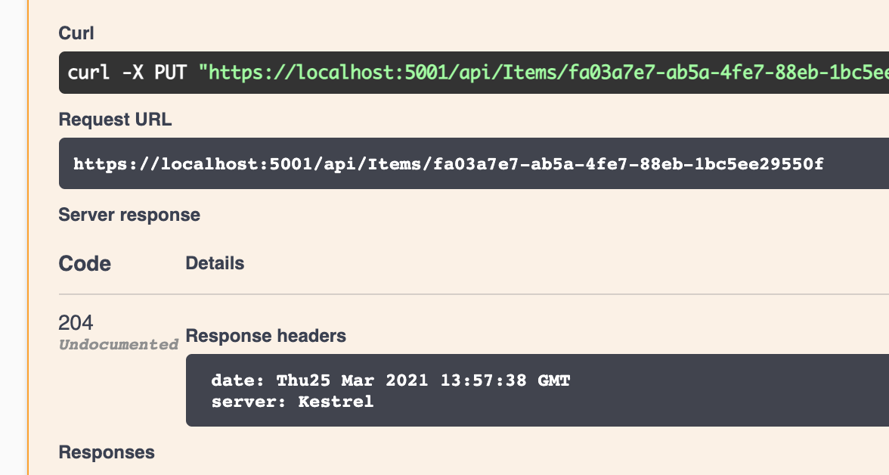

# 05 Post Put Delete

## Méthode `POST`

On va modifier l'interface `IItemsRepository.cs` :

```csharp
public interface IItemsRepository
{
  Item GetItem(Guid id);
  List<Item> GetItems();
  void CreateItem(Item item);
}
```

ET le `repository` lui-même `InMemItemsRepository.cs`

```csharp
public class InMemItemsRepository : IItemsRepository
{
  private readonly List<Item> _items = new()
  {
    // ... iitems
  };

  public List<Item> GetItems() => _items;

  public Item GetItem(Guid id) => _items.Where(item => item.Id == id).SingleOrDefault();

  public void CreateItem(Item item)
  {
    _items.Add(item);
  }
}
```


### Créer un nouveau `DTO` : `CreateItemDto.cs`

Nous n'avons pas besoin de recevoir certaines valeur depuis le client, par exemple l'`Id` et la `Created Date` sont générées côté serveur. C'est pratique d'utiliser un `record` pour un `DTO`.

```csharp
namespace Catalog.Dtos
{
    public record CreateItemDto
    {
        public string Name { get; init; }
        public decimal Price { get; init; }
    }
}
```


### `Post` 

La convention est de créer l'`item` et de le retourner.


```csharp
[HttpPost]
public ActionResult<ItemDto> CreateItem(CreateItemDto itemDto)
{
  Item item = new(){
    Id = Guid.NewGuid(),
    Name = itemDto.Name,
    Price = itemDto.Price,
    CreatedDate = DateTimeOffset.UtcNow
  };
  
  repository.CreateItem(item);
  
  return CreatedAtAction(nameof(GetItem), new { id = item.Id}, item.AsDto());
}
```

`CreatedAtAction(actionName, routeValues, value)` crée une réponse de création (status `201`) avec dans le `header HTTP` un champs `location`.

`actionName` : le nom de l'action à utiliser pour générer une `URL`.

`routeValues` : les données de la route pour générer une `URL` (ici l'`Id`).

`values` la valeur du contenu dans le `body`.



### `Swagger` : `Post`



On voit bien le `header` `location` créer par `CreatedAtAction`.

##### `location: https://localhost:5001/api/Items/f3bd498d-d41e-45fc-ba44-018e29528157 `


## Validation de données

Que se passe-t-il si on envoie une donnée incomplète, comme un prix sans nom :



L'`api` accepte est crée un `item` où `Name = null`.

On ne veut pas de ce comportement.



### `Data Annotation`

Pour prévenir ce genre de problème, on peut utiliser les `data annotation` dans notre classe `DTO`.

`CreateItemDto.cs`

```csharp
using System.ComponentModel.DataAnnotations;

namespace Catalog.Dtos
{
    public record CreateItemDto
    {
        [Required]
        public string Name { get; init; }

        [Required]
        [Range(1, 1000)]
        public decimal Price { get; init; }
    }
}
```

### Teste avec `Swagger`





`status code` : `400` => Bad Request

On retrouve les deux erreurs de validation


## `Update` : `PUT`

On ajoute la méthode `UpdateItem` à `IItemsRepository` et à `InMemItemsrepository` :

```csharp
using System;
using System.Collections.Generic;
using Catalog.Entities;

namespace Catalog.Repositories
{
    public interface IItemsRepository
    {
        Item GetItem(Guid id);
        List<Item> GetItems();
        void CreateItem(Item item);
        void UpdateItem(Item item);
    }
}
```

```csharp
public void UpdateItem(Item item)
{
  var index = _items.FindIndex(existingItem => existingItem.Id == item.Id);

  _items[index] = item;
}
```

On va créer un `UpdateItemDto` qui sera dans ce cas une copie de `CreateItemDto`, mais il pourrait ainsi être différent si nécessaire.

`UpdateItemDto.cs`

```csharp
using System.ComponentModel.DataAnnotations;

namespace Catalog.Dtos
{
    public record UpdateItemDto
    {
        [Required]
        public string Name { get; init; }

        [Required]
        [Range(1, 1000)]
        public decimal Price { get; init; }
    }
}
```

### Méthode du contrôleur `UpdateItem`

Pour une action `PUT`, la convention est de ne rien renvoyer.

```csharp
public ActionResult UpdateItem(Guid id, UpdateItemDto itemDto)
{
  var existingItem = _repository.GetItem(id);

  if (existingItem is null)
  {
    return NotFound();
  }

  Item updatedItem = existingItem with
  {
    Name = itemDto.Name,
    Price = itemDto.Price
  };

  _repository.UpdateItem(updatedItem);

  return NoContent();
}
```

Par convention on retourne `NoContent`.

### `with expression`

```csharp
Item updatedItem = existingItem with
{
  Name = itemDto.Name,
  Price = itemDto.Price
};
```

Le `with` crée une copie de son membre de gauche `existingItem` et le modifie avec les valeurs de droite, puis assigne le tout de l'autre côté du signe égal à `updatedItem`.




## `DElETE`

Les étapes :

- Modifier l'interface du `repository` : `IItemsRepository`
  Ajout d'une méthode `DeleteItem`
- Modifier le `repository` : implémentation de la méthode `DeleteItem`
- Ajout d'une action dans le `controller` : `DeleteItem`


### Modification de `IItemsRepository` et `InMemItemsRepository`

`IItemsRepository.cs`

```csharp
using System;
using System.Collections.Generic;
using Catalog.Entities;

namespace Catalog.Repositories
{
    public interface IItemsRepository
    {
        Item GetItem(Guid id);
        List<Item> GetItems();
        void CreateItem(Item item);
        void UpdateItem(Item item);
        void DeleteItem(Guid id);
    }
}
```

`InMemItemsRepository.cs`

```csharp
public void DeleteItem(Guid id)
{
  var index = _items.FindIndex(existingItem => existingItem.Id == id);

  _items.RemoveAt(index);
}
```


### ajout d'une action dans le contrôleur

```csharp
[HttpDelete("{id}")]
public ActionResult DeleteItem(Guid id)
{
  var item = _repository.GetItem(id);

  if (item is null)
  {
    return NotFound();
  }

  _repository.DeleteItem(id);

  return NoContent();
}
```


