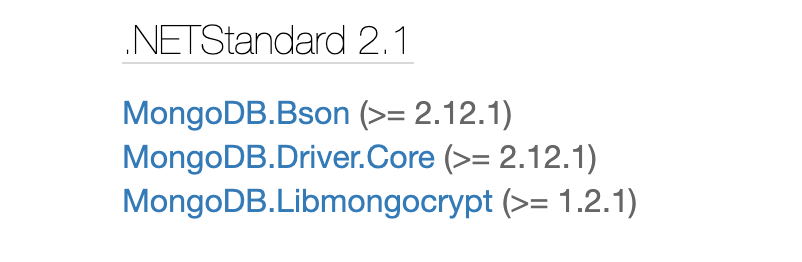
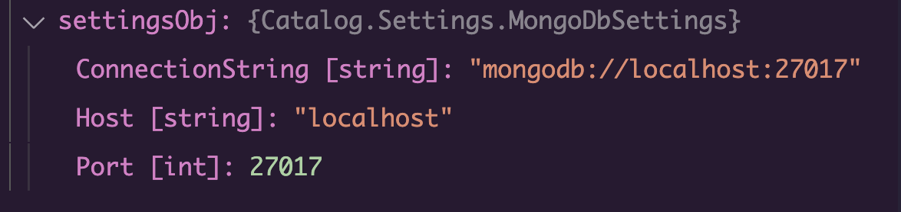
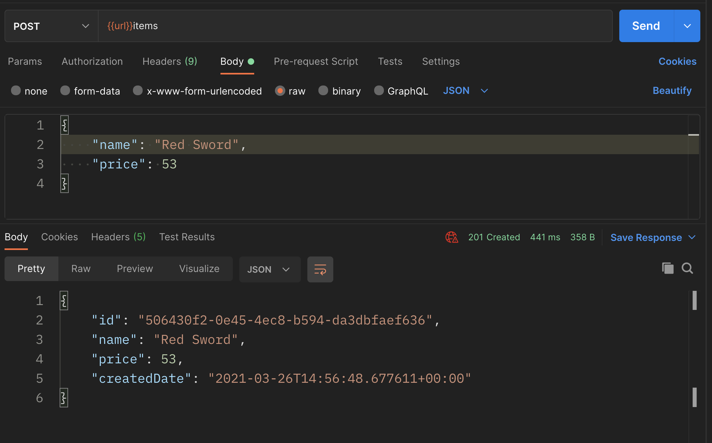
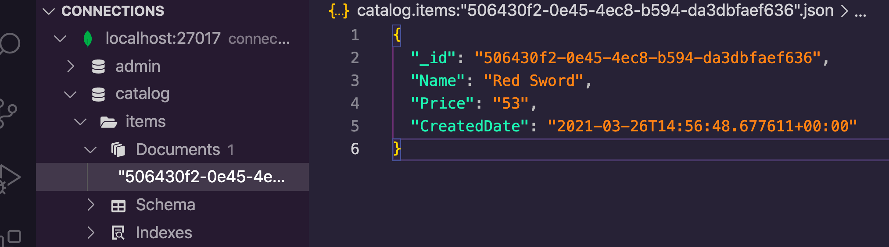
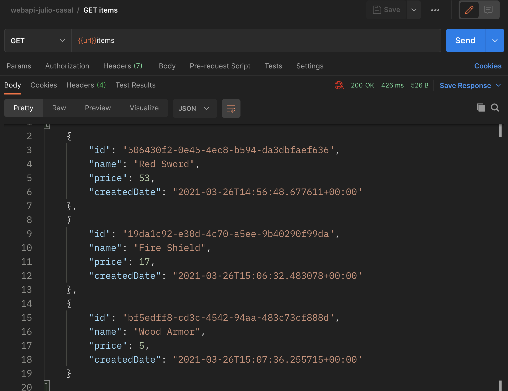

# 06 Mongo DB

## Un nouveau `repository`

Pour intéragir avec `Mongo DB` on va créer un nouveau `repository`.

On doit utiliser le `Mongo DB Client` fournit par `Mongo DB`.

Il fait l'injecter via le constructeur dans notre classe.

Il faut pour cela ajouter un package `Nuget` :

```bash
dotnet add package MongoDB.Driver --version 2.12.1
```

Voici ses dépendances :



`Catalog.csproj`

```cs
<Project Sdk="Microsoft.NET.Sdk.Web">

  <PropertyGroup>
    <TargetFramework>net5.0</TargetFramework>
  </PropertyGroup>

  <ItemGroup>
    <PackageReference Include="MongoDB.Driver" Version="2.12.1" />
    <PackageReference Include="Swashbuckle.AspNetCore" Version="5.6.3" />
  </ItemGroup>

</Project>
```

Une `database` `MongoDB` contient plusieurs collection.

`Mongo DB` va créer automatiquement la `database` et les `collections` si celles-ci n'existe pas.


`MongoDbItemsRepository.cs`

```csharp
using System;
using System.Collections.Generic;
using Catalog.Entities;

namespace Catalog.Repositories
{
    public class MongoDbItemsRepository : IItemsRepository
    {
        private const string _databaseName = "catalog";
        private const string _collectionName = "items";
        
        private readonly IMongoCollection<Item> _itemCollection;
        
        public MongoDbItemsRepository(IMongoClient mongoClient)
        {
            IMongoDatabase database = mongoClient.GetDatabase(_databaseName);
            _itemsCollection = database.GetCollections<Item>(_collectionName);
            
        }
        
        // Méthode à implémenter ...
    }
}
```


## Connection à `MongoDb`

Dans `appsettings.json`

```json
{
    "Logging": {
        "LogLevel": {
            "Default": "Information",
            "Microsoft": "Warning",
            "Microsoft.Hosting.Lifetime": "Information"
        }
    },
    "AllowedHosts": "*",
    "MongoDbSettings": {
        "Host": "localhost",
        "port": 27017
    }
}
```

On vacréer un nouveau dossier `Settings` et créer une classe pour intéragir avec les `settings`.

`Settings/MongoSettings.cs`

```csharp
namespace Catalog.settings
{
    public class MongoDbSettings
    {
        public string Host { get; set; }
        public int Port { get; set; }
        
        public string ConnectionString
        {
            get
            {
                return $"mongodb://{Host}:{Port}";
            }
        }
    }
}
```

Il faut maintenant ajouter `MongoClient` comme services dans le conteneur de service de `Startup.cs`.

```cs
public void ConfigureServices(IServiceCollection services)
        {
            services.AddSingleton<IMongoClient>(serviceProvider =>
            {
                var settings = Configuration.GetSection(nameof(MongoDbSettings));
                var settingsObj = settings.Get<MongoDbSettings>();

                return new MongoClient(settingsObj.ConnectionString);
            });

            services.AddSingleton<IItemsRepository, MongoDbItemsRepository>();
            // services.AddSingleton<IItemsRepository, InMemItemsRepository>();
```

Plutôt que de déclarer explicitement le type du service désiré comme pour `InMemItemsRepository`, on va directement construire le type.

On va récupérer les `settings` : `Configuration.GetSection(nameof(MongoDbSettings))`


Puis on va les transformer en objet : `settings.Get<MongoDbSettings>()`.



Et on va enfin instancier et retourner un `new MongoClient(settingsObj.ConnectionString)`.

Ensuite il suffit de substituer `InMemItemsRepositor` par `MongoDbItemsRepository` dans :

```cs
services.AddSingleton<IItemsRepository, MongoDbItemsRepository>();
```

### Dire à `Mongo DB` comment sérialiser certain types

```cs
using MongoDB.Bson;
using MongoDB.Bson.Serialization;
using MongoDB.Bson.Serialization.Serializers;

// ...

public void ConfigureServices(IServiceCollection services)
{
    BsonSerializer.RegisterSerializer(new GuidSerializer(BsonType.String));
    BsonSerializer.RegisterSerializer(new DateTimeOffsetSerializer(BsonType.String));
    
    // ...
```

Cela s'effectue aussi dans le `services container`.


## `CreateItem` : `MongoDbItemsRepository.cs`

```cs
public void CreateItem(Item item)
{
    _itemCollection.InsertOne(item);
}
```

On peut tester la méthode `POST` avec `Postman` :



On peut visionner sa base de données `Mongo DB` grace à un plugin `VSCode` :



Sans les `BsonSerializer` on aurait :

```json
{
  "_id": {
    "$binary": {
      "base64": "khzaGQ3jcEyl7ptAKQ+Z2g==",
      "subType": "03"
    }
  },
  "Name": "Fire Shield",
  "Price": "17",
  "CreatedDate": [
    637523679924830700,
    0
  ]
}
```


## `GetItems` : `MongoDbItemsRepository.cs`

```cs
public Ienumerable<Item> GetItems()
{
    return itemsCollection.Find(new BsonDocument()).ToList();
}
```



`Find` prend un filtre et des options [facultative `default = null`].

`new BsonDocument()` représente un filtre vide.


## `GetItem` : `MongoDbItemsRepository.cs`

On va construire un filtre comme variable de classe privée:

```cs
private readonly FilterDefinitionBuilder<Item> filterBuilder = Builders<Item>.Filter;
```


```cs
public Item GetItem(Guid id)
{
    var filter = filterBuilder.Eq(item => item.Id, id);
    return _itemsCollection.Find(filter).SingleOrDefault();
}
```

