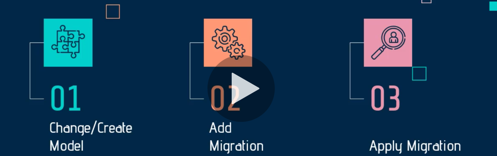
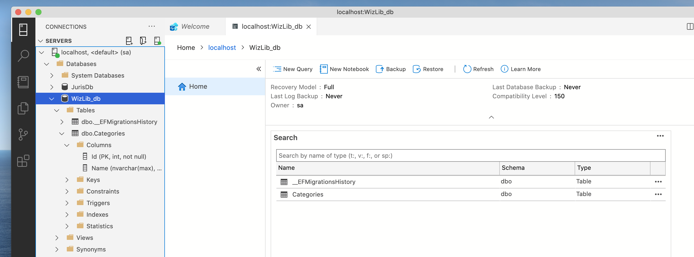

# 02 `Migrations`

## Créer le `model`

Un `model` représente une `table` en `BDD`.

Dans `WizLib.Model/Models` on va créer une nouvelle classe :

`Category.cs`

```cs
public class Category
{
  public int Id { get; set; }
  public string Name { get; set; }
}
```

Pour chaque `model` dont on veut une représentation dans la `BDD` par une `table`, on doit définir un `DbSet` dans notre `DbContext` :

`ApplicationDbContext.cs`

```cs
public DbSet<Category> Categories { get; set; }
```

On met le nom du `model` au pluriel. `EF Core` va automatiquement créer une table dans la `BDD`.


## `Migrations`

Les `migrations` permettent de garder le `model` et le `schema` de la `BDD` synchronisés.



1. On modifie le `model`
2. On ajoute une `migration`
3. On applique la `migration`

Pour les `migrations` on a besoin du package `EF Core.Tools` :

### désinstaller l'ancienne versio
```bash
dotnet tool uninstall --global dotnet-ef
```

### Installer la nouvelle version
```bash
dotnet tool install --global dotnet-ef --version 5.0.7
```


### Installer `EF Core.Design`

On doit être dans le projet contenant le `DbContext` : `WizLib.Data`

```bash
dotnet add package Microsoft.EntityFrameworkCore.Design --version 5.0.7
```


### Lancer une `migration`

La `migration` doit être lancée depuis l'application contenant le fichier `Startup` (ici `WizLib`) et on doit y ajouter :

`b => b.MigrationAssembly("WizLib")`

```cs
public void ConfigureServices(IServiceCollection services)
        {
            services.AddDbContext<ApplicationDbContext>(
                options => options.UseSqlServer(
                    Configuration.GetConnectionString("HukarConnection"),
                    b => b.MigrationsAssembly("WizLib") // <= ceci
                )
            );
```

```bash
dotnet ef migrations add AddCategoryTableToDb
```

### Correction

En fait les migrations sont lancées dans `WizLib.Data`, il ne faut pas ajouter le `MigrationAsssembly`.

Il faut être dans le projet `WizLib.Data` et spécifié en ligne de commande le projet `Startup` :

```bash
dotnet ef migrations add CategoryTable -s ../WizLib/
```

`-s` : `--startup-project` le projet de `startup` (qui contient la connexion à la `DB`).

## Mettre à jour la `BDD` :

```bash
dotnet ef database update -s ../WizLib/
```




## ajout de `Genre.cs`

### 1 Créer la classe

```cs
public class Genre
{
  public int GenreId { get; set; }
  public string Name { get; set; }
}
```


2 Ajouter un `DbSet` au `context`

```cs
public class ApplicationDbContext : DbContext
{
  // ...
  public DbSet<Genre> Genres { get; set; }
```


3 Créer une `migration`

```bash
dotnet ef migrations add GenreTable -s ../WizLib/
```


4 Mettre à jour la `BDD`

```bash
dotnet ef database update -s ../WizLib/
```


## Modifier les migrations

### règle d'or

Faire de petite `migration` => une modification par `migration`.


### Différents scénarios

1. Ajouter une classe / table

2. ajouter une propriété

    ```cs
    public class Genre
    {
    public int GenreId { get; set; }
    public string Name { get; set; }
    public bool DisplayOrder { get; set; }
    }
    ```

    ```bash
    dotnet ef migrations add AddPropertyDisplayOrderToGenre -s ../WizLib/
    ```

    Dans le fichier de `migration` :

    ```cs
    protected override void Up(MigrationBuilder migrationBuilder)
    {
    migrationBuilder.AddColumn<bool>(
    name: "DisplayOrder",
    table: "Genres",
    type: "bit",
    nullable: false,
    defaultValue: false);
    }
    ```

    Ajouter une propriété équivaut à ajouter une colonne.

    ```bash
    dotnet ef database update -s ../WizLib/
    ```

3. Modifier une propriété

   ```cs
   public class Genre
   {
     public int GenreId { get; set; }
     public string GenreName { get; set; }
     public bool DisplayOrder { get; set; }
   }
   ```
   
   ```bash
   dotnet ef migrations add ChangeNameToGenreNameInGanre -s ../WizLib/
   ```
   
   Dans le fichier de `migration` :
   
   ```cs
   protected override void Up(MigrationBuilder migrationBuilder)
   {
     migrationBuilder.RenameColumn(
       name: "Name",
       table: "Genres",
       newName: "GenreName");
   }
   ```
   
   Cela équivaut à renomer une colonne.
   
   ```bash
   dotnet ef database update -s ../WizLib/
   ```
   
   Par le passé cette opération supprimer l'ancienne colonne pour créer une nouvelle colonne, ce n'est plus le cas.
   
   > ## Exécuter du `SQL` dans une `migration`
   >
   > ```cs
   > migrationBuilder.Sql("UPDATE dbo.genre SET GenreName=Name");
   > ```
   >
   > Cela va copier les valeurs de la colonne `Name` dans la colonne `GenreName`.

4. Supprimer une propriété / colonne existante
   On va supprimer la propriété `DisplayOrder`

   ```cs
   public class Genre
   {
     public int GenreId { get; set; }
     public string GenreName { get; set; }
     // public bool DisplayOrder { get; set; }
   }
   ```

   ```bash
   dotnet ef migrations add DeletePropertyDisplayOrderToGenre -s ../WizLib/
   ```

   
   Bien sûr il y a un risque de perte de données.

   Dans la migration :

   ```cs
   protected override void Up(MigrationBuilder migrationBuilder)
   {
     migrationBuilder.DropColumn(
       name: "DisplayOrder",
       table: "Genres");
   }
   ```

   On retire bien une colonne.

   ```bash
   dotnet ef database update -s ../WizLib
   ```

5. Supprimer une classe / table de la `BDD`
   Pour supprimer une classe de la base de données il suffit de retirer (commenter) le `DbSet` correspondant :

   ```cs
   public class ApplicationDbContext : DbContext
   {
     public ApplicationDbContext(DbContextOptions<ApplicationDbContext> options) 
     : base(options) { }
   
     public DbSet<Category> Categories { get; set; }
     // public DbSet<Genre> Genres { get; set; }
   }
   ```

   Et de lancer une `migration` :

   ```bash
   dotnet ef migrations add RemoveGenreFromDb -s ../WizLib
   ```

   On obtient ceci :

   ```cs
   protected override void Up(MigrationBuilder migrationBuilder)
   {
     migrationBuilder.DropTable(
       name: "Genres");
   }
   ```

   Une suppression de table.

   ```bash
   dotnet ef database update -s ../WizLib
   ```

Les `migrations` ne doivent ni être supprimées, ni être renommées pour ne pas mettre la `DB` dans une situation chaotique (non consistente).

Les `migrations` sont de très bonnes candidates pour le versionning avec `git`.


## Retourner à une ancienne `migration`

```bash
dotnet ef database update <nom_de_la_migration>
```

`<nom_de_la_migration>` est le nom de la `migration` sans le `timestamp` et l'underscore `_` :

```cs
dotnet ef database update GenreTable -s ../WizLib
```

Pour la migration : `20210625085214_GenreTable.cs`

Un

```bash
dotnet ef database update -s ../WizLib
```

ramène dans l'état le plus récent.


## ! retour en arrière des `migrations`

Il vaut mieux créer une nouvelle `migration` que d'essayer de revenir à une migration antérieur.

