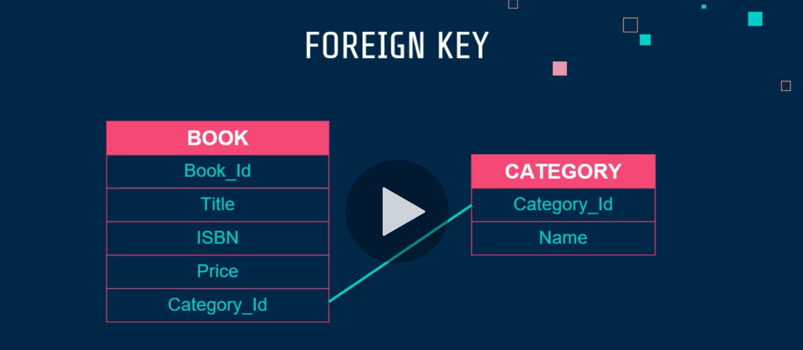
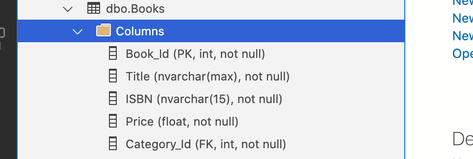
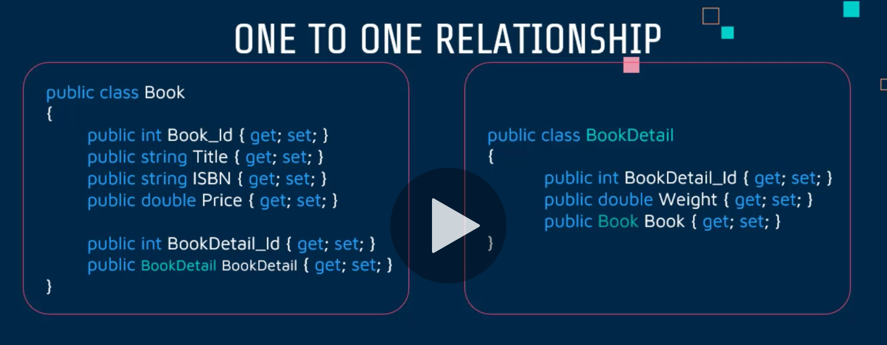
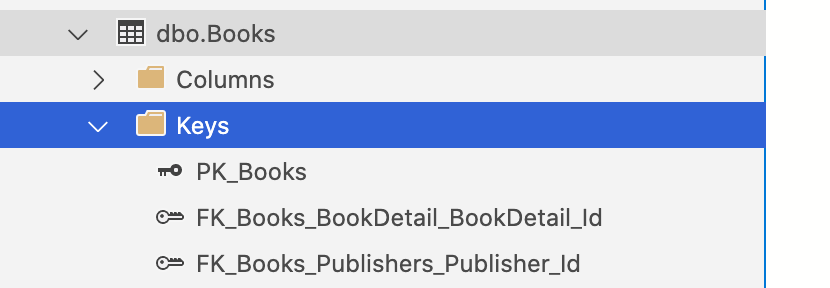
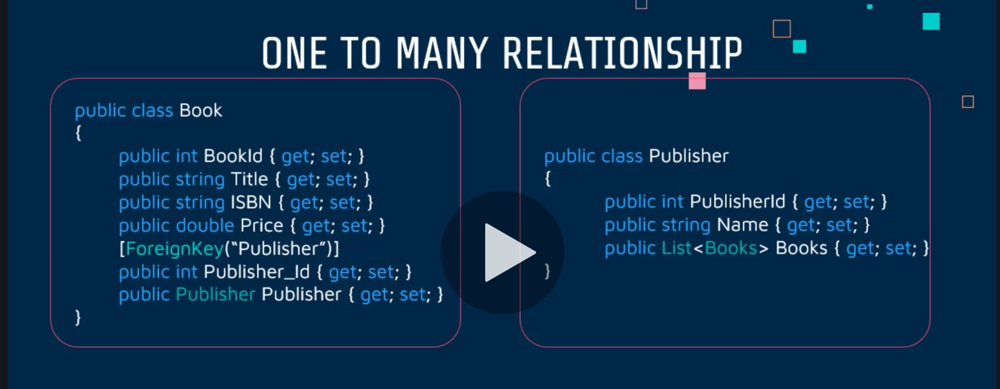

# 03 Data `Annotation`

## `EF Core` et le `mapping` avec la `BDD`

`EF Core` fonctionen tout d'abord par **convention**, une propriété se nommant `Id` ou `<entity>Id` sera automatiquement considérée comme une `primary key`.

Si notre syntaxe ne suit pas les conventions, il existe deux manières de résoudre le problème :

### 1. `Data Annotation`

```cs
[Key]
public int Genre_Id { get; set; }
```

### 2. `Fluent API`

```cs
modelBuilder.Entity<Genre>()
  .HasKey(b => b.Genre_id);
```


## Modifier le nom d'une table ou d'une colonne

Les noms de table ou de colonne prennent par convention les noms des classes ou des propriétés.

si on veut changer cela, on doit utiliser les `annotations` :

```cs
[Table("tb_Category")]
public class category
```

```cs
[Column("BookISBN")]
public string ISBN { get; set; }
```

### exemple avec la classe `Genre`

```cs
using System.ComponentModel.DataAnnotations.Schema;

namespace WizLib.Model.Models
{
    [Table("tb_Genre")]
    public class Genre
    {
        public int GenreId { get; set; }
        [Column("Name")]
        public string GenreName { get; set; }
        //public bool DisplayOrder { get; set; }
    }
}
```

Dans la `migration` :

```cs
protected override void Up(MigrationBuilder migrationBuilder)
{
  migrationBuilder.DropPrimaryKey(
    name: "PK_Genres",
    table: "Genres");

  migrationBuilder.RenameTable(
    name: "Genres",
    newName: "tb_Genre");

  migrationBuilder.RenameColumn(
    name: "GenreName",
    table: "tb_Genre",
    newName: "Name");

  migrationBuilder.AddPrimaryKey(
    name: "PK_tb_Genre",
    table: "tb_Genre",
    column: "GenreId");
}
```


## `Required` et `Primary Key`

### Création de `Book`

On va créer la classe `Book` dans le dossier `Models` :

```cs
public class Book
{
  public int Book_Id { get; set; }
  public string Title { get; set; }
  public string ISBN { get; set; }
  public double Price { get; set; }
}
```

On ajoute le `DbSet` au `context` :

```cs
public DbSet<Book> Books { get; set; }
```


### Syntaxe de `Required` et `Primary Key`

```cs
[Required]
public string Title { get; set; }
```
Met pour le champ en `BDD` le réglage `nullable` à `false`.

```cs
[Key]
public int Category_Id { get; set; }
```

Transforme la propriété en `Primary Key`


### Exemple avec la classe `Book`

```cs
public class Book
{
  [Key]
  public int Book_Id { get; set; }
  [Required]
  public string Title { get; set; }
  [Required]
  public string ISBN { get; set; }
  [Required]
  public double Price { get; set; }
}
```

Dans le fichier de `migration` :

```cs
protected override void Up(MigrationBuilder migrationBuilder)
{
  migrationBuilder.CreateTable(
    name: "Books",
    columns: table => new
    {
      Book_Id = table.Column<int>(type: "int", nullable: false)
        .Annotation("SqlServer:Identity", "1, 1"),
      Title = table.Column<string>(type: "nvarchar(max)", nullable: false),
      ISBN = table.Column<string>(type: "nvarchar(max)", nullable: false),
      Price = table.Column<double>(type: "float", nullable: false)
    },
    constraints: table =>
    {
      table.PrimaryKey("PK_Books", x => x.Book_Id);
    });
}
```


## `Max Length` et `Not Mapped`

```cs
[MaxLength(50)]
public string Title { get; set; }
```

```cs
using System.ComponentModel.DataAnnotations.Schema;

[NotMapped]
public double DiscountedPrice { get; set; }
```

Pour les propriétés qu'on veut afficher mais pas garder en `BDD`. Vient de `DataAnnotation.Schema`.

### Exemple

```cs
public class Book
{
  [Key]
  public int Book_Id { get; set; }
  [Required]
  public string Title { get; set; }
  [Required]
  [MaxLength(15)]
  public string ISBN { get; set; }
  [Required]
  public double Price { get; set; }
  [NotMapped]
  public string PriceRange { get; set; }
}
```

On obtient la migration suivante :

```cs
protected override void Up(MigrationBuilder migrationBuilder)
{
  migrationBuilder.AlterColumn<string>(
    name: "ISBN",
    table: "Books",
    type: "nvarchar(15)",
    maxLength: 15,
    nullable: false,
    oldClrType: typeof(string),
    oldType: "nvarchar(max)");
}
```

Une limite de 15 caractères a été ajoutée et `PriceRange` n'a pas été sauvé en `BDD`.

On peut donc retirer cette propriété sans ajouter une migration.


## Ajout au `Model`

`Author.js`

```cs
using System;
using System.ComponentModel.DataAnnotations;
using System.ComponentModel.DataAnnotations.Schema;

namespace WizLib.Model.Models
{
  public class Author
  {
    [Key]
    public int Publisher_Id { get; set; }
    [Required]
    public string FirstName { get; set; }
    [Required]
    public string LastName { get; set; }
    public DateTime BirthDate { get; set; }
    public string Location { get; set; }
    [NotMapped]
    public string FullName => $"{FirstName} {FullName}";
  }
}
```

`Publisher.cs`

```cs
using System.ComponentModel.DataAnnotations;

namespace WizLib.Model.Models
{
    public class Publisher
    {
        [Key]
        public int Publisher_Id { get; set; }
        [Required]
        public string Name { get; set; }
        [Required]
        public string Location { get; set; }
    }
}
```

On ajoute nos classes au `context` :

`ApplicationDbContext.cs`

```cs
public class ApplicationDbContext : DbContext
{
  // ...
  public DbSet<Author> Authors { get; set; }
  public DbSet<Publisher> Publishers { get; set; }
}
```

On ajoute une `migration` :

```bash
dotnet ef migrations add AuthorAndPublisherAdding -s ../WizLib
```

> ## Test sur `FullName`
>
> L'annotation `NotMapped` ne paraît pas nécessaire, car même sans, la migration ne semble pas prendre en compte une propriété sans `setter`.
>
> Il semble que sans `setter`, `EF Core` ne peut pas *voire* la propriété.

On met à jour la `BDD` :

```bash
dotnet ef database update -s ../WizLib
```


## `Identity`

Chaque `model` enregistré en `BDD` doit avoir un `Id`, mais il y a plusieurs façon de l'obtenir.

Par défaut c'est ce code qui est exécuté :

```cs
[Key]
[DatabaseGenerated(DatabaseGeneratedOption.Identity)]
public int Author_Id { get; set; }
```

On dit ici à la `BDD` de générer l'`Id`.

#### On a d'autres options :

`[DatabaseGenerated(DatabaseGeneratedOption.None)]` précise à la `BDD` de ne pas générer automatiquement l'`Id`.

`[DatabaseGenerated(DatabaseGeneratedOption.Computed)]` l'`Id` est régénéré à chaque nouvel sauvegarde.


## Ajouter une `Foreign Key`



Si dans la classe `Book` on ajoute une propriété `Category`, `EF Core` va automatiquement créer la relation :

```cs
public class Book
{
  // ...
  public Category Category { get; set; } // <= Foreign Key
}
```

On a dans la `migration` :

```cs
protected override void Up(MigrationBuilder migrationBuilder)
{
  migrationBuilder.AddColumn<int>(
    name: "CategoryId",
    table: "Books",
    type: "int",
    nullable: true);

  migrationBuilder.CreateIndex(
    name: "IX_Books_CategoryId",
    table: "Books",
    column: "CategoryId");

  migrationBuilder.AddForeignKey(
    name: "FK_Books_Categories_CategoryId",
    table: "Books",
    column: "CategoryId",
    principalTable: "Categories",
    principalColumn: "Id",
    onDelete: ReferentialAction.Restrict);
}
```

Pour retirer la dernière migration :

```bash
dotnet ef migrations remove -s ../WizLib
```


### Décider du nom de la clé étrangère en `BDD`

On doit ajouter explicitement une `Foreign Key` en plus de la `Navigation Property` dans le `model` du `Book` :

```cs
public class Book
{
  [Key]
  public int Book_Id { get; set; }
  
  // ...
  [ForeignKey("Category")]
  public int Category_Id { get; set; }
  
  public Category Category { get; set; }
}
```

On aura donc comme nom de colonne pour la clé étrangère `Category_Id` plutôt que `Category`.

```cs
migrationBuilder.AddColumn<int>(
  name: "Category_Id",
  table: "Books",
  type: "int",
  nullable: false,
  defaultValue: 0);

migrationBuilder.CreateIndex(
  name: "IX_Books_Category_Id",
  table: "Books",
  column: "Category_Id");

migrationBuilder.AddForeignKey(
  name: "FK_Books_Categories_Category_Id",
  table: "Books",
  column: "Category_Id",
  principalTable: "Categories",
  principalColumn: "Category_Id",
  onDelete: ReferentialAction.Cascade);
}
```




## `One-To-One` Relationship

On va créer un nouveau `model` : `BookDetail`

```cs
public class BookDetail
{
  [Key]
  public int BookDetail_Id { get; set; }
  [Required]
  public int NumberOfChapters { get; set; }
  public int NumberOfPages { get; set; }
  public double Weight { get; set; }
  public Book Book { get; set; } // One-To-One
}
```

La propriété `Book` renforce la relation `1-1`.

On va modifier le `model` `Book` :

```cs
public class Book
{
  [Key]
  public int Book_Id { get; set; }
  [Required]
  public string Title { get; set; }
  [Required]
  [MaxLength(15)]
  public string ISBN { get; set; }
  [Required]
  public double Price { get; set; }
  [ForeignKey("BookDetail")]
  public int BookDetail_Id { get; set; } // One-To-One
  public BookDetail BookDetail { get; set; } // One-To-One
}
```

On doit aussi retirer `Category` du `context` :

```cs
// public DbSet<Category> Categories { get; set; }
public DbSet<Genre> Genres { get; set; }
```

Voici la `migration` :

```cs
protected override void Up(MigrationBuilder migrationBuilder)
{
  migrationBuilder.DropForeignKey(
    name: "FK_Books_Categories_Category_Id",
    table: "Books");

  migrationBuilder.DropTable(
    name: "Categories");

  migrationBuilder.DropIndex(
    name: "IX_Books_Category_Id",
    table: "Books");

  migrationBuilder.RenameColumn(
    name: "Category_Id",
    table: "Books",
    newName: "BookDetail_Id");

  migrationBuilder.CreateTable(
    name: "BookDetail",
    columns: table => new
    {
      BookDetail_Id = table.Column<int>(type: "int", nullable: false)
        .Annotation("SqlServer:Identity", "1, 1"),
      NumberOfChapters = table.Column<int>(type: "int", nullable: false),
      NumberOfPages = table.Column<int>(type: "int", nullable: false),
      Weight = table.Column<double>(type: "float", nullable: false)
    },
    constraints: table =>
    {
      table.PrimaryKey("PK_BookDetail", x => x.BookDetail_Id);
    });

  migrationBuilder.CreateIndex(
    name: "IX_Books_BookDetail_Id",
    table: "Books",
    column: "BookDetail_Id",
    unique: true);

  migrationBuilder.AddForeignKey(
    name: "FK_Books_BookDetail_BookDetail_Id",
    table: "Books",
    column: "BookDetail_Id",
    principalTable: "BookDetail",
    principalColumn: "BookDetail_Id",
    onDelete: ReferentialAction.Cascade);
}
```

`Category` est retirée tandis que `BookDetail` est créer.

#### ! Il n'a pas été nécessaire de créer un `DbSet` pour `BookDetail`.

> Par défaut les types `int` et `double` sont `required`.
>
> Si on veut que `nullable: true`, il faut ajouter l'opérateur `?` :
>
> ```cs
> public int? NumberOfChapters { get; set; }
> public int NumberOfPages { get; set; }
> public double? Weight { get; set; }
> ```
>
> ```cs
> // migration
> protected override void Up(MigrationBuilder migrationBuilder)
> {
>   migrationBuilder.AlterColumn<double>(
>     name: "Weight",
>     table: "BookDetail",
>     type: "float",
>     nullable: true,
>     oldClrType: typeof(double),
>     oldType: "float");
> 
>   migrationBuilder.AlterColumn<int>(
>     name: "NumberOfChapters",
>     table: "BookDetail",
>     type: "int",
>     nullable: true,
>     oldClrType: typeof(int),
>     oldType: "int");
> }
> ```




## `One-To-Many` Relationship

Un `Publisher` peut avoir plusieurs `Book` publiés.

Un `Book` n'a qu'un `Publisher`.

```cs
public class Book
{
  // ...
  [ForeignKey("Publisher")]
  public int Publisher_Id { get; set; }
  public Publisher Publisher { get; set; }
}
```

```cs
public class Publisher
{
  public int Publisher_Id { get; set; }
  // ...
  public List<Book> Books { get; set; }
}
```

```bash
dotnet ef migrations add OneToManyPublisherBook -s ../WizLib
```

```cs
protected override void Up(MigrationBuilder migrationBuilder)
{
  migrationBuilder.AddColumn<int>(
    name: "Publisher_Id",
    table: "Books",
    type: "int",
    nullable: false,
    defaultValue: 0);

  migrationBuilder.CreateIndex(
    name: "IX_Books_Publisher_Id",
    table: "Books",
    column: "Publisher_Id");

  migrationBuilder.AddForeignKey(
    name: "FK_Books_Publishers_Publisher_Id",
    table: "Books",
    column: "Publisher_Id",
    principalTable: "Publishers",
    principalColumn: "Publisher_Id",
    onDelete: ReferentialAction.Cascade);
}
```



On a bien maintenant deux `Foreign Key` dans notre table `Books`.




## `Many-To-Many` Relationship

Un `Author` peut avoir plusieurs `Book`.

Un `Book` peut avoir plusieurs `Author`.

```cs
public class Book
{
  // ...
  public List<Author> Authors { get; set; }

}
```

```cs
public class Author
{
  // ...
  public List<Book> Books { get; set; }
}
```

```cs
protected override void Up(MigrationBuilder migrationBuilder)
{
  migrationBuilder.CreateTable(
    name: "AuthorBook",
    columns: table => new
    {
      AuthorsAuthor_Id = table.Column<int>(type: "int", nullable: false),
      BooksBook_Id = table.Column<int>(type: "int", nullable: false)
    },
    constraints: table =>
    {
      table.PrimaryKey("PK_AuthorBook", x => new { x.AuthorsAuthor_Id, x.BooksBook_Id });
      table.ForeignKey(
        name: "FK_AuthorBook_Authors_AuthorsAuthor_Id",
        column: x => x.AuthorsAuthor_Id,
        principalTable: "Authors",
        principalColumn: "Author_Id",
        onDelete: ReferentialAction.Cascade);
      table.ForeignKey(
        name: "FK_AuthorBook_Books_BooksBook_Id",
        column: x => x.BooksBook_Id,
        principalTable: "Books",
        principalColumn: "Book_Id",
        onDelete: ReferentialAction.Cascade);
    });

  migrationBuilder.CreateIndex(
    name: "IX_AuthorBook_BooksBook_Id",
    table: "AuthorBook",
    column: "BooksBook_Id");
}
```

Avec `EF Core 5` c'est vraiment très simple et ne nécessite pas de créer un `model` de la table de jointure.

