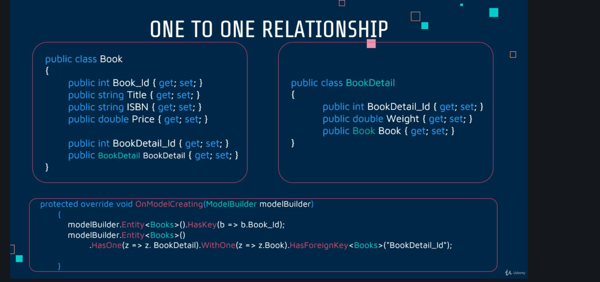

# 04 `Fluent Api`

## Clé Primaire composée

Pour avoir une clé Primaire formée par deux propriété, on est obligé d'utiliser `Fluent Api`.

### Utilisation de `Fluent Api`

Il faut redéfinir la méthode (`override`) `OnModelCreating` dans le `context` :

`ApplicationDbContext.cs`

```cs
// ...

protected override void OnModelCreating(ModelBuilder modelBuilder)
{
  // We configure fluent API
  
  // Composite key
  modelBuilder
    .Entity<BookAuthor>()
    .HasKey(ba => new { ba.Book_Id, ba.Author_Id });
}
```

Si on avait qu'une seule propriété comme clé on aurait :

```cs
.HasKey(ba => ba.Author_Id);
```

par exemple.


## `Required` et `Primary Key`

```cs
modelBuilder
  .Entity<Category>()
  .Property(c => c.Title)
  .IsRequired();
```

```cs
modelBuilder
  .Entity<Category>()
  .HasKey(c => c.Category_Id);
```

Si la propriété avait un nom comme `CategoryId` ou simplement `Id` il n'y aurait pas besoin de la spécifié comme `Primary Key`.


### Exemple

```cs
// dans la méthode OnModelCreating

// Bookdetail
modelBuilder
  .Entity<BookDetail>()
  .HasKey(bd => bd.BookDetail_Id);

modelBuilder
  .Entity<BookDetail>()
  .Property(bd => bd.NumberOfChapters)
  .IsRequired();
```

On ajoute le `DbSet` :

```cs
public DbSet<BookDetailFluent> BookDetailFluents { get; set; }
```

Et on lance une `migration` :

```cs
dotnet ef migrations add BookDetailFluent -s ../WizLib
```


## Smartness

`EF Core` est suffisamment intélligent pour déduire certaine chose.

En base de données on peut voire qu'une table `BookDetail` a été créée alors qu'aucun `DbSet` n'a été créé.

C'est parceque `EF Core` déduit cette table de l'entité `Book` qui a une propriété `BookeDetail`.

 Créons cette fois le `DbSet` `BookDetails` avec un `s` :

```cs
public DbSet<BookDetail> BookDetails { get; set; }
```

Lançons une `migrations` :

```cs
protected override void Up(MigrationBuilder migrationBuilder)
{
  migrationBuilder.DropForeignKey(
    name: "FK_Books_BookDetail_BookDetail_Id",
    table: "Books");

  migrationBuilder.DropPrimaryKey(
    name: "PK_BookDetail",
    table: "BookDetail");

  migrationBuilder.RenameTable(
    name: "BookDetail",
    newName: "BookDetails");

  migrationBuilder.AddPrimaryKey(
    name: "PK_BookDetails",
    table: "BookDetails",
    column: "BookDetail_Id");

  migrationBuilder.AddForeignKey(
    name: "FK_Books_BookDetails_BookDetail_Id",
    table: "Books",
    column: "BookDetail_Id",
    principalTable: "BookDetails",
    principalColumn: "BookDetail_Id",
    onDelete: ReferentialAction.Cascade);
}
```

La `migration` va modifier les clé (`drop` et ensuite `add`) et renommer la table.


## `BookFluent`

dans `ApplicationDbContext` :

```cs
// BookFluent
modelBuilder.Entity<BookFluent>
  .HasKey(bf => bf.BookFluent_id);

modelBuilder.Entity<BookFluent>
  .Property(bf => bf.ISBN)
  .IsRequired()
  .HasMaxLength(15);

modelBuilder.Entity<BookFluent>
  .Property(bf => bf.Title)
  .IsRequired();

modelBuilder.Entity<BookFluent>
  .Property(bf => bf.Price)
  .IsRequierd();
```

#### `HasMaxLength(int nb)` 


## `AuthorFluent`

```cs
// AuthorFluent
modelBuilder.Entity<AuthorFluent>()
  .HasKey(af => af.AuthorFluent_Id);

modelBuilder.Entity<AuthorFluent>()
  .Property(af => af.FirstName)
  .IsRequired();

modelBuilder.Entity<AuthorFluent>()
  .Property(af => af.LastName)
  .IsRequired();

modelBuilder.Entity<AuthorFluent>()
  .Ignore(af => af.FullName);
```

#### `Ignore(o => o.Property)` ne persiste pas la propriété en `BDD`. 


## `PublisherFluent`

```cs
// PublisherFluent
modelBuilder.Entity<PublisherFluent>().HasKey(pf => pf.PublisherFluent_Id);
modelBuilder.Entity<PublisherFluent>().Property(pf => pf.Name).IsRequired();
modelBuilder.Entity<PublisherFluent>().Property(pf => pf.Location).IsRequired();
```


## Ajout des `DbSet`

```cs
public DbSet<BookDetailFluent> BookDetailFluents { get; set; }
public DbSet<BookFluent> BookFluents { get; set; }
public DbSet<AuthorFluent> AuthorFluents { get; set; }
public DbSet<PublisherFluent> PublisherFluents { get; set; }
```


## `Table Name` et `Column Name`

### `ToTable("db_TableName")`

```cs
modelBuilder.Entity<Category>()
  .ToTable("tb_Category");
```

### `HasColumnName("MyColumnName")`

```cs
modelBuilder.Entity<Category>()
  .Property(c => c.ISBN)
  .HasColumnName("bookISBN");
```


### Exemple : `Category`

```cs
// Category table name and column name
modelBuilder.Entity<Category>().ToTable("tbl_category");
modelBuilder.Entity<Category>().Property(c => c.Name).HasColumnName("CategoryName");
```

```cs
migrationBuilder.CreateTable(
  name: "tbl_category",
  columns: table => new
  {
    Category_Id = table.Column<int>(type: "int", nullable: false)
      .Annotation("SqlServer:Identity", "1, 1"),
    CategoryName = table.Column<string>(type: "nvarchar(max)", nullable: true)
  },
  constraints: table =>
  {
    table.PrimaryKey("PK_tbl_category", x => x.Category_Id);
  });
```


## `One-To-One`

`BookFluent` et `BookDetailFluent` :

```cs
public class BookFluent
{
  // ...
  public int BookDetailFluent_Id { get; set; }

  public BookDetailFluent BookDetailFluent { get; set; }
}
```

```cs
public class BookDetailFluent
{
  public int BookDetailFluent_Id { get; set; }

  // ...

  public BookFluent BookFluent { get; set; }
}
```

On va définir la clé étrangère dans `ApplicationDbContext` :

```cs
// One to one book and bookDetail fluent
modelBuilder.Entity<BookFluent>()
  .HasOne(bf => bf.BookDetailFluent)
  .WithOne(bd => bd.BookFluent)
  .HasForeignKey<BookFluent>("bookDetailFluent_Id");
```

On a `WithOne` et `WithMany`.

### résumé




