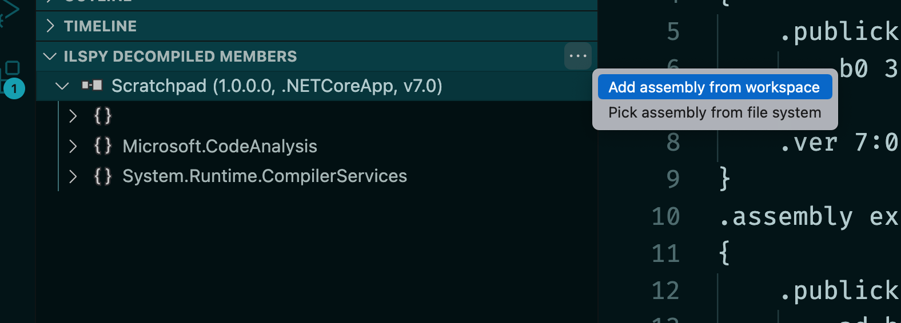
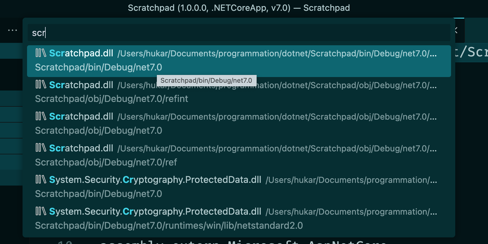
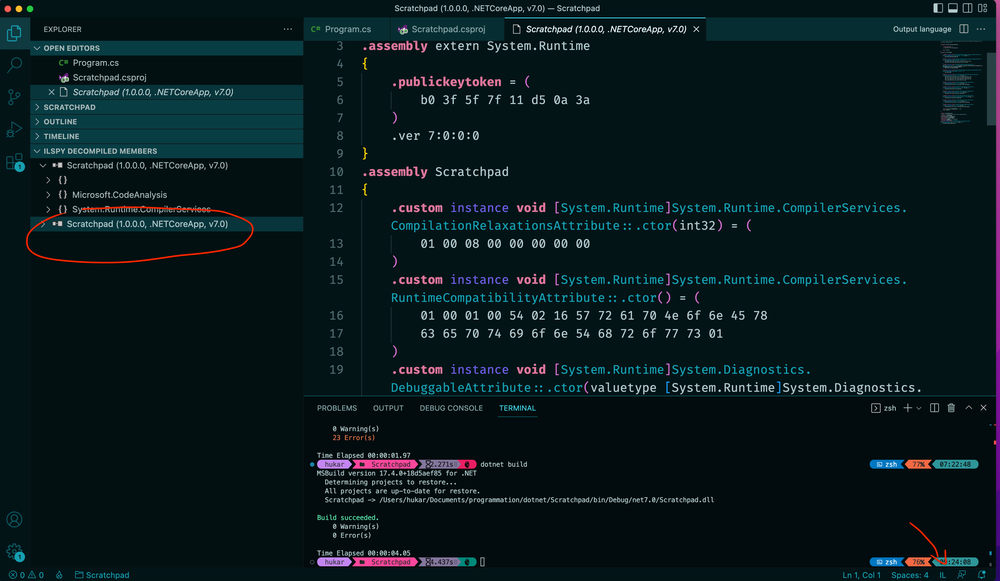
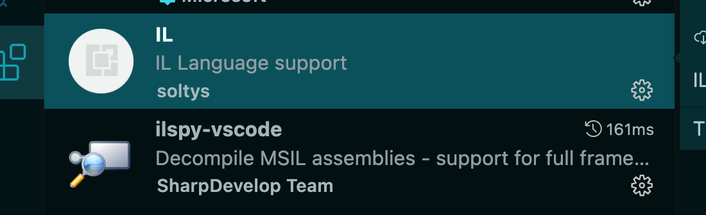
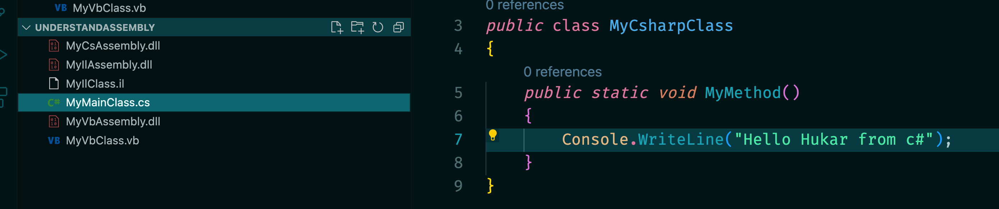
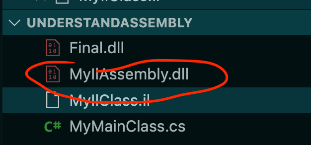
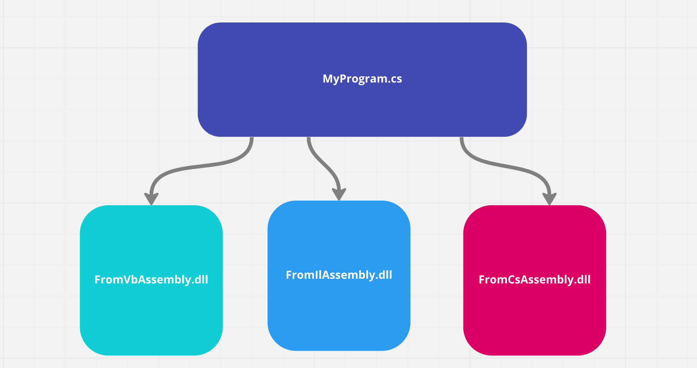

# 00.5 .net `Assembly`

Une `assembly` prend la forme d'un fichier executable `.exe` ou d'un fichier `Dynamic Link Library` (`.dll`).

Ce sont les blocks de construction d'une application `.net`.

On peut obtenir programmatiquement des infos sur l'`assembly` en utilisant la `Reflection`.


## `ILSpy`

Pour ouvrir une `dll` et y voire le code `IL`, il existe une extension `VSCode` : `ILSpy` :







Il faut changer le type en bas en `IL` pour avoir la coloration syntaxique (grâce à l'extension `IL`) :




## Exemple `.net framework` avec `csc.exe`

> `csc.exe` est l'équivalent `.net framework` de `dotnet build` pour `.NET`.
>
> Sur ma machine il est fourni par `mono` :
>
> ```bash
> which csc
> 
> /Library/Frameworks/Mono.framework/Versions/Current/Commands/csc
> ```
>
> `Mono` est une implémentation `Open Source` de `.net framework`.

Documentation : https://learn.microsoft.com/en-us/dotnet/csharp/language-reference/compiler-options/

C'est le compilateur `c#`, il est installé avec le `sdk`.

Compiler une `library` :

```bash
csc -target:library -out:MyCsAssembly.dll MyMainClass.cs 
```



`-target` : `library`, `exe`, `module`, ...

### `ilasm` compaliteur `IL`

Je peux aussi compiler un fichier en `IL` : `Intermediate Language`.

```csharp
.assembly MyIlAssembly {}

.assembly extern mscorlib {}

.class public MyIlClass extends [mscorlib]System.Object {
    .method public static void MyMethod() cil managed
    {
        ldstr "Hello from Il ... Hukar."

        call void [mscorlib]System.Console::WriteLine (string)
        ret
    }
}	
```

```bash
ilasm -dll -output:MyIlAssembly.dll MyIlClass.il                                             
```




###  `VBC` le compilateur `VB`

De même on créé un code simple en `VB` :

```vb
Imports System

Public Class MyVbClass
   Shared Sub MyMethod()
     Console.WriteLine("Hello World! from VB ...")
   End Sub
End Class
```

Et on le compile en `dll` :

```bash
vbc -target:library -out:MyVbAssembly.dll MyVbClass.vb 
```


### On va créer un programe pouvant utiliser ces `dll` :

```cs
using System;

class MainClass
{
    static void main()
    {
        MyCsharpClass.MyMethod();
        MyIlClass.MyMethod();
        MyVbClass.MyMethod();
    }
}
```

On doit créer une référence vers les différentes `dll` :

```bash
csc -reference:MyIlAssembly.dll -reference:MyVbAssembly.dll -reference:MyCsAssembly.dll MainClass.cs
```

Cela a créé un fichier `MyMainClass.exe`.

Pour le lire sur `Mac` on doit utiliser `mono` :

```bash
mono MyMainClass.exe 

Hello Hukar from c#
Hello from Il ... Hukar.
Hello World! from VB ...
```

On voit que quelque soit le langage de départ, le code est exécuté dans le programme `C#`.




### `Assembly`

99% du temps une `assembly` contient uniquement un `module`.

Mais il est possible de créer une `assembly` avec plusieurs `modules` (seulement pour `.net framework`).


