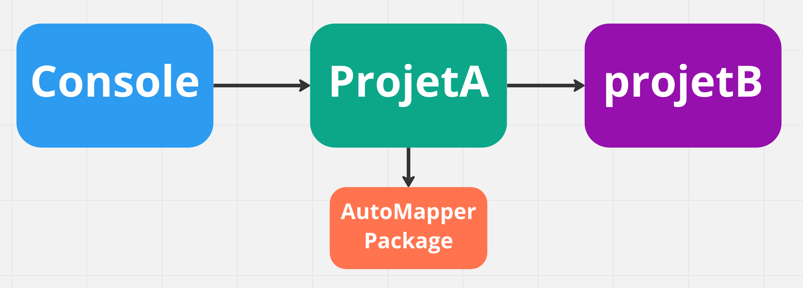

# 00.6 `Assembly` et transitivité


Il y a trois projets :

- `Console` qui est le projet `console` exécutable  `exe`

  ```cs
  <PropertyGroup>
      <OutputType>Exe</OutputType>
  ```

- `ProjetA` une `classlib`

- `ProjetB` une `classlib`

**Si** le `ProjetA` référence le `ProjetB`:

```bash
dotnet add ./ProjetA reference ./ProjetB
```

```cs
<ItemGroup>
    <ProjectReference Include="..\ProjetB\ProjetB.csproj" />
  </ItemGroup>
```

**Et** le programme `Console` référence le `ProjetA`:

```cs
dotnet add ./Console reference ./ProjetA
```

```cs
<ItemGroup>
    <ProjectReference Include="..\ProjetA\ProjetA.csproj" />
 </ItemGroup>
```

**Alors** le programme `Console` a par transitivité accès au `ProjetB`.


## `Package` transitivité

Les `nuget package` sont aussi diponible d'un projet à l'autre par transitivité:



> ### Attention !
>
> Pour que les `nuget package` soient vus et disponibles, il faut obligatoirement faire un `restore` au niveau de la solution (`sln`).