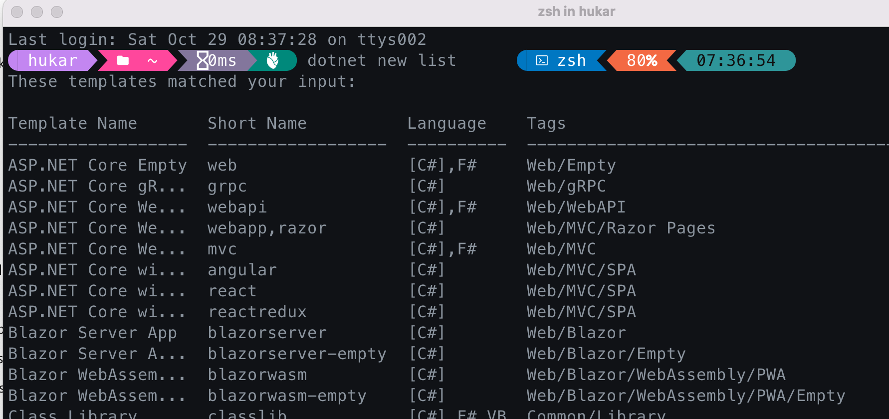
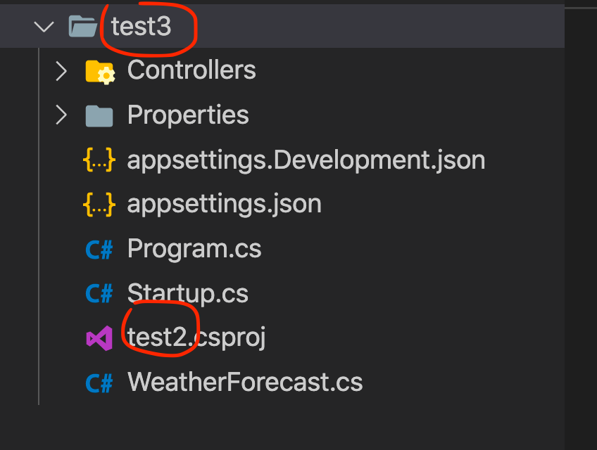

# 01 Les commandes les plus utilisées `DOTNET CLI`

`dotnet restore` génère les dépendances `bin` et `obj`

`dotnet run Program.cs` lance un `restore` et un `build` avant de lancer le programme.

`dotnet new console -o mon-projet-console` crée un projet console.

`dotnet /path/to/my/Program.dll` lance le programme compilé.

`dotnet new classlib -o ./ma-librairie` pour créer une librairie.


## Changer la langue

```bash
export DOTNET_CLI_UI_LANGUAGE=en
```


## Créer une solution

```bash
dotnet new sln -o SamouraiApp2 -n TotoEnPrison
```


```bash
dotnet new sln -o SamouraiApp2 -n TotoEnVacances
```


`-n` le nom du fichier de solution.

`-o` le chemin où placer le contenu généré, crée le dossier s'il n'existe pas.


## Lister les projets disponibles

```bash
dotnet new list
```




## Créer un projet

```bash
dotnet new classlib -o SamouraiApp.Data

dotnet new console -o SamouraiApp.UI
```


```bash
dotnet new webapi -n test2 -o test3
```




## Ajouter une référence d'un projet à l'autre

`dotnet add reference ./path/to/my/reference.csproj` pour utiliser des librairie annexe dans son projet.

```bash
# Ajouter une référence de PROJECT2 dans PROJECT1
dotnet add ./PROJECT1/ reference ./PROJECT2/
```


## Retirer une référence à un projet

```bash
dotnet remove API/API.csproj reference Lib/Lib.csproj
```

Retire la librairie `Lib` au projet `API`.

ici on doit donner le chemin vers le fichier de projet `csproj`.


## `watcher` son projet

```bash
dotnet watch run --project ./MonSuperProjet/
```

`dotnet watch run` équivalent de `nodemon app.js`.


## Ajouter un projet à la Solution

```bash
dotnet sln add ./MonNouveauProjet/
```


### Ajouter plusieurs projets

```bash
dotnet sln todo.sln add **/*.csproj
```

Si on est dans le dossier de la solution :

```bash
dotnet sln add **/*.csproj

Projet 'SamouraiApp.Data/SamouraiApp.Data.csproj' ajouté à la solution.
Projet 'SamouraiApp.Domain/SamouraiApp.Domain.csproj' ajouté à la solution.
```

Dans le fichier `MonApp.sln` :

```
Project("{FAE04EC0-301F-11D3-BF4B-00C04F79EFBC}") = "SamouraiApp.Data", "SamouraiApp.Data\SamouraiApp.Data.csproj", "{92116AF8-4D19-4806-A006-11CCBD2942E7}"
EndProject
Project("{FAE04EC0-301F-11D3-BF4B-00C04F79EFBC}") = "SamouraiApp.Domain", "SamouraiApp.Domain\SamouraiApp.Domain.csproj", "{3CF6B09E-A0CC-4F40-905F-5A366FB7B253}"
EndProject
```


### Lister les projets de la solution

```bash
dotnet sln list

Projet(s)
---------
SamouraiApp.Data/SamouraiApp.Data.csproj
SamouraiApp.Domain/SamouraiApp.Domain.csproj
```


## Ajouter un `package`

```bash
dotnet add package Mon.PackageDeLaMort.QuiTue --version 6.66

dotnet add package Microsoft.EntityFrameworkCore.SqlServer --version 5.0.4
```


## Retirer un `package`

```bash
dotnet remove package Mon.PackageDeLaMort.QuiTue
```


## Lister les `SDK` installés sur sa machine

```bash
dotnet --list-sdks

2.1.818 [/usr/local/share/dotnet/sdk]
3.1.416 [/usr/local/share/dotnet/sdk]
5.0.404 [/usr/local/share/dotnet/sdk]
6.0.100 [/usr/local/share/dotnet/sdk]
6.0.101 [/usr/local/share/dotnet/sdk]
```


## Mettre à jour les `packages` de `template`

Contrôler si les package de template sont à jour :

```bash
dotnet new update --check-only
```

```
All template packages are up-to-date.
```

Mettre à jour les packages de template :

```bash
dotnet new update
```


## Utilisation de `aspnet-codegenerator`

Installer `aspnet-codegenerator` et les `templates`

```bash
dotnet tool install -g dotnet-aspnet-codegenerator

# les templates :
dotnet add package Microsoft.VisualStudio.Web.CodeGeneration.Design
```

Créer un `controller`

```bash
dotnet aspnet-codegenerator -p API/ controller -api -name SelfiesController --relativeFolderPath Controllers -namespace Selfies.API.Controllers
```

`-p` spécifie le projet

`-api` crée un `controller` d'`api` (hérite de `ControllerBase` et `attribute` spécifiques)

`-name` nom du contrôleur

`--relativeFolderPath` chemin relatif

`-namespace` spécifie le `namespace`


## Vider le cache des `package nuget`

```bash
# Clear all caches (use either command)
dotnet nuget locals all --clear
```

