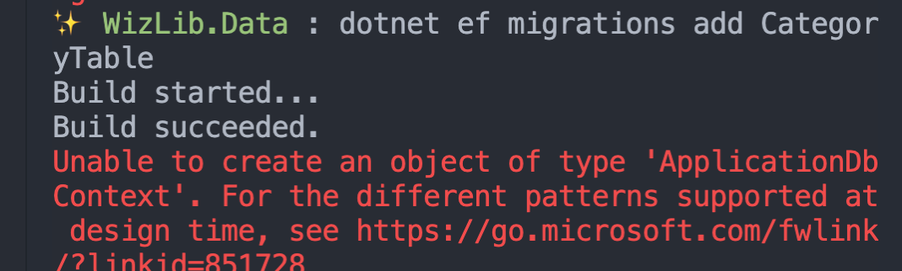

# 02 Utilisation de `EF Core` en ligne de commande

## Installer `EF Core` pour `SQL Server`

```bash
dotnet add package Microsoft.EntityFrameworkCore.SqlServer --version 6.0.6
```


## Installation

### Installer les `Entity Framework Tools`

On a besoin des `Entity Framework Tools`.

#### Tester s'ils sont installés :

```bash
dotnet ef
```

#### Installation

```bash
# désinstaller l'ancienne version
dotnet tool uninstall --global dotnet-ef

# Installer la nouvelle version
dotnet tool install --global dotnet-ef --version 6.0.0-rc.2.21480.5
```

### Mise à jour de l'outil globale

```bash
dotnet tool update --global dotnet-ef --version 6.0.0-rc.2.21480.5
```


### Installer `Entity Framework Design`

```bash
dotnet add package Microsoft.EntityFrameworkCore.Design --version 6.0.0-rc.2.21480.5
```


## `Migration`

```bash
dotnet ef migrations add <MonNomDeMigration>
```


### Mise à jour de la base de données

```bash
dotnet ef database update
```


## Startup Project

> Si la `migration` n'est pas exécutée dans le projet de `Startup`, il peut être nécessaire de spécifier le `Startup Project` avec `-s`  ou `--startup-project`
>
> ```
> -s|--startup-project <PROJECT>         The startup project to use. Defaults to the current working directory.
> ```
>
> 
>
> Pour corriger ce problème il faut renseigner le `Startup Project` :
>
> ```bash
> ✨ WizLib.Data : dotnet ef migrations add CategoryTable -s ../WizLib/
> Build started...
> Build succeeded.
> Done. To undo this action, use 'ef migrations remove'
> ```
> Il faut aussi que le `projet` `startup` possède le `package` : `Microsoft.EntityFrameworkCore.Design`

