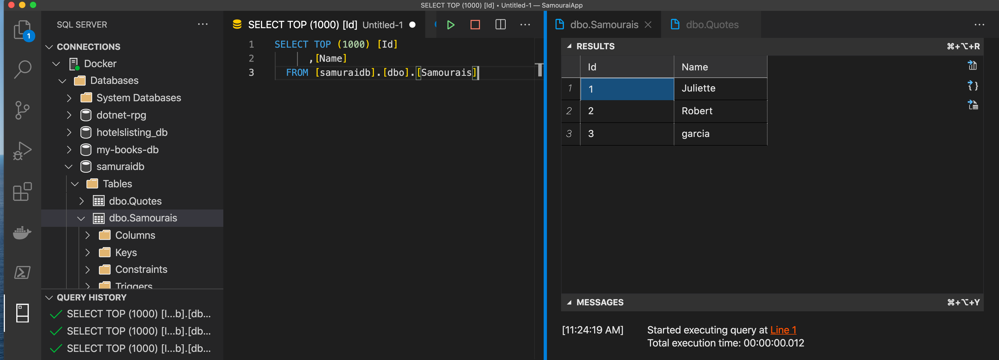
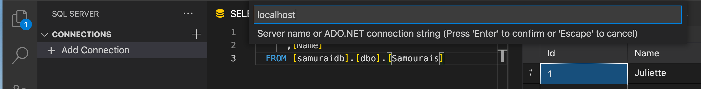
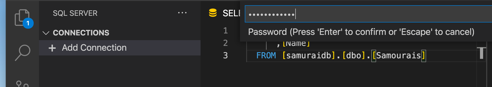
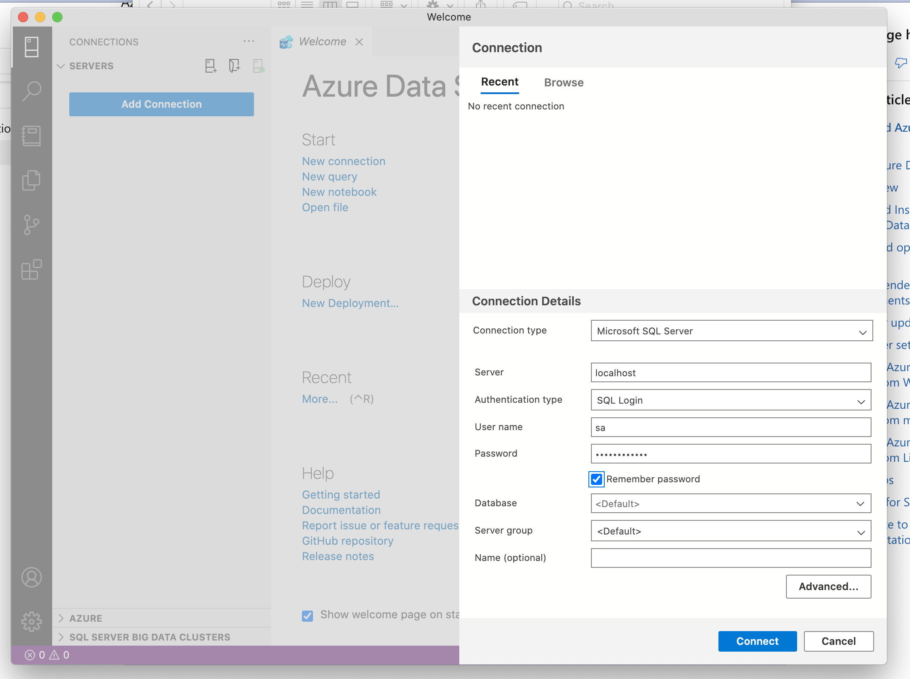

# 03 Connection à une db `SQL Server`

## Dans `appSettings.json`

```json
{
    "ConnectionStrings": {
        "HukarConnection": "Server=localhost,1433; Database=dotnet-rpg; User=sa; Password=huk@r2Xmen99"
    },
    // ...
}
```

`"ConnectionStrings"` suit une convention de nommage utilisée par `Startup.cs`.

`"HukarConnection"` nom arbitraire.

Plutôt que `User=xxx; Password=xxx` on pourrait utiliser `integrated security=true`, ce qui laisse l'authentification au `Windows` qui héberge `SQL Server`.

> On peut avoir un problème si on exécute une requête tout en itérant sur les résultats d'une autre requête.
>
> Pour éviter cela on utilise `MultipleActiveResultSets=true` :
>
> ```json
> "ConnectionStrings": {
>         "HukarConnection": "Server=localhost,1433;Database=InAndOut;User=sa;Password=huk@r2Xmen99;MultipleActiveResultSets=true"
>     },
> ```


## Dans `Startup.cs`

```cs
public void ConfigureServices(IServiceCollection services)
{
  services.AddDbContext<DataContext>(options => options.UseSqlServer(Configuration.GetConnectionString("HukarConnection")));
  // ...
}
```


## Extension `SQL Server` pour VSCode



Il faut juste répondre aux questions pour se connecter :



Pas besoin de renseigner le `port`.


Ce sont les mêmes crédentials de la `connection string`.



Maintenant on peut requête et afficher sa `BDD` directement dans `VSCode` :


## Connexion `Azure Data Studio`

C'est la même chose :



Et on clic sur `connect`.

