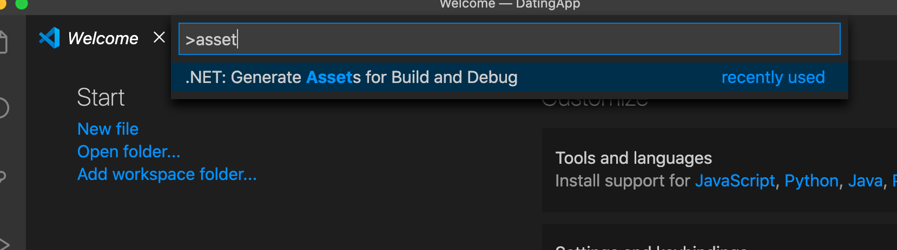
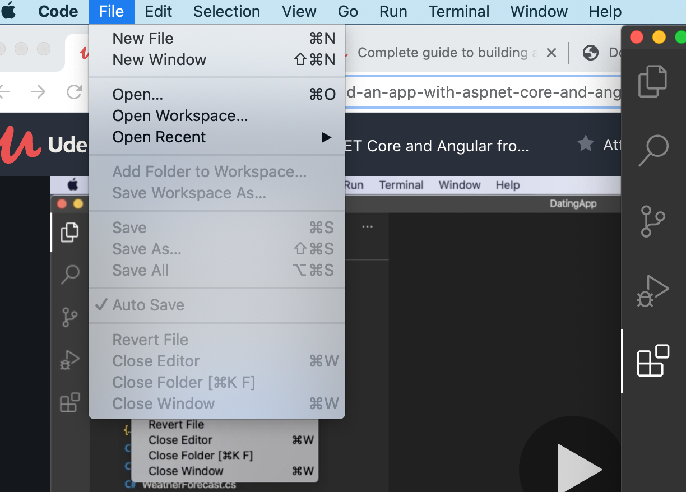
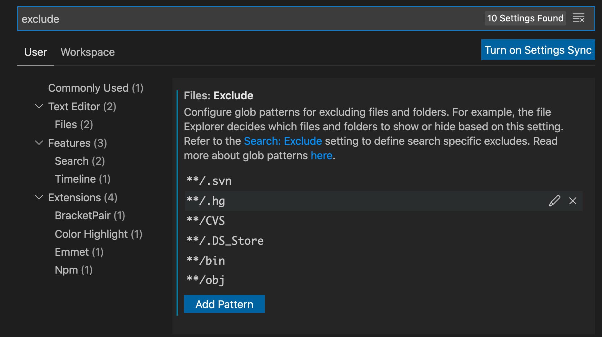
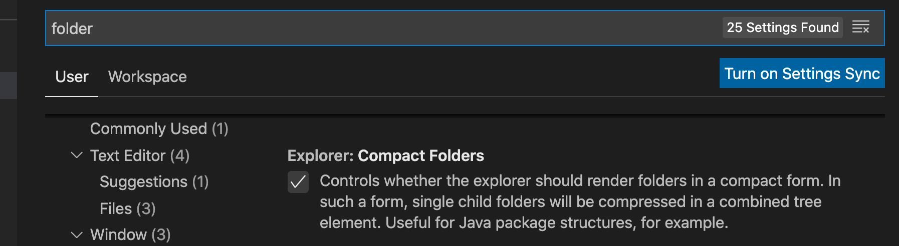
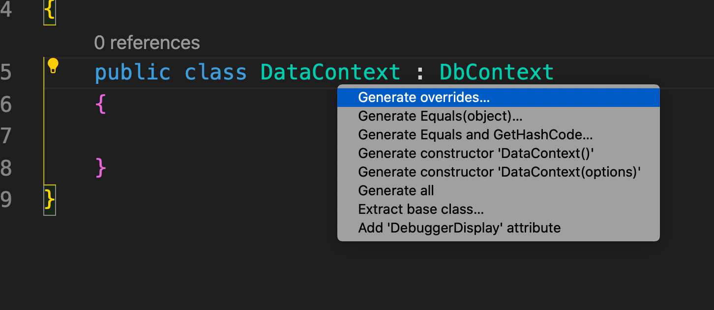
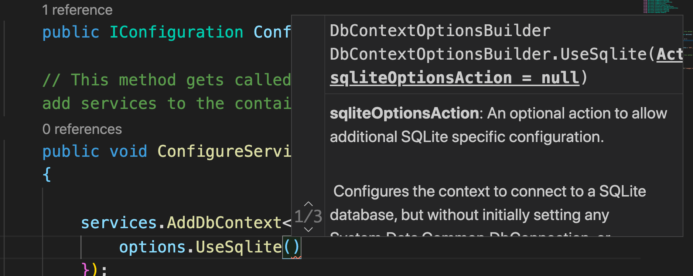
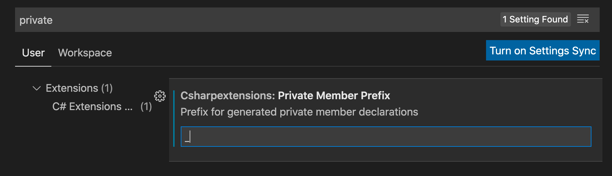
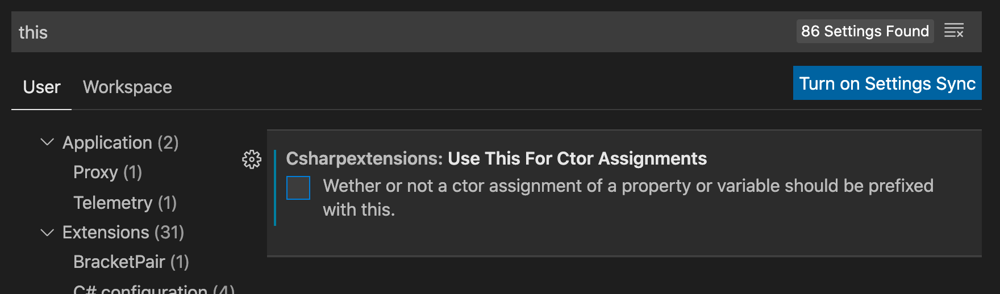
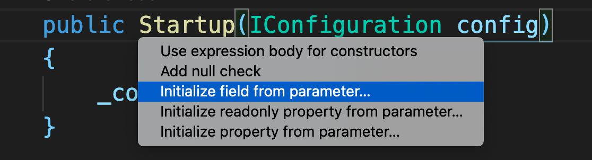
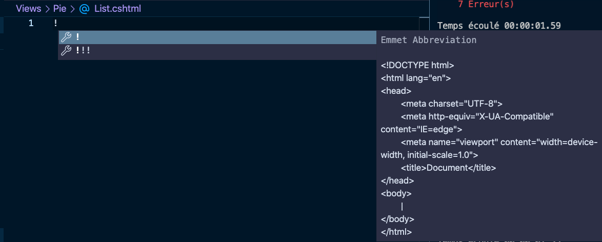

# 04 `VSCode` tips


## Affichage et taille des polices

Meilleur réglage pour moi :

```json
{
    "window.zoomLevel": 1,
    "editor.fontSize": 18,
    "terminal.integrated.fontSize": 12
}
```

On peut bien sûr définir cela de manière globale dans `User Settings UI`.


## `assets` génération

Pour ajouter les fichiers de configuration `.vscode` :

`cmd`+`shift`+`p` => taper `assets`



## Auto save



## Masquer les dossiers `bin` et `obj`



## Utiliser l'affichage normal des dossiers 

Décocher `Compact Folder` pour ne pas avoir les dossiers vides représentés sur un ligne.




## Voire les `Quick Fix`

### `cmd` + `shift` + `;`


## Auto Completion

### `ctrl` + `space`


## Ajouter un `emoji`

Valable partout (pas seulement `vscode`)

### `ctrl` + `cmd` + `space`

## Voire les constructeur disponible et les générés



`cmd` + `shift` + `;`

## Voire les paramètres possible (`overload`) d'une méthode

### `cmd` + `shift` + `space`



## Configurer les membres privés `C# extension`





Résultat du code généré

```csharp
public Startup(IConfiguration config)
{
}
```



```csharp
private readonly IConfiguration _config;

public Startup(IConfiguration config)
{
    _config = config;
}
```


## Utiliser `Emmet` avec `Razor`

Il faut ajouter dans `.vscode/settings.json` :

```json
"emmet.includeLanguages": {
    "aspnetcorerazor": "html"
}
```

ensuite tout fonctionne correctement.



