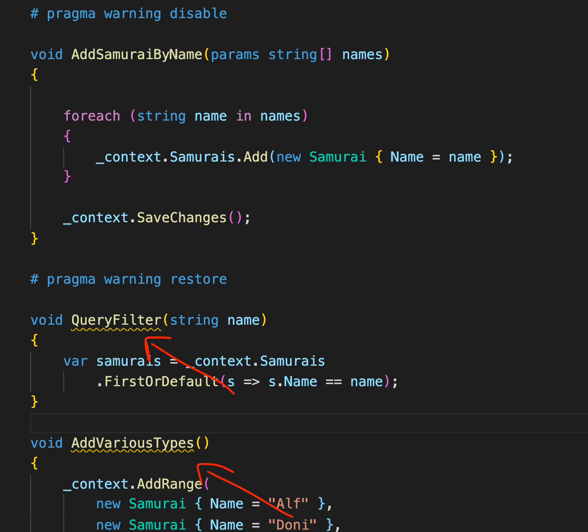
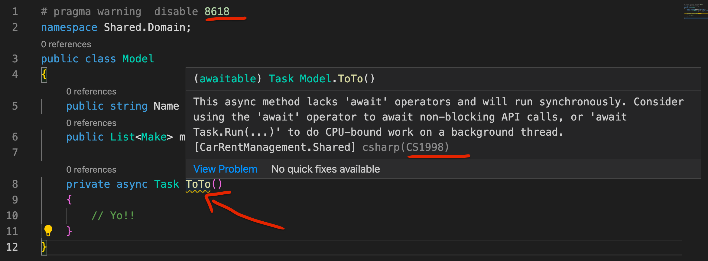

# 05 Preprocessor

## désactiver les `Warning` dans la console

```cs
# pragma warning disable
    
# pragma warning restore
```



`pragma` signifie tout simplement directive pour le compilateur.

`# pragma` en `c#` sert spécifiquement a contrôler les avertissement et les sommes de contrôle.

On peut même spécifier le `warning` particulier avec son numéro :

```cs
# pragma warning disable 8618
```




## `#if DEBUG`

En mode `DEBUG` (définie automatiquement), on peut rendre des parties de code conditionnelles grâce à `#if DEBUG` :

```cs
#if DEBUG
Console.WriteLine("DEBUG is define");
#endif
```

On peut aussi utiliser l'annotation :

```cs
[Conditional("Debug")]
void myDebugFunc() { ... }
```


