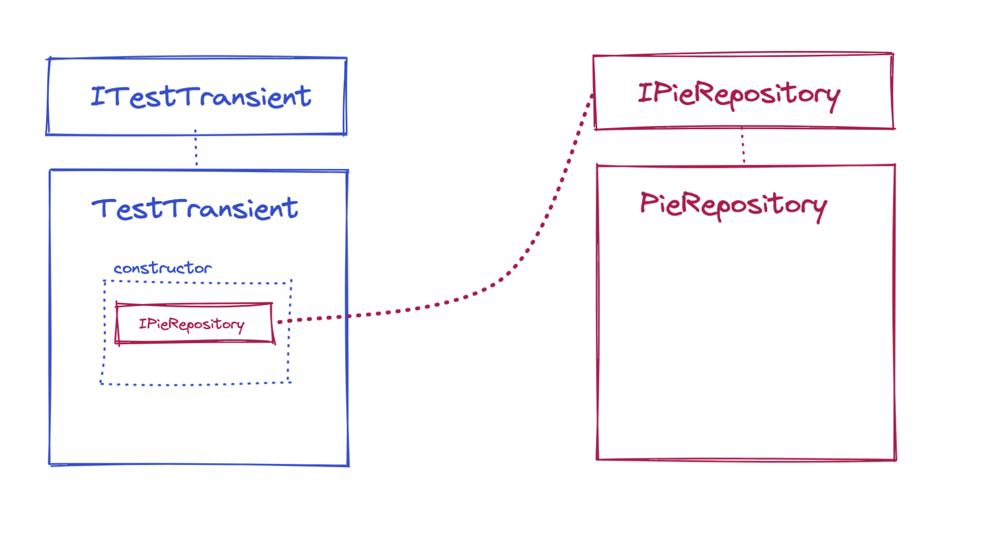
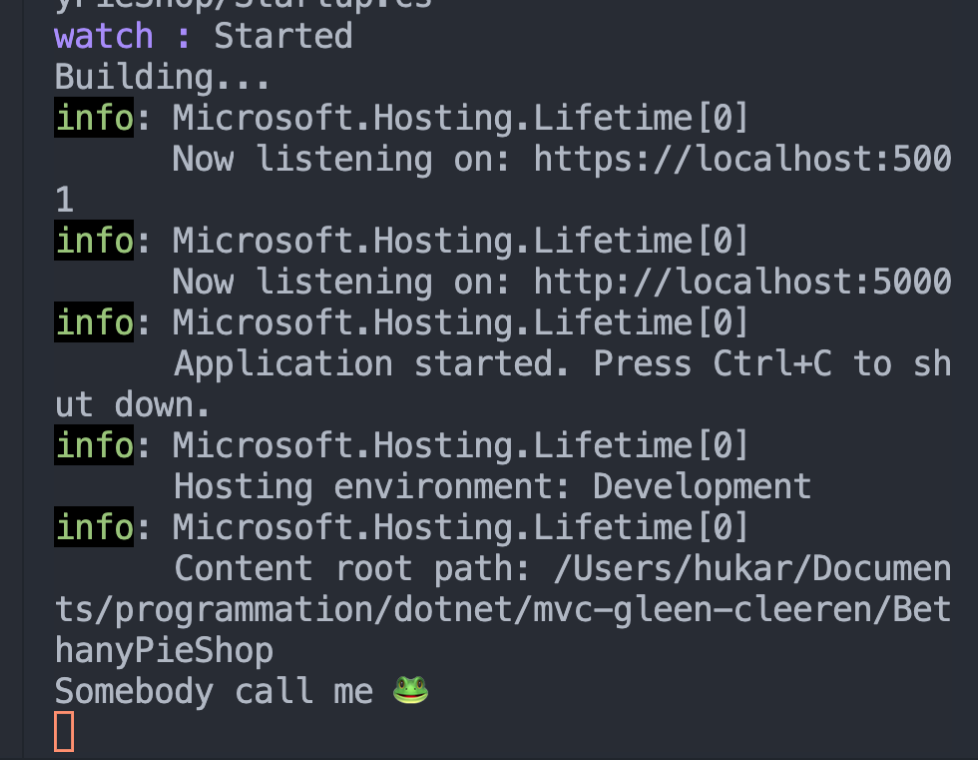

# 09 `AddTransient` et `AddScoped`

Il faut que deux services soient appelé par le `controller` et que l'un des services appelle le premier.



`TestTransient`

```cs
public class TestTransient : ITestTransient
{
  private readonly IPieRepository _repo;
  public TestTransient(IPieRepository repo)
  {
    _repo = repo;
  }
}
```

`PieRepository`

```cs
public class PieRepository : IPieRepository
{
  public PieRepository()
  {
    Console.WriteLine("Somebody call me 🐸");
  }

  // ...
}
```

On injecte ensuite les `services` dans `Startup.cs`

```cs
public void ConfigureServices(IServiceCollection services)
{
  services.AddTransient<IPieRepository, PieRepository>();
  services.AddTransient<ITestTransient, TestTransient>();
  // ...
}
```

Ensuite le contrôleur injecte lui aussi ces deux services :

`MyController`

```cs
public class PieController : Controller
{
  private readonly IPieRepository _pieRepository;
  private readonly ITestTransient _testTransient;
  public PieController(IPieRepository pieRepository, ITestTransient testTransient)
  {
    _testTransient = testTransient;
    _pieRepository = pieRepository;
  }

  public ViewResult Index() => View();
}
```

À chaque nouvelle requête un `controller` est instancié et `PieRepository` étant appelé deux fois, deux objets sont instancié :

```bash
Somebody call me 🐸
Somebody call me 🐸

```

Si on passe `PieRepository` avec `AddScoped`, le même objet est censé être utilisé lors d'une même requête, on ne devrait voire la phrase du constructeur qu'une seule fois :

```cs
public void ConfigureServices(IServiceCollection services)
{
  services.AddScoped<IPieRepository, PieRepository>();
  services.AddTransient<ITestTransient, TestTransient>();
  // ...
}
```



Lorsque le service `TestTransient` demande une instance de `PieRepository`, c'est le même objet qu'au `controller` qu'on lui passe.