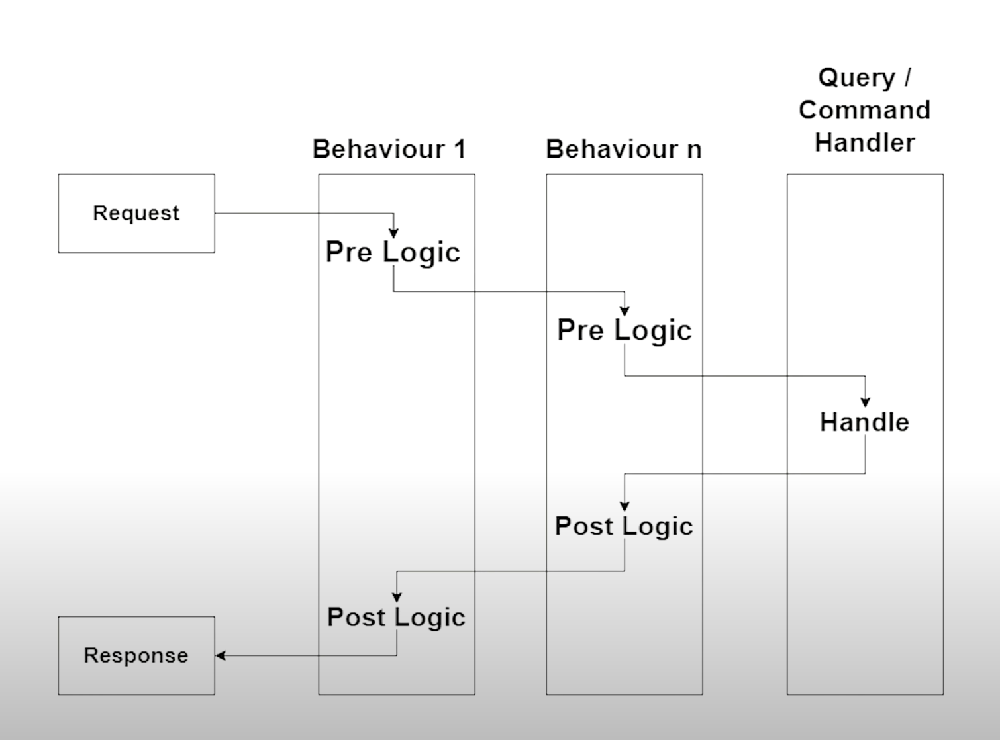

# `CQRS` utilisant `MediatR`

D'après Jonathan Williams

https://www.youtube.com/watch?v=mdzEKGlH0_Q&t=1s&ab_channel=JonathanWilliams

## Idée de `CQRS` (Commands and Queries Responsability Segregation)

On veut séparé la logique de lecture avec la logique d'écriture.

Ce `pattern` permet de suivre le principe de `Single Responsability`.

Il isole les logiques de `read` et de `write`.


## Mise en place

On crée un projet `webapi`.

Dossier `Database` avec dedans la classe `Repository`

```cs
public class Repository
{
  public List<Todo> Todos { get; set; } = new()
  {
    new() { Id = 1, Name = "Go to the supermarket", Completed = true },
    new() { Id = 2, Name = "Play golf", Completed = false },
    new() { Id = 3, Name = "Drive my bike", Completed = true },
    new() { Id = 4, Name = "Complete my collection strange", Completed = false },
    new() { Id = 5, Name = "Go to the swimmingpool", Completed = false }
  };
}
```

Dossier `Domain` avec dedans la classe `Todo`

```cs
public class Todo
{
  public int Id { get; set; }
  public string Name { get; set; }
  public bool Completed { get; set; }
}
```

On ajoute le `nuget` `MediatR.DependencyInjection`

```bash
dotnet add package MediatR.Extensions.Microsoft.DependencyInjection --version 9.0.0
```

Dans `Program.cs` on ajoute nos `services` :

`MediatR` 

```cs
services.AddMediatR(typeof(Program).Assembly);
```

`typeof(Program).Assembly` => l'`Assembly` qui contient `Program.cs`.

Le `Repository`  

```cs
builder.Services.AddSingleton<Repository>();
```


## Structure de base

```cs
public static class ActionEntity
{
  public record Command() : IRequest<Response>;

  public class Handler : IRequestHandler<Command, Response>
  {
    private readonly MinimalContext _context;
    public Handler(MinimalContext context)
    {
      _context = context;
    }

    public Task<Response> Handle(Command request, CancellationToken token)
    {
      // ...
      return new Response();
    }
  }

  public record Response();
}
```


## Création des `Queries`

Il y a trois blocs importants :

1. `Query / Command` Les données en entrées
2. `Handler` La logique métier, elle retourne une réponse
3. `Response` les données en sortie

On crée un dossier `Queries` et dedans la classe `GetTodoById`.

```cs
public static class GetTodoById
{
  // Query
	public record Query(int Id) : IRequest<Response>;
  // Handler
  public class Handler : IRequestHandler<Query, Response>
  {
    public Task<Response> Handle(Query request, CancallationToken)
    {
      // All the business logic
    }
  }

  // Response
  public record Response(int Id, string Name, bool Completed);
}
```

Tout d'abord on déclare cette classe `static` car ce n'est qu'un conteneur.

Les autres éléments seront des `Record`. Ce sont des objets immutable.

Grâce à l'injection de dépendance je peux simplement récupérer mon `Repository` à l'intérieur de mon `Handler` et développer ma logique métier :

```cs
public class Handler : IRequestHandler<Query, Response>
{
  private readonly Repository _repository;
  
  public Handler(Repository repository)
  {
    _repository = repository;
  }
  
  public async Task<Response> Handle(Query request, CancallationToken)
  {
    var todo = _repository.Todos.FirtsOrDefault(x => x.Id == request.Id);
    return todo == null ? null : new Response(todo.Id, todo.Name, todo.Completed);
  }
}
```

Les `record` sont de bon candidat pour remplacer les `DTO`.

#### ! Ici le mot clé `async` permet de ne pas avoir d'erreur du fait qu'on ne retourne pas une `Task` (pourquoi ?).  Cela évite de retourner un `Task.FromResult`.

### Alternative sans `async` avec `TaskFromResult`

```cs
public Task<Response> Handle(Query request, CancellationToken cancellationToken)
{
  var todo = _repository.Todos.FirstOrDefault(x => x.Id == request.Id);

  return todo == null ? null : Task.FromResult(new Response(todo.Id, todo.Name, todo.Completed));
}
```


Il n'est peut-être pas utile d'encapsuler les trois élément dans une classe statique (?), à tester.

**Si**, cela permet une syntaxe élégante `GetTodoById.Query(id)`.

Pas besoin de nom interne de méthode très long.


## Dans le `Controller`

On injecte `mediator` dans le constructeur du contrôleur, on peut envoyer une `request` avec la méthode `Send` :

```cs
[Route("api/[controller]")]
[ApiController]
public class TodoController : ControllerBase
{
  private readonly IMediator _mediator;
  
  public TodoController(IMediator mediator)
  {
    _mediator = mediator;

  }
  
  [HttpGet("/{id}")]
  public async Task<IActionResult> GetTodoById(int id)
  {
    var response = await _mediator.Send(new GetTodoById.Query(id));
    
    return response == null ? NotFound() : Ok(response);
  }
}
```


## `Commands`

On va créer un dossier `Commands` et dedans une class `AddTodo`.

```cs
public static class AddTodo
{
  // Command
  public record Command(string name) : IRequest<Response>;

  // Handler
  public class Handler : IRequestHandler<Command, Response>
  {
    private readonly Repository _repository;
    public Handler(Repository repository)
    {
      _repository = repository;
    }

    public Task<Response> Handle(Command request, CancellationToken cancellationToken)
    {
      var id = _repository.Todos.Count + 1;
      _repository.Todos.Add(new Todo { Id = id, Name = request.name});
      // false est la valeur par défaut de completed ce qui nous convient

      return Task.FromResult(new Response(id));
    }
  }

  // Response
  public record Response(int Id);
}
```

Puis une méthode `Post` dans le `Controller` :

```cs
[HttpPost]
public async Task<IActionResult> AddTodo(AddTodo.Command command) 
  => Ok(await _mediator.Send(command));
```

Un `Controller` ultra fin.


## `IRequest`

Si on veut retourner `void`, on peut utiliser `IRequest` ou `IRequest<Unit>`.

```cs
public record Command(string Name) : IRequest<Unit>;
// OU
public record Command(string Name) : IRequest;
```


## Valeur de retour

- `IRequestHandler<T, U>` - Implementée elle retourne `Task<U>`
- `RequestHandler<T, U>` - Héritée elle retourne `U`

## Pas de valeur de retour

- `IRequestHandler<T>` - Implementée elle retourne `Task<Unit>`.
- `AsyncRequestHandler<T>` - Héritée elle retourne `Task`.
- `RequestHandler<T>` - Héritée elle ne retourne rien (`void`).


## Exemple avec `Delete`

```cs
public static class DeleteRobot
{
    public record Command(int Id) : IRequest;

    public class Handler : AsyncRequestHandler<Command>
    {
        private readonly RobotContext _db;
        public Handler(RobotContext db)
        {
            _db = db;
        }

        protected override async Task Handle(Command request, CancellationToken cancellationToken)
        {
            var robot = await _db.Robots.FindAsync(request.Id);
            if(robot is not null)
            {
                _db.Robots.Remove(robot);
                await _db.SaveChangesAsync();
            }
        }
    }
}
```


## `Behaviour`

`Behavior` de `MediatR` est avant tout un `pipeline`.

Un `pipeline` est un ensemble d'étapes appliquant un pré-traitement et un post-traitement.




### Ajouter un `logger` au `Controller`

`TodoController`

```cs
[Route("api/[controller]")]
[ApiController]
public class TodoController : ControllerBase
{
  private readonly IMediator _mediator;
  private readonly ILogger<TodoController> _logger;
  
  public TodoController(IMediator mediator, ILogger<TodoController> logger)
  {
    _logger = logger;
    _mediator = mediator;
  }

  [HttpGet("/{id}")]
  public async Task<IActionResult> GetTodoById(int id)
  {
    logger.LogInformation("Get todo by id executing");
    var response = await _mediator.Send(new GetTodoById.Query(id));

    return response == null ? NotFound() : Ok(response);
  }

  [HttpPost]
  public async Task<IActionResult> AddTodo(AddTodo.Command command)
  {
    logger.LogInformation("Add Todo Executing");
    Ok(await _mediator.Send(command));
  }

}
```


### Utilisation de `Behavior`

On crée un dossier `Behaviors` et dedans une classe `LoggingBehavior`.

C'est une classe générique qui implémente `IPipelineBehavior`.

On a la `PRE LOGIC` et `POST LOGIC` avant et après l'appelle de `next()`.

```cs
public class LoggingBehavior<TRequest, TResponse> : IPipelineBehavior<TRequest, TResponse>
{
  public Task<TResponse> Handle(TRequest request, CancellationToken cancellationToken, RequestHandlerDelegate<TResponse> next)
  {
    // PRE LOGIC
    // ...
    
    var response = await next();
    
    // POST LOGIC
    // ...
    
    return response;
  }
}
```


```cs
public class LoggingBehavior<TRequest, TResponse> : IPipelineBehavior<TRequest, TResponse>
{
  // On injecte le logger
  private readonly ILogger<LoggingBehavior<TRequest, TResponse>> _logger;

  public LoggingBehavior(ILogger<LoggingBehavior<TRequest, TResponse>> logger)
  {
    _logger = logger;
  }

  public async Task<TResponse> Handle(TRequest request, CancellationToken cancellationToken, RequestHandlerDelegate<TResponse> next)
  {
    // Pre Logic
    _logger.LogInformation("{Request} is starting", request.GetType().Name);
    var timer = Stopwatch.StartNew();
    var response = await next();
    timer.Stop();

    // Post Logic
		_logger.LogInformation("{Request} has finished in {Time}ms", request.GetType().Name, timer.ElapsedMilliseconds);
    return response;
  }
}
```

`Stopwatch` est dans `System.Diagnostic`.

À ce moment on peut supprimer les `_logger` du `Controller` :

```cs
[HttpGet("/{id}")]
public async Task<IActionResult> GetTodoById(int id)
{
  var response = await _mediator.Send(new GetTodoById.Query(id));

  return response == null ? NotFound() : Ok(response);
}

[HttpPost]
public async Task<IActionResult> AddTodo(AddTodo.Command command) 
  => Ok(await _mediator.Send(command));
```


### Ajouter notre `behaviour` aux `services`

Dans `Startup` on va ajouter notre `IPipelineBehaviour` au conteneur de `services` :

```cs
public void ConfigureServices(IServiceCollection services)
{
  // ...
  services.AddMediatR(typeof(Startup).Assembly);
  
  // Order is important
  services.AddTransient(typeof(IPipelineBehaviour<,>), typeof(LoggingBehaviour1<,>));
  services.AddTransient(typeof(IPipelineBehaviour<,>), typeof(LoggingBehaviour2<,>));
  services.AddTransient(typeof(IPipelineBehaviour<,>), typeof(LoggingBehaviour3<,>));
}
```

L'ordre des `Behaviour` est déterminant de l'ordre du `pipeline`.


## `Behavior`et `Validation` (`FluentValidation`)

```bash
dotnet add package FluentValidation.DependencyInjectionExtensions --version 10.3.3
```


On Crée un `AddTodoValidator` dans le dossier `Commands`

```cs
using FluentValidation;

namespace CQRSTest.Commands
{
    public class AddTodoValidator : AbstractValidator<AddTodo.Command>
    {
        public AddTodoValidator()
        {
            RuleFor(x => x.Name)
                .NotEmpty()
                .MinimumLength(6)
                .MaximumLength(22);
        }
    }
}
```

On ajoute le `service` dans `Startup` :

```cs
public void ConfigureServices(IServiceCollection services)
{
  // ...
  services.AddValidatorsFromAssembly(Assembly.GetExecutingAssembly());
```

Dans le dossier `Behavors` on crée une nouvelle classe `ValidationBehavior` :

```cs
public class ValidationBehavior<TRequest, TResponse> : IPipelineBehavior<TRequest, TResponse>
{

}
```

Dans le `constructor`, on va récupérer par injection, tous les `validator` ayant pour type généric le type de la `TRequest` :

```cs
private readonly IEnumerable<IValidator<TRequest>> _validators;

public ValidationBehavior(IEnumerable<IValidator<TRequest>> validators)
{
  _validators = validators;
}
```


