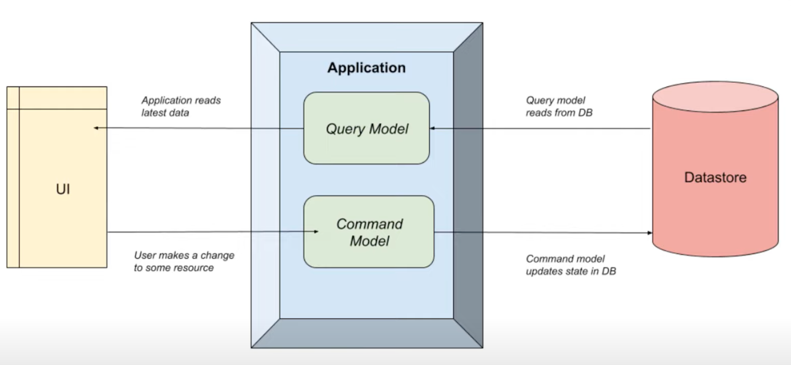
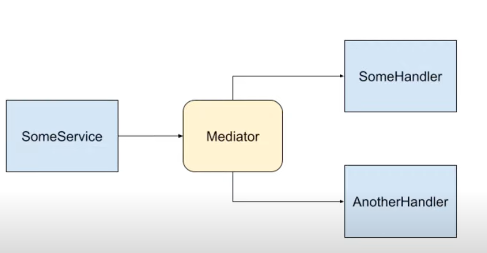
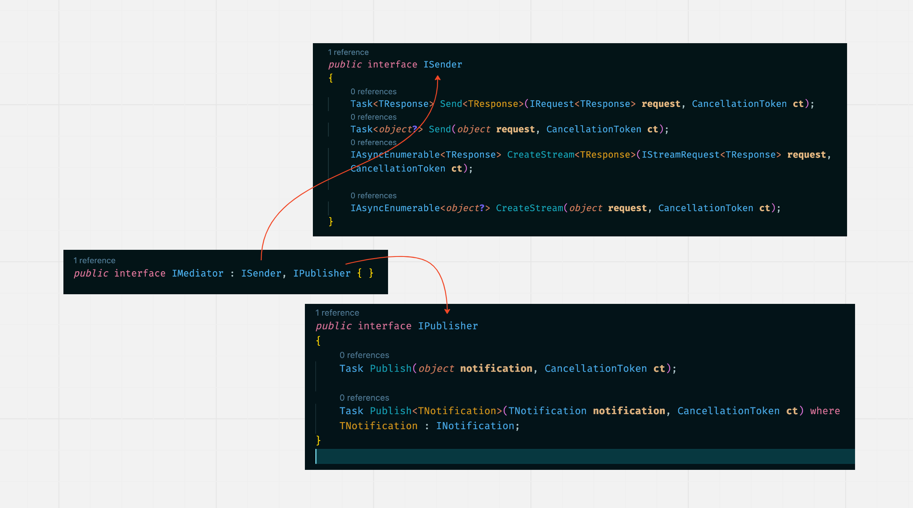

# 12.5 `CQRS` et `Mediatr`

`Code Maze` : https://www.youtube.com/watch?v=ykC3Ty-3U7g&ab_channel=CodeMaze 


## `CQRS`



On sépare en deux les lectures (`read`) et les écritures (`create`, `update`, `delete`).

Chaque partie peut être optimisée indépendamment de l'autre au niveau de l'accès aux données (`ORM`, `ADO`) ou de la/les `DB` en elle(s)-même. Cela apporte aussi en `agilité`, si par exemple on souhaite diviser le travail pour plusieurs équipes/développeurs ou utiliser deux `db` différentes.


## `Mediator` pattern



Un `objet` au lieu de communiquer directement avec un autre `objet`, utilise `mediator` comme `relais` (`broker`). Cela permet, tout comme `Inversion Of Control : IOC` de découplé les interactions entre `objets`. Dans le schéma aucun objet bleu n'a de `dépendances` vers un autre objet bleu.

Le code est plus simple et plus facile à tester.

L'application peut plus facilement évoluer.


## `MediatR` implémentation

```bash
dotnet new web
```

```bash
dotnet add package MediatR.Extensions.Microsoft.DependencyInjection
```


### Ajouter à l'application

`Program.cs`

```cs
using MediatR;

var builder = WebApplication.CreateBuilder(args);

builder.Services.AddMediatR(typeof(Program));

var app = builder.Build();

app.MapGet("/", () => "Hello World!");

app.Run();
```

> La class `Program` est générée par le `Top Level Statements`. On peut l'utilisée ou même l'étendre :
>
> ```cs
> partial class Program
> {
>     // Some Code
> }
> ```
>
> ### `ChatGPT` (après une longue conversation)
>
> - Moi je parle de la classe `Program` qui ne génère pas d'erreur si on l'appelle par exemple `var p = new Program()` mais je ne vois nul part cette classe déclarée ?
>
> Vous avez raison, si vous écrivez `var p = new Program()` dans votre code, cela ne génèrera pas d'erreur même si vous n'avez pas explicitement déclaré une classe `Program`. Cela est dû au fait que le compilateur C# crée automatiquement une classe `Program` vide lorsque vous utilisez `var p = new Program()` dans votre code. Cette classe est utilisée pour contenir la méthode `Main` qui est considérée comme le point d'entrée de l'application.
>
> En fait, il est possible de créer des objets à partir d'une classe qui n'est pas explicitement déclarée, mais qui est utilisée par le compilateur pour permettre de respecter certaines conventions de nommage.
>
> Il est à noter que cette classe créée automatiquement n'a aucune méthode ou propriété, donc vous ne pourriez pas utiliser cette instance créée pour appeler des méthodes sur celle-ci.


## `IMediator` : `ISender` , `IPublisher`

L'interface `Imediator` est splitée en deux autres interfaces `ISender` et `IPublisher`.

Si on veut juste envoyer (`Send`) un `message` à un `Handler` (getsionnaire), on peut de manière strict seulement utiliser `ISender`avec la méthode `Send` plutôt que `IMediator`.

Pour publier (`Publish`) une `notifications`, on utilisera l'interface `IPublisher` avec la méthode `Publish`.



```cs
app.MapGet("/", (ISender sender) => {
    
});
```

Plutôt que :

```cs
app.MapGet("/", (IMediator mediator) => {
    
});
```


## Fake `async repository`

Pour l'exemple on crée un `fake repo` en utilisant `await Task.CompletedTask` et `await Task.FromResult`:

```cs
public class ProductRepository : IProductRepository
{
    private readonly List<Product> _products;

    public ProductRepository()
    {
        _products = new() { /* Products */};
    }

    public async Task<List<Product>> GetAll()
        => await Task.FromResult(_products);
    public async Task<Product?> GetById(int id)
        => await Task.FromResult(_products.Where(p => p.Id == id).SingleOrDefault());
    public async Task Create(Product p)
    {
        _products.Add(p);
        await Task.CompletedTask;
    }
}
```


## `Requests` et `Handlers`

`MediatR` est un système `request`/`handler`, il y a deux types de `Request` :

- `Query` qui renvoie quelque chose
- `Command` qui ne renvoie rien (j'ajouterai l'exception de création d'une entrée en `db` qui est une `Command` qui renvoie un `id`)


## Exemple `Request`

### `Queries/GetProducts`

`GetProductsQuery.cs`

```cs
public record GetProductsQuery : IRequest<IEnumerable<Product>>;
```

`GetProductsHandler.cs`

```cs
public class GetProductsHandler : IRequestHandler<GetProductsQuery, IEnumerable<Product>>
{
    private readonly IProductRepository _products;

    public GetProductsHandler(IProductRepository products)
    {
        _products = products;
    }

    public async Task<IEnumerable<Product>> Handle(GetProductsQuery request, CancellationToken ct)
        => await _products.GetAll();
}
```

`Endpoint`

```cs
app.MapGet("/products", async (ISender sender) => await sender.Send(new GetProductsQuery()));
```


---

### `Queries/GetProductById`

`GetProductByIdQuery.cs`

```cs
public record GetProductByIdQuery(int Id) : IRequest<Product?>;
```

`GetProductByIdHandler.cs`

```cs
public class GetProductByIdHandler : IRequestHandler<GetProductByIdQuery, Product?>
{
    private readonly IProductRepository _products;

    public GetProductByIdHandler(IProductRepository products)
    {
        _products = products;
    }

    public Task<Product?> Handle(GetProductByIdQuery request, CancellationToken ct) 
        => _products.GetById(request.Id);
}		
```

`Endpoint`

```cs
app.MapGet("/products/{id:int}", async (int id, ISender sender) 
    => (await sender.Send(new GetProductByIdQuery(id))) is Product p 
           ? Results.Ok(p) 
           : Results.NotFound()
);
```


## Exemple `Command`

### `Commands/CreateProduct`

`CreateProductCommand.cs`

```cs
public record CreateProductCommand(ProductDto product) : IRequest<int>;
```

`CreateProductHandler.cs`

```cs
public class CreateProductHandler : IRequestHandler<CreateProductCommand, int>
{
    private readonly IProductRepository _products;

    public CreateProductHandler(IProductRepository products)
    {
        _products = products;
    }

    public async Task<int> Handle(CreateProductCommand request, CancellationToken ct)
    {
        int id = (await _products.GetAll()).Count() + 1;
        string productName = request.product.Name;

        await _products.Create(new Product(id, productName));

        return id;
    }
}
```

`Endpoint`

```cs
app.MapPost("/products", async (ProductDto product,ISender sender) 
    => {
        int id = await sender.Send(new CreateProductCommand(product));

        var productCreated = new Product(id, product.Name);

        return Results.Created($"/products/{id}", productCreated);
    });
```


