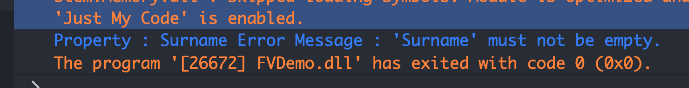
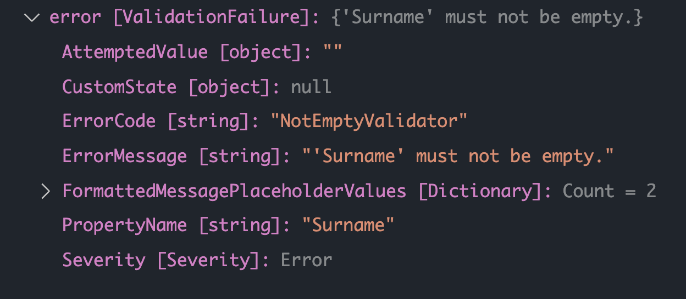
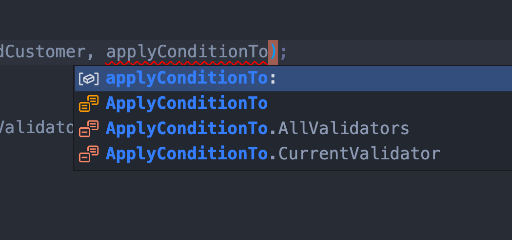

# `FluentValidation`


## `Dependency Injection`

On peut utiliser une méthode d'extension qui injecte tous les `validator` automatiquement.

Il faut le package :

```
FluentValidation.DependencyInjectionExtensions
```

Ensuite dans `Program.cs` :

```cs
builder.Services.AddValidatorsFromAssemblyContaining<CustomerValidator>();

// ou

builder.Services.AddValidatorsFromAssembly(Assembly.GetExecutingAssembly());
```

Puis on injecte dans un constructeur avec `IValidator<MyValidator> validator` :

```cs
public SomeContructor(IValidator<ItemValidator> validator)
{
    // ...
}
```


## Mise en place

On crée une application console très simple pour tester : `FVDemo` :

`Customer`

```cs
public class Customer
{
  public int Id { get; set; }
  public string Surname { get; set; }
  public string Forename { get; set; }
  public DateTime DateOfBirth { get; set; }
  public decimal discount { get; set; }
  public bool IsPreferredCustomer { get; set; }
  public List<Order> Orders { get; } = new();
  public string Email { get; set; }
}
```

`Order`

```cs
public class Order
{
  public decimal Amount { get; set; }
  public string ProductName { get; set; }
}
```


## Créer un `Validator`

On installe le package `FluentValidation`

```cs
dotnet add package FluentValidation.DependencyInjectionExtensions --version 10.3.3
```

Je prends la version complète avec injection de dépendance.

On créer la classe `CustomerValidator`

Cette classe hérite de `AbstractValidator<Type>`

```cs
public class Customervalidator : AbstractValidator<Customer>
{
  public Customervalidator()
  {
    RuleFor(x => x.Surname).NotNull();
  }
}
```

### `RuleFor(x => x.PropertyName)`

Permet de sélectionner à l'aide d'une `lambda` une propriété à valider.

### `NotNull()`

règle de validation.


## Validation : `Validate`

Dans `Program`

```cs
var custmer = new Customer();

// 1. On crée un validator
var validator = new CustomerValidator();

// 2. On exécute la validation et on récupère le résultat
var result = validator.Validate(customer);
```

`result` contient les erreurs `Errors` et un booléen `IsValid`.

```cs
// 3. On lit les erreurs
foreach(var error in result.Errors)
{
  WriteLine($"Property: {error.PropertyName} Error Message : {error.ErrorMessage}");
}
```



### `result.Errors`

Une liste des erreurs.

### `result.IsValid`

Un booléen disant simplement si la validation est passée ou pas.

### `error` 

##### : `FluentValidation.Results.ValidationFailure`

Objet contenant l'erreur :



On utilise ici `PropertyName` et `ErrorMessage`.

### Récupérer les erreurs dans un `IEnumerable`

```cs
var result = roboValidator.Validate(robo);

IEnumerable<string> errorMessages = result.Errors.Select(er => $"{er.PropertyName} : {er.ErrorMessage}");
```

On utilise la méthode de `Linq`: `Select`pour *mapper* `Errors` avec un `IEnumerable<string>`.


### Les `options` de `Validate`

Il faut impérativement mettre un `using FluentValidation` dans le fichier où on utilise `Validate` avec les `options` car cela correspond à une méthode d'extension.

#### Pour ne validé qu'une propriété

```cs
var result = roboValidator.Validate(robo, 
               options => options.IncludeProperties(x => x.Name));
```

Ici, seuls les règles pour `Name`seront testées.

#### `options.IncludeProperties`

Syntaxe pour plusieurs `Properties`:

```cs
roboValidator.Validate(robo, opt 
        => opt.IncludeProperties(r => r.Name, r => r.Speed, r => r.Brand));
```

Ou plus court :

```cs
roboValidator.Validate(robo, opt 
        => opt.IncludeProperties("Name", "Speed", "Brand"));
```


#### Pour ne valider qu'un ensemble de règles : `RuleSet`

```cs
public class PersonValidator : AbstractValidator<Person> 
 {
  public PersonValidator() 
  {
     RuleSet("Names", () => 
     {
        RuleFor(x => x.Surname).NotNull();
        RuleFor(x => x.Forename).NotNull();
     });

     RuleFor(x => x.Id).NotEqual(0);
  }
}
```

```cs
var result = validator.Validate(person, options => options.IncludeRuleSets("Names"));
```

#### `options.IncludeRuleSets`

Pour plusieurs `RuleSets`:

```cs
options.IncludeRuleSets("Names", "MyRuleSet", "SomeOtherRuleSet");
```


## Customiser son message :

##  `WithMessage("my custom message")`

```cs
public CustomerValidator()
{
  RuleFor(x => x.Surname)
    .NotNull()
    .NotEmpty().WithMessage("{PropertyName} can not be empty like this");
}
```

### `Placeholder` pour `WithMessage`

On a quelques `placeholder` que l'on peut utiliser dans le message

#### `{PropertyName}`

Pour le nom de la propriété.

Raccourci la syntaxe avec `lambda` suivante :

```cs
public CustomerValidator()
{
  RuleFor(x => x.Surname)
    .NotNull()
    .NotEmpty().WithMessage(x => $"{nameof(x.Surname)} can not be empty like this");
}
// x étant une référence vers le customer
```

`nameof` opérateur retournant le nom sous forme de `string`.


#### `{PropertyValue}`

La valeur d'une propriété.


#### `{ComparisonValue}`

`placeholder` de la valeur comparée.


## Un `custom Validator` : `Must`

Pour valider un age on va créer un `custom validator` :

```cs
public CustomerValidator()
{
  RuleFor(x => x.Surname)
    .NotEmpty();
	
  RuleFor(x => x.DateOfBirth)
    .Must(BeOver18).WithMessage("Must Be Over 18");
}


bool BeOver18(DateTime dateOfBirth)
{
  var now = DateTime.Today;
  int years = now.Year - dateOfBirth.Year;
  if(now.Month < dateOfBirth.Month || (now.Month == dateOfBirth.Month && now.Day < dateOfBith.Day))
  {
    years--;
  }

  return years >= 18;
}
```

`Must` prend en paramètre un `delegate` qui prend la propriété retournée en paramètre et qui retourne un `bool`.

`Program`

```cs
var customer = new Customer() { Surname = "Sam", DateOfBirth = new(2019, 12, 14) };
```

```bash
✨ FVDemo : dotnet run
Hello, Fluent Validation!
Property : DateOfBirth Error Message : Must be over 18
```


## Un autre : `Custom`

`Custom` permet de créer des règles ayant plusieurs cas de figure et donc plusieurs méssages d'erreur différents :

```cs
RuleFor(p => p.MyPet)
  .Custom((myPet, context) => {
    if(myPet.Name.Contains("pupy"))
    {
      context.AddFailure("No please not this name");
    }
    else if(myPet.Age < 3)
    {
      context.AddFailure("your pet is too young");
    }
  });
```

`context.AddFailure("error message")` permet de finement gérer les messages suivant diverses règles métier rassemblées dans le validateur.

## Comparaison croisé : `NotEqual`

```cs
RuleFor(x => x.Forename)
  .NotEqual(x => x.Surname)
  .WithMessage("{PropertyValue} must be different to {ComparisonValue}");
```

```cs
Property : Forename Error Message : Sam must be different to Sam
```

### `{ComparisonValue}`

`placeholder` de la valeur comparée.

### `NotEqual(x => x.PropertyName)`

permet avec la `lamnda` des comparaisons croisées antre les propriétés.

Fonctionne aussi avec `GreaterThan[OrEqualTo]` et `LessThan[OrEqualTo]`. 


## Ajouter des conditions : `When`

```cs
RuleFor(x => x.Discount)
  .GreaterThan(5)
  .When(x => x.IsPreferredCustomer)
  .When(x => x.Surname == "Sam");
```

On peut mettre une ou plusieurs condition après une comparaison.

`Program`

```cs
var customer = new Customer() { Surname = "Sam", Forename = "Sam", Discount = 2, IsPreferredCustomer = true, DateOfBirth = new(2019, 12, 14) };
```

```bash
Property : Discount Error Message : 'Discount' must be greater than '5'.
```


### Appliquer des règles sous condition

On peut utiliser `When` au niveau plus haut :

```cs
When(x => x.Surname == "Sam", () => {
  RuleFor(x => x.DateOfBirth)
    .Must(BeOver18).WithMessage("Must be over 18");

  RuleFor(x => x.Forename)
    .NotEqual(x => x.Surname)
    .WithMessage("{PropertyValue} must be different from {ComparisonValue}");
});
```

Cela permet d'appliquer certaines règles dans un certain cas.


## Valider un champ `Enum`

Vérifie si la valeur du champ est bien contenu dans les limites des valeurs de l'`enum`.

```cs
RuleFor(u => u.Gender)
    	.IsInEnum();
```


## Réutiliser un `Validator` dans un autre.

On va créer un `Validator` pour `Order` :

`OrderValidator`

```cs
using FluentValidation;

namespace FVDemo;

public class OrderValidator : AbstractValidator<Order>
{
    public OrderValidator()
    {
        RuleFor(x => x.Amount).GreaterThan(0);
    }
}
```

> ## Nouveauté
>
> On peut utiliser le `namespace` sans le bloc d'accolades.
>
> Cela raccourci le code de 3 lignes tout en restant aussi lisible.


### Avec un objet imbriqué

```cs
RuleFor(x => x.Order)
    .SetValidator(new OrderValidator());
```


### Avec une `collection` : `RuleForEach`

```cs
RuleForEach(x => x.Orders)
  .SetValidator(new Ordervalidator());
```

`Program`

```cs
customer.Orders.AddRange(new List<Order>() {
        new() {
            Amount = 6,
        },
        new() {
            Amount = 0,
        },
        new() {
            Amount = 3,
        },
        new() {
            Amount = -1,
        }
    }
);
```

> ## ! `new() { ... }` et `new { ... }`
>
> `new { ... }` s'emploie uniquement pour les types anonymes.

```
Property : Orders[1].Amount Error Message : 'Amount' must be greater than '0'.
Property : Orders[3].Amount Error Message : 'Amount' must be greater than '0'.
```

Les éléments d'index `1` et `3` ne passent pas la validation.


## Composition de `validator` : `Include`

Si une classe de base possède des `validator`, elle peut les transmettre aux classes dérivées.

```cs
public class Person
{
  public string Surname { get; set; } = "";
  public string Forename { get; set; } = "";
}

public class Customer : Person
{
  public int Id { get; set; }
  // ...
```

`PersonValidator`

> ### `global using`
>
> Il est maintenant possible de regrouper ses `using` grâce au mot clé `global` dans un fichier par exemple `usings.cs`.
>
> Un `global using` est accessible dans tout le projet.

`PersonValidator`

```cs
namespace FVDemo;

public class PersonValidator : AbstractValidator<Person>
{
    public PersonValidator()
    {
        RuleFor(x => x.Surname)
        	.NotNull()
        	.NotEmpty()
          .WithMessage(x => $"{nameof(x.Surname)} can not be empty like this");

        RuleFor(x => x.Forename)
          .NotEqual(x => x.Surname)
          .WithMessage("{PropertyValue} must be different to {ComparisonValue}");
    }
}
```

`CustomerValidator`

```cs
public class CustomerValidator : AbstractValidator<Customer>
{
    public CustomerValidator()
    {
        Include(new PersonValidator());
        
        RuleFor(x => x.DateOfBirth)
            .Must(BeOver18).WithMessage("Must be over 18");
      // ...
```


## Étendre les règles de validation avec une méthode d'extension

Plutôt que d'associer une méthode `BeOver18` directement dans un `validator` particulier, on peut souhaiter centraliser la logique de cette validation. Les `extension method` permettent alors d'ajouter des règles de validation de manière globale.

Une règle de validation renvoi un type :

`IRuleBuilderOptions<TPrincipal, TProperty>` 

`TPrincipal` étant le type de la classe principal passé à `AbstractValidator<TPincipal>`.

`TProperty` étant le type de la propriété de la classe `TPrincipal` sur laquelle on veut tester la règle.

On crée une classe `MyValidatorExtension`

```cs
namespace FVDemo;

public static class MyValidatorExtension
{
	public static IRuleBuilderOptions<T, DateTime> MinimumAge<T>(this IRuleBuilder<T, DateTime> rule, int age)
    {
        return rule.Must(dob => BeOfAge(dob, age))
                          .WithMessage($"Must be at least {age} years old.");
    }
  
  private static bool BeOfAge(DateTime dateOfBirth, int age)
    {
        var now = DateTime.Today;
        int years = now.Year - dateOfBirth.Year;
        if (now.Month < dateOfBirth.Month || (now.Month == dateOfBirth.Month && now.Day < dateOfBirth.Day))
        {
            years--;
        }

        return years >= age;
    }
}
```

Dans le `CustomerValidator` on peut maintenant utiliser cette `custom rule` :

```cs
RuleFor(x => x.DateOfBirth)
            .MinimumAge(18);
```


## `NotEmpty`

`NotEmpty` verifie aussi les valeur par défaut d'un type.

Par exemple pour les `DateTime`, `NotEmpty` va réaliser le test `NotEqual(default(DateTime))`.

```cs
RuleFor(x => x.dateOfBirth)
  .NotEmpty();

// équivalent à

RuleFor(x => x.DateOfBirth)
  .NotEqual(default(DateTime));
```


## `When` `Otherwise` validation

Si on veut séparer deux cas de figure on peut utiliser `When` suivi de `Otherwise` :

```cs
When(x => x.IsPreferredCustomer, () => {
  RuleFor(x => x.Discount).GreatherThan(0);
}).Otherwise(() => {
  RuleFor(x => x.Discount).Equal(0);
})
```


### Précison sur `When`

Dans la syntaxe en ligne (`fluent`), `When` s'applique à toutes les règles le précédent :

```cs
RuleFor(x => x.Discount)
  .NotEmpty()
  .GreatherThan(0)
	.LessThan(10000)
  .When(x => x.IsPreferredCustomer).
```


### Exemple

```cs
var customer = new Customer()
{   
    Discount = -2,
    IsPreferredCustomer = true,
};
```

```
Property : Discount Error Message : 'Discount' must be greater than '0'.
```

Si on passe `IsPreferredCustomer` à `false`, le message de validation n'apparaît plus.

Si on veut que le `When` ne s'applique qu'à la règle au dessus (et seulement) on écrit :

```cs
.When(x => x.IsPreferredCustomer, ApplyConditionTo.CurrentValidator);
```



`ApplyConditionTo.AllValidators` étant la valeur par défaut. 

Du coup comme l'erreur de validation est un cran au-dessus, elle n'est plus conditionelle est apparaît :

```
Property : Discount Error Message : 'Discount' must be greater than '0'.
```


## Contrôle de l'`email`

`FluentValidation` utilise un contrôle simple de type :

```
something@something
```


