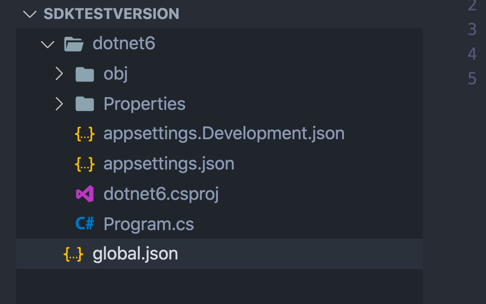
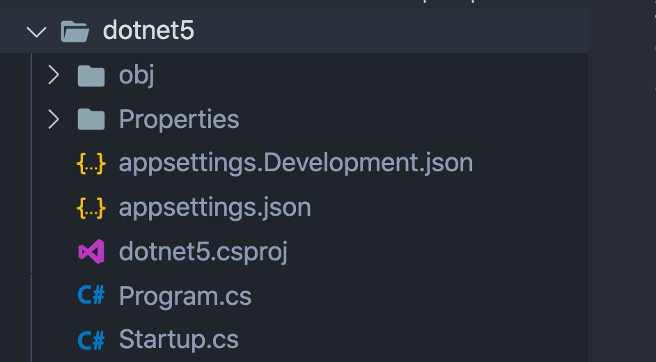

# 14 Gérer les versions de `.net` 

Il suffit de créer un fichier `global.json` dans un dossier où `.net cli` sera utilisé.

```bash
dotnet new globaljson
```

```json
{
  "sdk": {
    "version": "6.0.100-preview.7.21379.14"
  }
}
```

Si je crée une nouvel application `web` :

```bash
dotnet new web -o dotnet6
```



J'obtiens la nouvelle `minimal api`.

Maintenant je modifie `global.json` :

```json
{
  "sdk": {
    "version": "5.0.400"
  }
}
```

```bash
✨ sdkTestVersion : dotnet --version
5.0.400
```

```bash
dotnet new web -o dotnet5
```



On observe le retour de la classe `Startup`.