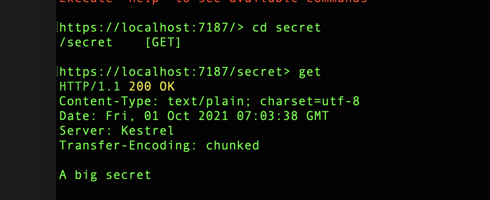
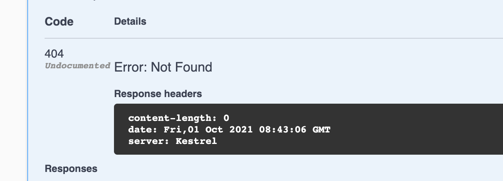

# 16 Autorisation et authentification

## `[Authorize]`

On crée un `endpoint` censé cacher un secret :

```cs
[HttpGet("secret")]
public string Secret() => "This is a secret"; 
```



On va ajouter l'annotation `[Autorize]` :

```cs
using Microsoft.AspNetCore.Authorization;
```

```cs
[HttpGet("secret")]
[Authorize]
public string Secret() => "This is a secret"; 
```

On obtient une erreur :

```bash
No authenticationScheme was specified, and there was no DefaultChallengeScheme found. The default schemes can be set using either AddAuthentication(string defaultScheme) or AddAuthentication(Action<AuthenticationOptions> configureOptions).
```

On peut retenir qu'il faut un `DefaultChallengeScheme`.

On va ajouter un service pour utiliser les `Cookies` et lui fournir le schéma (`scheme`) :

`Program.cs`

```cs
using Microsoft.AspNetCore.Authentication.Cookies;

builder.Services.AddAuthentication(CookieAuthenticationDefaults.AuthenticationScheme).AddCookie();
```

Cette fois on a un `404 Not Found` :



si on test l'`URL` directement on voit qu'elle est redirigé vers `login` :

```
https://localhost:7027/Account/secret
```

=>

```
https://localhost:7027/Account/Login?ReturnUrl=%2FAccount%2Fsecret
```

Il faut donc un `EndPoint` (ou une `page` en `MVC`) de `login`.

