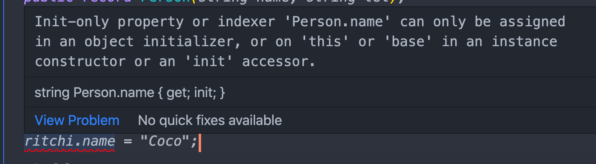
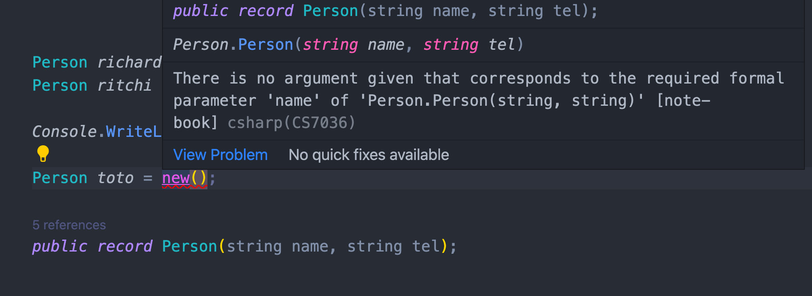

# 18 Les `record`

Les `record` sont utilisés pour représenter des données.

Les classes en comparaison traduise des comportement et des responsabilités.

## Égalité

```cs
public record Person(string name, string tel);

Person richard = new("Richard", "04565656");
Person ritchi = new("Richard", "04565656");

Console.WriteLine(richard == ritchi);
```

```
true
```


## Immutabilité



Si on essaye de modifier le contenu d'un `record` on obtient une erreur de compilation.


## Nullabilité

On ne peut pas créer un nouvel objet sans renseigner tous les champs.



Si besoin, on peut donner une valeur par défaut :

```cs
public record Person(string name = "", string tel = "");
```

Il sont aussi facilement lisible avec un `Console.WriteLine` :

```cs
Person toto = new("Toto", "000 000 00");

Console.WriteLine(toto);
```

```
Person { name = Toto, tel = 000 000 00 }
```


## déconstruire un `record`

```cs
Person toto = new Person("Toto", 12);

var (name, age) = toto;

Console.WriteLine(name);
Console.WriteLine(age);

public record Person(string name, int age);
```

```
Toto
12
```


## Héritage des `records`

```cs
var HyperRobot = new HyperRobot("FT-178", 450, "FireBlaster");

public record Robot(string CodeName, int Power);
public record HyperRobot(string CodeName, int Power, string Weapon) : Robot(CodeName, Power)
```

