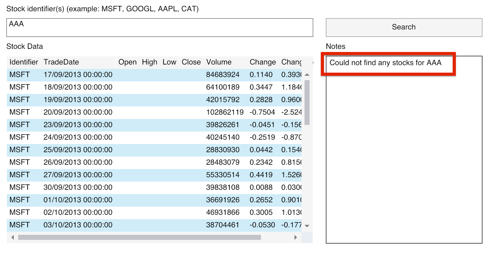

# 01 `async/await`

Apparaît pour la première fois dans `C# 5` en 2012.

`async/await` résout un problème de scalabilité pas forcement de performances.

Une gestion des ` I/O` `asynchrone` permet une scalabilité de l'application.


## `Processus` : `Process`

C'est une instance d'un programme informatique en cours d'exécution.

Un `Process` est composé d'au moins un `Thread`.

Il a un espace d'adressage dédié.

Deux `Processes` ne partagent pas leurs mémoires.


## `Fil`  : `Thread`

Si un `Process` est la réservation d'un espace mémoire, une `Thread` est la réservation du temps de `CPU`.

Une `thread` est gébéralement contenu dans un `Process`.

Toutes les `Threads` d'un `Process` partage la même mémoire.

Le `CPU` alloue un certain temps par `Thread` avant de passer à une autre `Thread`.

Si une application (une `Thread`) entre dans une boucle infini ou a un traitement extrêmement long (impression par exemple), le système ne *freeze* plus, car chaque `Thread` dispose d'un `Qantum` de temps (`30ms`par exemple) avant de passer son tour. 

Le nombre idéal de `Thread` est le même que celui du nombre de `CPU`.


## Périphérique `I/O`

```cs
FileStream fs = new FileStream(...);
Int32 bytesRead = fs.Read(...);
```

Chaque périphérique `I/O` posséde son propre `CPU` chargé de traiter la demande :

- Carte réseau
- Disque Dur
- Lecteur DVD

Il en resulte que le `CPU` de la carte mère lui ne fait rien en attendant le résultat du traitement par le périphérique (`device`).

Le `Thread Pool` voyant qu'un `Thread` ne fait rien (bloqué en attente d'un `I/O`), va créer un nouveau `Thread`.

Ce n'est pas un système efficace car la gestion des `Thread` a un coût en performance (temps et mémoire).

De plus quand le `Thread` est en attente, l'interface graphique reste figée (`freeze`).


## Amélioration du code `I/O`

```cs
FileStream fs = new FileStream(..., FileOptions.Asynchronous);
Int32 bytesRead = await fs.ReadAsync(...);
```

`FileOptions.Asynchronous` est un `flag` qui va dire au périphérique de ne pas bloquer le `Thread`.

`await` et `async` permettent d'écrire un code séquentiel en utilisant les appels `I/O` **mais** sans bloquer la `Thread` du programme.

Comme la `Thread` n'est pas bloquée, le `Thread Pool` ne crée pas de nouvelle `Thread` et réutilise la même `Thread`.

Les réponses des `I/O` sont envoyées dans une `Queue` du `Thread Pool`, ainsi celui ci peut rappelé la `Thread` à ce moment.

Le système n'est plus limité en `scalabilité` dû à la perte de performance lié à la création de plusieurs `Thread`.


## Programmation Asynchrone en `.net`


`Code Synchrone`

```cs
private void SearchClick(...)
{
  var client = new WebClient();
  var content = client.DownloadString(url);
}
```

Ce code est bloquant.

`Code Asynchrone`

```cs
private async void SearchClick(...)
{
  var client = new HttpClient();
  var response = await client.GetAsync(url);
  var content = await response.Content.ReadAsStringAsync();
}
```

Avec `HttpClient`, le code n'est plus bloquant.


### Exemple avec le `file system`

On peut de la même manière qu'avec `HTTP` utiliser `await/async` avec l'accès aux fichiers :

```cs
public async Task<List<StockPrice>> GetStockPrice(string stockId)
{
  // ...
  using(var stream = new StreamReader(File.OpenRead(pathFile)))
  {
    string line;
    while(line = await stream.ReadLineAsync() is not null)
    {
      // ...
    }
  }
  
  return prices;
}
```

On l'utilise de la même manière que `HTTP` :

```cs
private async void SearchClick(...)
{
  var store = new DataStore();
  var response = await store.GetStockPrices("MSFT");

  Stocks.Items = response;
}
```


## Utilisation

`async/await` s'utilise avec toutes les interraction entrée/sortie :

- Web / `HTTP`
- Disque
- Mémoire
- `BDD`


## `Task`

Le type `Task` est la representation d'une opération **asynchrone**.

Pour récupérer une `Task`, on utilise le mot clé `await` :

```cs
Task<string> asyncOperation = GetStringAsync();
string result = await asyncOperation();
```

On ne peut utiliser `await` que dans une méthode `async`.

### Simuler un temps long de chargement `Task.Delay(10000)`

```cs
using(var client = new HttpClient())
{
  var response = await client.GetAsync($"{API_URL}/{StockId.Text}");

  await Task.Delay(10000);
  // ...
}
```

Avec `Thread.Sleep(10000)` par exemple le code reste bloquant.


## `async/await`

### `async`

Donne la possibilité à une méthode d'utiliser  `await`.


### `await`

Au premier `await` rencontré, le programme redonne la main au `thread` principal.

`await` introduit une `continuation`, lorsque la `Task` est `completed`, le code de la méthode continu d'être exécuté.

On peut gérer les erreurs avec un bloc `try/catch`

```cs
try
{
  var store = new DataStore();
  var response = await store.GetStockPrices("MSFT");

  Stocks.Items = response;
}
catch(Exception ex)
{
  Notes.Text = ex.Message;
}

// code à exécuté après l'erreur ou la réussite de la Task
```

`await` produit une `continuation` qui nous permet de revenir dans le context original.


### Appelle d'une méthode avec `await`

On peut appeller une méthode avec `await` comme paramètre d'une autre méthode.

cela peut peut être considéré comme une unité `await MethodAsyn()` :

```cs
Console.WriteLine(await GetDataAsync(url));
```


 

## Utiliser `async` `await` sur le serveur.

Quel intérêt peu-il y avoir à utiliser `async/await` côté serveur (avec `mvc` le client ne profite pas du côté asynchrone) ?

Cela permet au serveur de répondre à plusieurs requête sans devoir attendre que les `data` d'une requête soient arrivés.


## Créer une méthode `async`

```cs
private async Task GetStocks()
{
  try
  {
    var store = new DataStore();
    var response = await store.GetStockPrices(StockIdentifier.Text);

    Stocks.Items = response;
  }
  catch(Exception ex)
  {
    throw ex;
  }
}
```

Sauf pour les `event handler`, on ne doit pas utiliser `async void` mais plutôt `async Task`.

On l'utilise avec `await` :

```cs
await GetStocks();
```




### Utilisation sans `await`

```cs
private async void Search_Click(object sender, RoutedEventArgs e)
{
	try
  {
    GetStocks();
  }
  catch(Exception ex)
  {
    Notes.Text = ex.Message;
  }
}
```

Cela fonctionne sur les données mais les `exceptions` ne sont pas remontées.


## `async void`

Si on modifie la signature de notre méthode en `async void` plutôt que `async Task`, il n'est plus possible d'utiliser `await` devant l'appelle de notre méthode :


Seul une `Task` peut être *attendu*, pas `void`.

Et sans le mot clé `await`, on perd l'`exception` dans la nature.

#### ! On utlise jamais `async void`.

#### ! On utilise toujours `await` avec les méthodes asynchrones.

#### ! Toujours retourner une `Task` dans une méthode asynchrone

Les `event handler` oblige à utiliser `async void`, on doit alors essayer de garder tout le code dans le bloc `try/catch/finally` :

```cs
private async void Search_Click(object sender, RoutedEventArgs e)
{
  try
  {
    BeforeLoadingStockData();
    await GetStocks();
  }
  catch(Exception ex)
  {
    Notes.Text = ex.Message;
  }
  finally
  {
    AfterLoadingStockData();
  }
}
```


## `await task` VS `task.Wait`

`await` n'est pas bloquant alors que `Wait` l'est.


### Test avec un serveur `Web` (outil `ab` Apache Benchmark)

```cs
Task.Delay(100).Wait(); // not async programming
```

`Wait` bloque la `thread`.

```bash
ab -n 1000 -c 100 http://localhost:5116/
```

```bash
Time taken for tests:   8.403 seconds
Complete requests:      1000
Failed requests:        0
Total transferred:      104000 bytes
HTML transferred:       12000 bytes
Requests per second:    119.00 [#/sec] (mean)
Time per request:       840.320 [ms] (mean)
Time per request:       8.403 [ms] (mean, across all concurrent requests)
Transfer rate:          12.09 [Kbytes/sec] received

Connection Times (ms)
              min  mean[+/-sd] median   max
Connect:        0    2   1.0      2       5
Processing:   100  820 2151.2    103    7277
Waiting:      100  820 2151.2    103    7277
Total:        100  822 2151.5    105    7281
```

Le temps d'une requête varie entre `103ms` et `7281ms`.

```bash
Percentage of the requests served within a certain time (ms)
  50%    105
  66%    106
  75%    108
  80%    108
  90%   7265
  95%   7273
  98%   7278
  99%   7279
 100%   7281 (longest request)
```


```cs
await Task.Delay(100); // async programming
```
> Pour plus de lisibilité du code (pas de constante magique !!) on peut écrire :
> ```cs
> await Task.Delay(TimeSpan.FromMilliseconds(100));
> ```
>
> On sait ainsi directement que c'est `100 ms`.

`await` ne bloque pas la `Thread`.

```bash
Time taken for tests:   1.240 seconds
Complete requests:      1000
Failed requests:        0
Total transferred:      104000 bytes
HTML transferred:       12000 bytes
Requests per second:    806.17 [#/sec] (mean)
Time per request:       124.043 [ms] (mean)
Time per request:       1.240 [ms] (mean, across all concurrent requests)
Transfer rate:          81.88 [Kbytes/sec] received

Connection Times (ms)
              min  mean[+/-sd] median   max
Connect:        0    2   1.2      2       5
Processing:   100  104   4.1    103     176
Waiting:      100  104   3.8    103     170
Total:        100  106   4.3    106     176
```

On passe d'une `centaine` de requêtes par seconde à `800`.

Le temps est divisé par `8`.

L'écart entre le temps le plus long et le plus court est de `70ms` !!

```bash
Percentage of the requests served within a certain time (ms)
  50%    106
  66%    107
  75%    108
  80%    109
  90%    112
  95%    115
  98%    116
  99%    117
 100%    176 (longest request)
```

