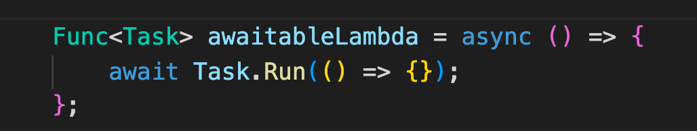

# 02 `Task Parallel Library`

## Version synchrone de la lecture de fichier 

```cs
var lines = File.ReadAllLines(filePath);

var data = new List<Item>();

foreach(var line in lines)
{
  data.Add(item)
}
```


## Création d'une `Task`

### Une `Task` est un pointeur vers une tâche asynchrone.

Une `Task` n'est pas une `Thread`, on peut lancer des centaines de `Task` en même temps sans problèmes.

C'est juste quelque chose à faire !

Dès que le `Thread Pool` s'ennuie, il prend une nouvelle `Task` et il la résoud.

Avantages :

- L'exécution fonctionne dans un `Thread` différent
- Renvoie le résultat d'une opération asynchrone
- S'abonne à la fin d'une opération grâce au mécanisme de `continuation`
- Elle peut nous prévenir s'il y a une `Exception`

```cs
Task.Run(SomeMethod);

// ou avec une lambda (Action)

Task.Run(() => { /* Heavy operation */ });
```


### Une `Task` a un `Status`

```bash
Created = 0,
WaitingForActivation = 1,
WaitingToRun = 2,
Running = 3,
WaitingForChildrenToComplete = 4,
RanToCompletion = 5,
Canceled = 6,
Faulted = 7
```

```cs
Task<string[]> readLinesTask = File.ReadAllLinesAsync("wiki.txt");
Console.WriteLine(readLinesTask.Status);
Console.WriteLine(readLinesTask.Status);
```

```
WaitingForActivation
RanToCompletion
```

La lecture du fichier est tellement rapide que la `Task` passe quasi instantanément du status `WaitingForActivation` à `RanToCompletion` (résolu avec succès).

### Une `Task` a un `Result`


### Type de retour 

Une `Task` peut avoir un type de valeur de retour :

```cs
Task<T> task = Task.Run<T>(() => {
  return new T();
})
```

On peut simplifier l'écriture de `Run<T>` en `Run` :

```cs
Task<T> task = Task.Run(() => {
  return new T();
})
```


## `Blocking` or `not blocking`

### ! utiliser `Wait` ou `Result` directement bloque la `Thread`

```cs
readLinesTask.Wait();

// ou

var lines = readLinesTask.Result;
```


### Code non bloquant `ContinueWith`

```cs
File.ReadAllLinesAsync("wiki.txt")
    .ContinueWith(t => {
        Console.WriteLine($"ContinueWith Thread : {Thread.CurrentThread.ManagedThreadId}"); 
        foreach(var line in t.Result)
        {
            Console.WriteLine(line);
        }
    });

Console.WriteLine($"Main Thread : {Thread.CurrentThread.ManagedThreadId}");  
```

```
Main Thread : 1
ContinueWith Thread : 7
Le léopard d'Anatolie (Panthera pardus tulliana) est une sous-espèce ... 
```

`ContinueWith` n'exécute le code que quand la `Task` est `Completed`. La `Thread` principal n'est pas bloquée comme on peut le voire avec l'affichage en premier du `Console.WriteLine` lui appartenant.

#### ! On doit garder le `Thread` principale suffisamment longtemps actif pour avoir le retour du traitement asynchrone.

Ici un simple `Console.WriteLine` donne le temps pour que la `Task` soit effectuée, mais on peut utiliser aussi `Console.ReadKey` pour être sûr que la `Thread` principale ne se termine pas.


### Code non bloquant `async/await`

```cs
_ = ReadTextAsync();

Console.WriteLine($"Main Thread : {Thread.CurrentThread.ManagedThreadId}");    


async Task ReadTextAsync()
{
    Console.WriteLine($"Func Async Thread : {Thread.CurrentThread.ManagedThreadId}");
    var lines = await File.ReadAllLinesAsync("wiki.txt");
    foreach(var line in lines)
    {
        Console.WriteLine(line);
    }
}
```

```
Func Async Thread : 1
Main Thread : 1
Le léopard d'Anatolie (Panthera pardus tulliana) est une sous-espèce de ...
```

Au premier `await` rencontré, la fonction `async` redonne la main à la `Thread` principale.

`_ = ReadTextAsync` : On peut utiliser le `Discard` : `_` pour éviter d'avoir un `warning` avec un appelle sans `await` d'une fonction `async`.

`Thread.CurrentThread.ManagedThreadId` retourne le même `Id`, car c'est `File.ReadAllLinesAsync` qui crée une nouvelle `Thread`.

Pour vérifier on va utiliser une fonction pour voire l'état du `ThreadPool` :

### `ThreadPool.GetAvailableThreads`

```cs
void DisplayThreadPool()
{
  ThreadPool.GetAvailableThreads(out int workerThreads, out int completionPortThreads);
  Console.WriteLine($"workerThreads : {workerThreads}\n");
  // Console.WriteLine($"workerThreads : {workerThreads}, completionPortThreads : {completionPortThreads}\n"); si on veut aussi les IO
}
```

Puis on va regarder comment se comporte le `ThreadPool` :

```cs
Console.WriteLine($"Main Thread"); 
DisplayThreadPool();   

_ = ReadTextAsync();

DisplayThreadPool();
Console.WriteLine($"Main Thread");

async Task ReadTextAsync()
{
    Console.WriteLine($"Func Async Thread");
  	DisplayThreadPool();
    var lines = await File.ReadAllLinesAsync("wiki.txt");
    DisplayThreadPool();
    foreach(var line in lines)
    {
        Console.WriteLine(line);
    }
}
```

```
Main Thread
workerThreads : 32767

Func Async Thread
workerThreads : 32767

workerThreads : 32764

Main Thread
workerThreads : 32766

Le léopard d'Anatolie (Panthera pardus tulliana) est une sous-espèce de ...
```

On voit que plusieurs `Thread` sont utilisées par `File.ReadAllLinesAsync`.


## Optimisation du code avec `async/await`

Le principe est qu'il faut lancer toutes les `Task` avant de chercher à les `await` pour ne pas bloquer la `Thread` principal.

### Ce qu'il ne faut pas faire

```cs
var sw = Stopwatch.StartNew();

async Task ReadFile(string path)
{
    var lines = await File.ReadAllLinesAsync("wiki.txt");

    foreach(var line in lines)
    {
        Thread.Sleep(300);
        Console.Write(line.Substring(0, 2) + ", ");
    }
}

await ReadFile("wiki.txt");
Console.WriteLine($"\n\ntime in ms : {sw.ElapsedMilliseconds}");
await ReadFile("wiki.txt");
Console.WriteLine($"\n\ntime in ms : {sw.ElapsedMilliseconds}");
await ReadFile("wiki.txt");
Console.WriteLine($"\n\ntime in ms : {sw.ElapsedMilliseconds}");
await ReadFile("wiki.txt");
Console.WriteLine($"\n\ntime in ms : {sw.ElapsedMilliseconds}");
```

```
Le, Il, Le, Da, En, En, En, 

time in ms : 2140
Le, Il, Le, Da, En, En, En, 

time in ms : 4249
Le, Il, Le, Da, En, En, En, 

time in ms : 6354
Le, Il, Le, Da, En, En, En, 

time in ms : 8461
```

On voit que les `Task` sont traitées en séquentiel, on ne profite pas du côté asynchrone.


## Optimisation

```cs
Task tRead1 = ReadFile("wiki.txt");
Task tRead2 = ReadFile("wiki.txt");
Task tRead3 = ReadFile("wiki.txt");
Task tRead4 = ReadFile("wiki.txt");

await tRead1;
Console.WriteLine($"\n\ntime in ms : {sw.ElapsedMilliseconds}");

await tRead2;
Console.WriteLine($"\n\ntime in ms : {sw.ElapsedMilliseconds}");

await tRead3;
Console.WriteLine($"\n\ntime in ms : {sw.ElapsedMilliseconds}");

await tRead4;
Console.WriteLine($"\n\ntime in ms : {sw.ElapsedMilliseconds}");
```

```
Le, Le, Le, Le, Il, Il, Il, Il, Le, Le, Le, Le, Da, Da, Da, Da, En, En, En, En, En, En, En, En, En, En, En, En, 

time in ms : 2139

time in ms : 2139

time in ms : 2139

time in ms : 2139
```

On voit que les quatre `Task` ont été traitées en même temps, le temps d'exécution est divisé par `4`!


> ### Renoyer vers la `Thread` principale pour des éléments `UI`
>
> Pour des interfaces graphiques (`Avalonia`), on ne peut appeler les élément de l'`UI` uniquement dans la `Thread` principale :
>
> ```cs
> Task.Run(() => {
>   Thread.Sleep(5000);
>   string filePath = "StockPrices_Small.csv";
> 
>   var lines = File.ReadAllLines(filePath);
> 
>   var data = new List<StockPrice>();
> 
>   foreach(var line in lines.Skip(1))
>   {
>     var price = StockPrice.FromCSV(line);
> 
>     data.Add(price);
>   }
> 
>   Stocks.Items = data.Where(sp => sp.Identifier == StockIdentifier.Text);
> });
> ```
>
> La dernière ligne va provoquer une erreur.
>
> On utilise ici `Dispatcher.UIThread.InvokeAsync` pour exécuter du code dans la `Thread` principale depuis une `Thread` créée par `Task.Run` :
>
> ```cs
> Dispatcher.UIThread.InvokeAsync(() => {
>   Stocks.Items = data.Where(sp => sp.Identifier == StockIdentifier.Text);
> });
> ```
>
> 


### `Task.Run`

Met en `queue` dans le `Thread Pool` le travail de la méthode instantanement.

```cs
try
{
  BeforeLoadingStockData();
  Task.Run(() => {/* ... */});
}
catch (Exception ex)
{
  Notes.Text = ex.Message;
}
finally
{
  AfterLoadingStockData();
}
```

Le temps d'une séquence comme celle-ci est quasi instantané, quelque soit la longueur du traitement envoyé dans la `Task`.

Pour attendre que la `Task` soit terminée on utilise tout simplement `async/await`.

```cs
private async void Search_Click(object sender, RoutedEventArgs e)
{
  try
  {
    BeforeLoadingStockData();
    await Task.Run(() => {/* ... */});   
  }
  catch (Exception ex)
  {
    Notes.Text = ex.Message;
  }
  finally
  {
    AfterLoadingStockData();
  }
}
```


## Utiliser les `Task` sans `async/await`

Une `Task` retourne une autre `Task` qui peut être poursuivi (`continuation`) grâce à la méthode `ContinueWith` :

```cs
var loadLinesTask = Task.Run(() => {
  return File.ReadAllLines(filePath);
});

loadLinesTask.ContinueWith((completedTask) => {
  var lines = completedTask.Result;
  
  // ...
});
```

`continueWith` retourne aussi une `Task`;

```cs
var processStockTask = loadLinesTask.ContinueWith(t => { });

processStockTask.ContinueWith(t => { })
  							 .ContinueWith(t => { })
  							 .ContinueWith(t => { });

```

On peut donc chaîner `continueWith`.


## Comparaison de la `continuation` entre `Task.ContinueWith` et `async/await`

Dans le cas de `Task.ContinueWith` la `continuation` s'exécute de manière asynchrone dans une `Thread` différente :

```cs
task.ContinueWith((_) => {
  //This continnuation executes asynchronously
  // on a different thread
});
```

Avec `async/await` la `continution` s'exécute dans le context original :

```cs
await task;

// this continuation executes on the original context
```

### Gestion des erreurs

Même si une `exception` est levée, `Task.ContinueWith` passe au prochain bloc de code.

Contrairement avec `await` qui en cas d'`exception` arrêtera l'exécution et sautera au bloc `catch`.


## Imbrication de `Task`


> `using` appelle `Dispose()` qui a son tour appelle `Close()`.

```cs
var loadLinesTask = Task.Run(async () => {
  using(var stream = new StreamReader(File.OpenRead(filePath))
  {
		var lines = new List<string>();
    string line;
    while((line = await stream.ReadLineAsync()) != null)
    {
				lines.Add(line);
    }
    
    return lines;
  }
});
```

> Marquer une `méthode anonyme` avec `async`  n'est pas la même chose que d'avoir une méthode `async avoid`.
>
> Une `Anonymous Method` avec `async` renvoie automatiquement une `Task`.
>
> 

