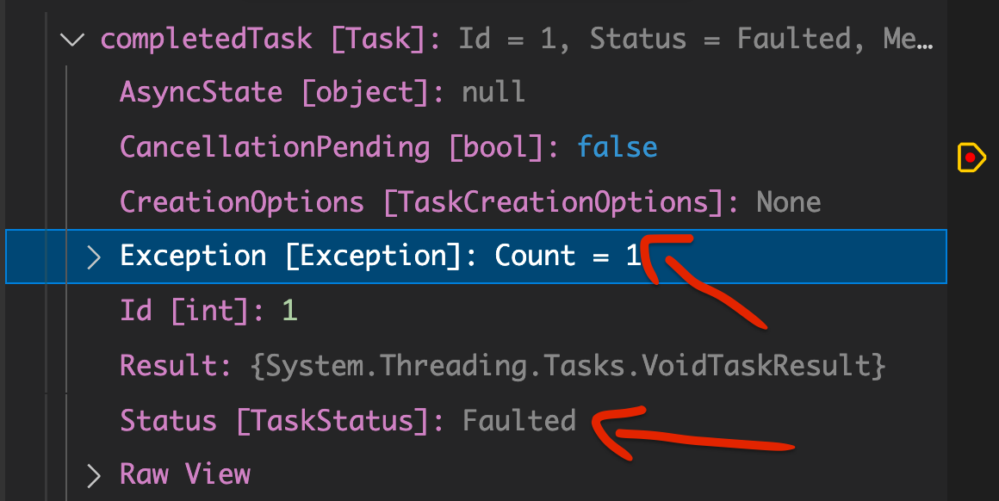
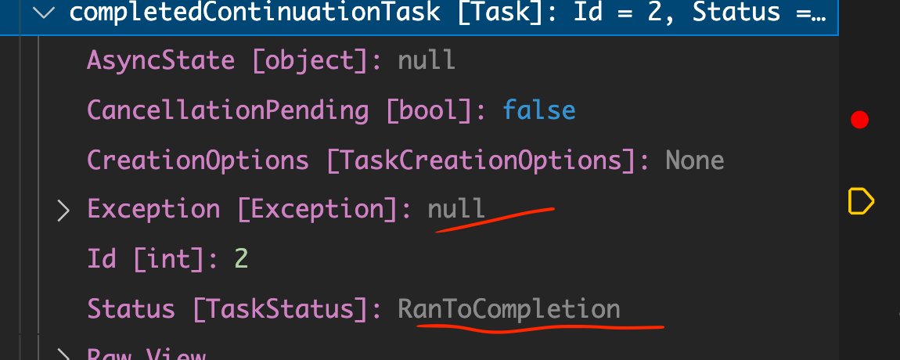

# 03 `Exception` 

## Règle

Le code client attrape l'`exception` quand une `Task` en route est `awaited`, pas avant.

```cs
async Task ThrowFireException()
{
    Console.WriteLine("Fire Exception");
    await Task.Delay(1000);
    throw new InvalidOperationException("The code is on fire !");
}

Task oneTask = ThrowFireException();

Console.WriteLine("I'm telling my life story");
Console.WriteLine("To be continued ....");
```

```
Fire Exception
I'm telling my life story
To be continued ....
```

```cs
await oneTask;
```

```
Error: System.InvalidOperationException: The code is on fire !
at Submission#4.<ThrowFireException>d__1.MoveNext()
...
```


## Gestion des `Success` et des `Failures`

Si une `Exception` est levée, `ContinueWith` va continuer d'exécuter le code de sa `lambda` quelque soit le `status` de la `Task`.

```cs
Task.Run(() => {
  throw new FileNotFoundException();
})
  .ContinueWith((completedTask) => {
    // completedTask.Status = faulted with attached exception !
  })
```



```cs
  .ContinueWith((completedContinuationTask) => {
    // Not faulted ! status = RanToCompletion no exception !
  });
```



Au deuxième `ContinueWith`, l'`Exception` est perdu et le `status`est `successful`.

Lorsqu'une `exception` est lancée, le `status` d'une `Task` passe à `Faulted` et l'`Exception` est enregistrée dans la propriété `Task.Exception`.

L'`exception` est re-lancée lorsque le code `await` cette `Task`.

La propriété `Task.Exception` est de type `AggregateException` car plus d'une `Exception` peuvent être lancées endant le traitement asynchrone.


## Gestion des `Exceptions`

### `taskCompleted.IsFaulted`

C'est le moyen le plus simple de gérer une exception :

```cs
File.ReadAllLinesAsync("wki.txt") // ici le nom est faux
    .ContinueWith(taskCompleted => {

        if(taskCompleted.IsFaulted)
        {
            Console.Error.WriteLine(taskCompleted.Exception!.Message);
        }
        foreach(var line in taskCompleted.Result)
        {
            Console.WriteLine(line);
        }
    });
```

```
One or more errors occurred. (Could not find file '/Users/hukar/Documents/programmation/dotnet/note-book/wki.txt'.)
```


### `TaskContinuationOptions`

On voudrait un moyen de ne continuer les `Task` que si la `Task` précédente n'a pas d'`exception`.

On dispose d'une option `TaskContinuationOptions` qui peut prendre la valeur `OnlyOnRanToCompletion`, ce qui signifie que la `Task` n'est ni `Faulted`, ni `Cancelled`.

```cs
Task.ContinueWith(() => { ... }, TaskContinuationOptions.OnlyOnRanToCompletion);
```


```cs
await Task.Run(() => throw new Exception("hello coco!"))
  .ContinueWith(completedTask => { }, TaskContinuationOptions.OnlyOnRanToCompletion)
  .ContinueWith(completedContinuationTask => {
      Console.WriteLine("Hello Second");
    });
```

La fonction `Lambda` ne sera exécuté que si le `Status` de la première `Task` est `RanToCompletion`.

C'est un court-circuit et les autres `ContinueWith` ne sont pas atteint.


## Créer une `Continuation` pour une erreur

### `TaskContinuationOptions.OnlyOnFaulted`

On veut créer une `Continuation` capable de gérer les erreurs :

```cs
var loadLinesTask = task.Run(async () => { ... });

// continuation quand ça se passe mal
loadLinesTask.ContinueWith(t => {
  Dispatcher.
    Notes.Text = t.Exception.InnerException.Message;
}, TaskContinuationOptions.OnlyOnFaulted)
```

### Exemple

```cs
await Task.Run(() => throw new Exception("hello First!"))
  .ContinueWith(firstTask => {
        Console.WriteLine("Hello Second");
        Console.WriteLine($"Log for error {firstTask.Exception.Message}");
    }, TaskContinuationOptions.OnlyOnFaulted)
  .ContinueWith(secondTask => {
        Console.WriteLine("Hello Third");     
    });
```

```
Hello Second
Log for error One or more errors occurred. (hello First!)
Hello Third
```

La deuxième tâche a elle le `Status` : `RanToCompletion` et donc la troisième tâche s'exécute aussi.

## Résumé


Avec `async/await` les erreurs sont gérer par un bloc `try and catch`.

Les erreurs ne sont pas agrégée avec la `Task`.

Avec `ContinueWith`, les erreurs sont `aggregate` avec la `Task` dans la propriété `InnerException`.

Pour les gérer on peut utiliser plusieurs `ContinueWith` sur la même `Task` avec des `TaskContinuationOptions` différentes :

- `OnlyOnFaulted`
- `OnlyOnRanToCompletion`
- ...

